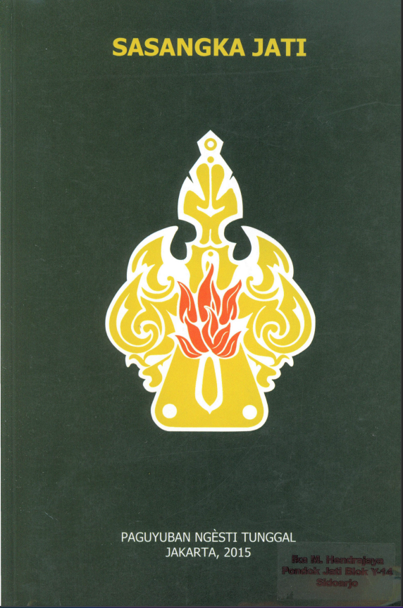

```{figure} coverbk/under-construction-snb.png
:alt: underconstruction
:width: 200px
:align: center

```

```{admonition} This Book is Still Under Construction
:class: warning

<mark>Progress: Input Data, Format & Typo Checking</mark>

***Buku masih dalam tahap dalam proses penyusunan, sehingga mungkin masih banyak ditemukan typo. Mohon di maklumi ya ...***

```



<br/>
<br/>

# SASANGKA JATI

## BEBUKA

<br/><audio controls><source src="https://satyaaditech.github.io/audiolib/ssj/01%20Hasta%20Sila.mp3" type="audio/mpeg"></audio><br/>
Pangarang kula serat punika boten saking pikajeng kula piyambak, nanging lugu namung nyatheti dhawuh wejanganipun Panuntun kita Sang Guru Sejati (Suksma Sejati) ingkang dipunpangandikakaken lumantar siswanipun ingkang peparab Raden Soenarto, ing Surakarta. Dene suraosipun wejangan wau, paring piwulang dhumateng para cecaloning siswa, ingkang nedya anggayuh kasuksman, mirantosaken margi ingkang kedah dipunambah dening para lelampah, murih boten angengecer wanci, sarta saged rancag dumugining gegayuhanipun. Margi wau kula wastani: Hastha Sila, tegesipun panembahing batos wolung prakawis. Sarehning piwulang wau ing serat-serat kina karanganipun para sarjana sujana tuwin para linangkung ugi sampun kathah, mila anggen kula nyerat ing buku punika, namung kula ringkes suraosipun, dados manawi para marsudi kapengin priksa moncering and haran, satunggalsatunggalipun bab, ingkang kapacak ing buku punika, lang kung prayogi maos serat-serat sanesipun.

Ngelmu punika sagedipun dados kawruh kanyataan, kedah kanthi laku, ngelmu ingkang tanpa laku, badhe boten saged nekseni kanyataanipun (kandheg wonten ing gagasan), rumaosipun sampun saged, garanipun namung apil dhateng apalaning piwulang, nanging sejatosipun dereng paja-paja, mila saking pangajeng-ajeng kula, sadaya wewarahing Hastha Sila punika, sageda kasarira wonten ing batosipun. Dene kalampahanipun kedah dipunpeleng, upami satunggal-satunggalipun bab, tansah kapeleng salebetipun saminggu, gentos-gentos, ing dalem wolung minggu sampun kemput. Dene bilih rumaos dereng ngepleki kados suraosing piwulang wau, inggih dipunambali malih pamelengipun, sarana patrap makaten punika, para marsudi bad he rancag indhaking kasagedanipun.
<br/>
Surakarta, Juni 1932<br/>
<br/>
Hardjoprakoso <br/>
tuwin<br/>
Tr. Soemodihardjo<br/>

## UWAT-UWAT

Mugi andadosna ing kauninganipun para sadherek, bilih ing sayektosipun, kula makaten namung sadarmi dados warana, medharaken wejangan saking dhawuh pangandikanipun Panutan kita Sang Guru Sejati, dados sanes saking kasagedan kula piyambak, nanging kula (Soenarto) namung lugu dados margi utawi urung-urung, ingkang ngilekaken ilining sih dhawuhipun Sang Guru Sejati, inggih Panuntun kita sejati, inggih Suksma Sejati, ingkang ugi sumimpen wonten ing batosipun satunggalsatunggaling tiyang. Awit saking punika, mugi sampun sami seling serep, utawi klentu ing panampi, nginten bilih namung kula piyambak ingkang saged dados siswanipun, agengipun nginten dhiri kula ingkang dados Panutan utawi Guru Sejati, babar pisan boten kados makaten. Ananging kawuningana, jengandika inggih saged dados siswanipun Sang Guru Sejati, inggih Suksma Sejati jengandika piyambak. Dene kula makaten sami kemawon kados manungsa limrah, boten bed a kados jengandika tuwin sanes-sanesipun tiyang. Amung kemawon jengandika dereng saged bad he pinanggih kaliyan Panjenenganipun, ing saderengipun jengandika marsudi netepi sadaya piwulangipun, kados ingkang sampun kaparingaken dhateng kula punika, tuwin dhateng sadherek sanes-sanesipun, samanten wau bilih jengandika parsudi kanthi genging kapitadosan ingkang santosa dhateng Panjenenganipun, inggih Guru Sejati jengandika piyambak, inggih Suksma Sejati jengandika piyambak.

Wasana tutuping atur, kula ngaturaken genging panuwun ingkang tanpa upami, dhateng Sadherek Raden Tumenggung Hardjoprakoso tuwin Sadherek Raden Trihardono Soemodihardjo, anggenipun sampun kapareng ngestokaken dhawuhipun Sang Guru Sejati, mengeti wejangan punika, ngantos dados buku cangkingan, ingkang anggampilaken dhateng lampahipun para marsudi, ingkang sami ngupados ngelmu sejati.

Pamuji kula mugi-mugi serat alit punika, sageda mewahi paedahipun, tuwin ageng pigunanipun dhateng ingkang sami taksih wonten ing salebeting pepeteng, punapa dene lajeng saged dados sesuluhipun, salebetipun sami marsudi dhateng indhaking kasuksmanipun.

Mugi rahayua sagung dumadi.

**Soenarto**

## TRI SILA

<br/><audio controls><source src="https://satyaaditech.github.io/audiolib/ssj/02%20Tri%20Sila.mp3" type="audio/mpeg"></audio><br/>

**Panembahing Ati Ian Cipta Telung Prakara marang Tripurusa Sesanggeman gedhe kang perlu banget dilakoni ing saben dinane**, yaiku:

1. Eling
2. Pracaya (Piandel)
3. Mituhu

### 1. Eling

Kang diarani eling, iku tegese: bekti marang Pangeran Kang Mahatunggal (Gusti Allah). Dene kahanane Pangeran Kang Mahatunggal, iku sinebut: Tripurusa, tegese: kahanan siji kang sipat tetelu, yaiku:
(penjelasan-tripurusa)=

```{admonition} TRIPURUSA
1. Suksma Kawekas (Pangeran Sejati), tembunge Arab: Allah Taala.
2. Suksma Sejati (Panutan Sejati = Panuntun Sejati = Guru Sejati), Utusaning Pangeran.
3. Roh Suci (Manungsa Sejati), iya jiwane manungsa kang sejati.
```

Wruhanira, manawa sesanggeman telung prakara mau satemene wus padha sira sanggemi, nalika sira arep tinitahake urip ana ing alam donya. Dene bisane eling iku alantaran tansah manembah kalayan pelenging ati kang wening Ian suci. Dene panembah iku ana telung tataran:

1. Panembahing kawula marang Roh Suci (panembahe jiwa-jiwa kang isih mudha utawa ringkih, kava kang wus padha dilakoni dening lumrahing wong awam).
2. Panembahing Roh Suci marang Suksma Sejati (panembahe jiwajiwa kang wus diwasa).
3. Panembahing Suksma Sejati marang Suksma Kawekas (panembahe jiwa-jiwa kang wus luhur budine).

Panembah kang angka 2) Ian angka 3) iku bakal padha sira lakoni kabeh, manawa sira temen pracaya Ian mituhu marang pituduhe Sang Guru Sejati, sarana anetepi sesanggeman gedhe Tri Sila iki, Ian uga anetepi kalakuan becik limang prakara, kava kang bakal katerangake ana ing perangan: Panca Sila. Sira ora bakal bisa umarek ing ngarsane Sang Guru Sejati, manawa sira durung netepi Hastha Sila iki, amarga iva pituduh mau kang bakal nuntun ing sira sumiwi ing ngarsane Sang Guru Sejati, Ian iya Panuntunira kang sejati kang bakal ngeterake sira marang pangayunaning Pangeran (Suksma Kawekas).

Kawula ora bisa sumiwi dhewe ana ngayunaning Pangeran, manawa ora antuk pitulungane Sang Guru Sejati kang paring tuntunan, pepindhane kaya dene lawa kang mabur ana ing wayah awan, kang banjur mati sabab kebloloken dening sunaring srengenge. Guru Sejati iku pepindhane kaya dene rembulan, kang nampani soroting srengenge (Suksma Kawekas) kang padhange ora gawe bloloking lawa Ian sapepadhane. Mangkono mungguh perlune kawula bisane oleh tuntunane Guru Sejati, supaya slamet anggone lelaku ing dalaning kautaman, awit saka iku perlu banget kawula tansah ngangkaha bisane tunggal kahanan kalawan Guru Sejati (Suksma Sejati), murih bisa umarek ing dhamparing Pangeran (Suksma Kawekas).

Mungguh elinge marang Tripurusa mau, ing saben dinane padha diparsudia kang nganti kulina, pepindhane kaya dene wong luwe, elinge marang pangan kang ora susah mawa pangatage luamah. Dadi sanadyan pinuju lumaku, thenguk-thenguk, sajrone nyambut gawe, turu, Ian ing wanci apa wae, bisaa tansah eling marang Pangeran Kang Mahatunggal (Suksma Kawekas - Suksma Sejati - Roh Suci).

Sumurupa mungguh nugrahane eling kang langgeng iku, bisa nuntuni sira marang watak weweka, yaiku nyilah-nyilahake kang bener Ian kang luput, kang nyata Ian kang dudu, kang langgeng Ian kang owah gingsir. Samubarang tindak-tanduk, kang sira lakoni ing saben dinane, manawa langgeng elingira mau, bakal ora pisah lawan weweka, nadyan kongsi tumeka ing delahan.

### 2. Pracaya (Piandel)

<br/><audio controls><source src="https://satyaaditech.github.io/audiolib/ssj/03%20Pracaya.mp3" type="audio/mpeg"></audio><br/>
Sanadyan sawenehing golongan, ana kang ngremehake marang bab pangandel, nanging satemene piandel iku dadi prabot kang wigati, utawa tali kang kuwat, kang bisa anggandheng rasanira lawan kang sira bekteni. Kapriye anggone Sang Guru Sejati (Suksma Sejati) bakal bisa mitulungi sira, manawa sira ora darbe piandel ing Panjenengane, amarga ora ana tali panggandheng kang nekakake ilining daya kekuwatane. Awit saka iku, manawa sira ngangkah bisane oleh pitulungan saka Panjenengane, sira kudu pracaya marang Sang Guru Sejati, awit Panjenengane iku pancen wus kinanthekake ing sira, supaya dadi Panutanira, Panuntunira, iya Guru Sejatinira. Wruhanira manawa sejatinira (Roh Suci), iku siji lawan Suksma Sejati (Guru Sejati) Ian Suksma Kawekas (Pangeran Sejati), dadi yen sira ora darbe pangandel, iku sira prasasat amedhot tali rasa kang anggandheng sira Ian Panjenengane. Sumurupa, manawa ora ana piandel kang santosa, ora bakal ana ilining sih Ian panguwasa linuwih saka Panjenengane. Mula upayanen kanthi gunging piandel marang Panuntunira Sejati mau, dikongsi bisa katemu aneng telenging batinira, supaya sira tansah ingayoman ing salawaslawase, sarta tansah tinuntun ing Panjenengane marang dalan kang bener, kongsi tumeka Ian anjog ing gegayuhanira kang sanyata.

Akeh wong kang ngucapake kawicaksanan: Manungsa kudu pracaya marang dhiri pribadi. Nanging satemene akeh kang padha ora ngerti, endi kang diarani dhiri pribadi, Ian kapriye dedalane supaya manungsa tetep ngandel-kumandel marang dhirine priangga. Kang akeh-akeh weruhe lagi marang dhirine kang ora langgeng, sinengguh iku kang dadi Panutan Ian Panuntune Sejati[^1]

[^1]: Kawontenaning dhiri ingkang kenging risak, kateranganipun kawrat ing buku bab: Gumelaring Dumadi, Buku Kandhutan III.

Satemene sejatinira iku soroting Pangeran, Ian Pangeran iku tunggal kahanan lawan sejatinira, awit saka iku ora ana samubarang kang sira ora bisa nglakoni, janji sira temen-temen wus bisa katemu lawan Panuntunira kang sejati, iya Gurunira kang sejati, amarga iya Suksma Sejati mau kang bakal paring pituduh marang sira mungguh gawat rungsiting lakunira aneng dalaning kautaman, mula disantosa niyatira nganti kaya adeging gunung waja.

### 3. Mituhu

<br/><audio controls><source src="https://satyaaditech.github.io/audiolib/ssj/04%20Mituhu.mp3" type="audio/mpeg"></audio><br/>
Kang diarani mituhu, yaiku ngestokake dhawuhe Pangeran, kang lumantar Utusane, iya Suksma Sejati kang dadi Panuntun sarta Gurunira kang sanyata. Satemene sakehe kuwajibanira kang akeh-akeh, iku ringkesane mung saprakara, yaiku: niyat anglakoni pakaryane Sang Guru Sejati.

Sanadyan sira katekan prakara apa wae, ora kena babar pisan kelalen niyatira mau, amarga sejatine ora ana pakaryan utama kang tumiba ing sira, kang dudu pakaryane Sang Guru Sejati. Sakabehe panggawe becik Ian rahayu tumrap sakehe manungsa, iku pakaryane Sang Guru Sejati, atas asmaning Pangeran Kang Mahaagung. Marmane padha dilakonana ing sapandumira dhewe-dhewe kalayan talesih Ian titi, supaya ing sabisa-bisa pakaryan mau kaleksanan kalawan sampurna.

Aja sira kapengin age-age nandangi pakaryan gedhe, utawa ngareparep tekane pakaryan gedhe, amarga pakaryan gedhe iku arang tekane, kang mesthi kerep sira sandhung iku pakaryan kang cilik-cilik. Sira aja ngremehake marang pakaryan kang cilik-cilik iku, sabab yen sira durung kulina nandangi pakaryan kang gampang, kapriye anggonira bakal bisa nandangi pakaryan kang angel. Muiane samubarang kang tinemu ana ing tanganira, lakonana kalawan temen-temen ing ati suci, atasna awit saka karsaning Gusti, amarga ora ana pakaryan ing donya iki, kang ora atas saka karsaning Pangeran, nadyan kang katone remeh pisan, siji-sijining wong padha anduweni kuwajiban dhewe-dhewe, kang bisa nyukupi marang kabutuhaning ngaurip, muiane sira aja rumangsa luwih luhur katimbang liyane, jalaran lakune urip iku padha samad-sinamadan siji Ian sijine.

Yen sira temen-temen mituhu marang tuntunane Sang Guru Sejati, ora ana prakara kang bisa nyimpangake sira saka dalaning kautaman kang sira lakoni. Sanadyan ana godha rencana apa wae, kayata: kasenengan utawa pakareman bab kadonyan, sira kudu tansah tetep pangambahira ing dalan kautaman mau, kanthi mituhu marang tuntunane Sang Guru Sejati, niyat anglakoni kabeh piwulange. Iya piwulange iku kang sinebut dalaning kautaman kang sira liwati, muiane dalan mau kudu tunggal kahanan lawan sira, luluh dadi sawiji ing dalem atinira, aja kongsi ana renggange sathithik-thithika.

## PANCA SILA

<br/><audio controls><source src="https://satyaaditech.github.io/audiolib/ssj/05%20Panca%20Sila.mp3" type="audio/mpeg"></audio><br/>
Watak Kautaman Limang Prakara

Supaya bisa sampurna anggonira nglakoni sesanggeman telung prakara mau, sira wajib marsudi bisane anduweni watak utawa kalakuan becik limang prakara, yaiku:

1. Rila.
2. Narima.
3. Temen.
4. Sabar.
5. Budi luhur.

### 1. Rila

Sejatine kang ingaran rila iku enggaring ati, tumrap anggone masrahake kabeh darbeke, wewenange, Ian kabeh wohing panggawene marang Pangeran, kanthi legawa (iklas), amarga angelingi manawa kabeh iku ana ing dalem panguwasane Pangeran, muiane kudu ora ana sawiji-wiji kang nabet ing atine. Awit saka iku wong kang anduweni watak rila, ora patut yen ta ngarep-arepa pituwasing lakune, apa maneh yen ngantia susah utawa anggresah, tumrap kabeh panandhang kang lumrahe ingaran sangsara, panyamah, pitenah, kelangan bandha, drajat, kasripahan, Ian sapanunggalane. Wong kang rila ora anduweni melik babar pisan marang pangaji-aji Ian suwur, apa dene kemeren sarta dahwen. Wong kang rila iku anduweni watak: ora kelet marang kabeh barang kang bisa rusak, nanging dudu wong kang nglirwakake kuwajiban. Wose yen sira arep anduweni watak rila, sinaua Ian kulinakna enthengan kanthi legawaning ati, yen dijaluki pitulungan ing wong liyan, tumrap panggawe utama, manut sakuwasanira. Sarana tindak kang mangkono sira saka sathithik, bakal tumeka ing tataran: ora winengku Ian ora mengku paracidraning kahanan (donya).

### 2. Narima

<br/><audio controls><source src="https://satyaaditech.github.io/audiolib/ssj/06%20Narima.mp3" type="audio/mpeg"></audio><br/>
<mark>Narima iku akeh lerege marang tentreming ati</mark>, dadi dudu wong kang lumuh ing gawe, nanging kang narima ing sapandum. Apa kang wus cinekel ana ing tangane, digarap kanthi senenging ati, ora murka Ian ora ngangsa-angsa. Narima iku ora mengini darbeking liyan, sarta ora meri marang kabegjane liyan, muiane wong kang narima iku kena den arani wong kang sokur ing Pangeran. Panarima iku sawijining bandha kang ora bisa entek, muiane sing sapa golek sugih upayanen aneng jroning panarima. Wong kang narima iku begja ing sajroning uripe, amarga dheweke menang karo owah gingsiring kahanan. Sumurupa manawa kauripan ing donya iku sawijining cakra panggilinganing mangsa kang owah gingsir; yen sira narima kalawan apa kang wus pinaringake dening Pangeran marang sira, sira bakal dadi sugih-sugihing wong ana ing antarane para manungsa. Yen pepenginanira ora bisa kasembadan, narimaa kalawan apa kang wus sira darbeni, amarga sanadyan kabeh mau ora bisa kacandhak, nanging saperangan rak iva wis sira cekel utawa sira darbeni. Mung panarima kang bisa nuntun marang padhanging atinira, amarga panarima iku isi ayem Ian tentreming ati, mula sira bakal ora krasa marang kombak-kombuling lelakon kang sira sand hang, dene kang sira perlokake, mung angestokake dhawuhe Sang Guru Sejati, kava kang wus kasebut aneng sesanggeman gedhe Tri Sila kang angka telu, yaiku mituhu.

### 3. Temen

<br/><audio controls><source src="https://satyaaditech.github.io/audiolib/ssj/07%20Temen.mp3" type="audio/mpeg"></audio><br/>
Temen iku tegese kang baku: netepi janji utawa netepi sesanggeman, sanadyan wus kelair ing wicara utawa isih kabatin (niyat) iva padha wae. Dadi wong kang ora netepi niyate, iku jenenge nyidrani karo batine dhewe, dene yen niyat mau wus kelair ing wicara, mangka ora ditetepi, iku gorohe mau ateges diseksekake marang wong liya.

Padha sinaua marang katemenaning atinira, amarga temen iku nekakake marang adil, dene adil iku nuntun marang kamulyan langgeng. Temen iku maweh kakendelan, sarta katentreman marang ati, Ian uga nucekake ati, apa dene agawe tulusing pambekan. Wong ora bisa nglakoni agama kalawan becik, manawa atine ora suci, dene ati ora bisa suci, manawa ilate uga ora suci. Kang tetep marang bener, sanadyan katemenanira mau bisa agawe kapitunanira, Ian aja sok dhemen goroh, nadyan gorohira mau bisa agawe kauntunganira.

Mung yen wong celathu temen, Ian tumindak kang cocog karo kanyataan, tegese tumindak kalawan bener, wong mau temen bisa sampurna. Wong bodho kang temen, iku luwih becik katimbang wong pinter kang cidra. Satemene wong kang ora kena pinitaya unine, utawa ora netepi janji Ian kasaguhane, iku kalebu ewone wong munapek (lelamisan). Kang mangkono bakal ora bisa oleh sihing Pangeran. Para cecalone siswa kang padha ngangkah supaya bisa katemu Ian Sang Guru Sejati, poma padha netepana samubarang prakara kang wus sira sanggemi.

### 4.Sabar

<br/><audio controls><source src="https://satyaaditech.github.io/audiolib/ssj/08%20Sabar.mp3" type="audio/mpeg"></audio><br/>
Sumurupa manawa watak sabar iku becik-beciking bebuden, kang kudu dinarbe para cecalon utawa siswa. Kabeh agama padha nyaritakake, yen Pangeran iku asih marang wong kang padha sabar bebudene. Sabar mono tegese momot, kuwat nand hang sakehing coba, nanging dudu wong kang pepes pangarep-arepe, balik wong kang santosa atine, jembar sesurupane, ora rupak budine, pantes mungguh den aranana segaraning kawruh, marga saka anggone wus ora ambedak-bedakake emas Ian lempung, mitra Ian mungsuh wus kaanggep padha wae. Pepindhane kava dene segara kang kamot diiseni apa-apa, Ian ora bisa ambaludag dening kajogan saka kali-kali ing ngendi wae.

Awit saka iku sira kang padha ulah kasabaran, padha diangkaha bisane sumingkir saka wewatakan cekak rupak, sarta brangasan.

Wong kang padha cekak budine, iku jalaran saka pikire winatesan ing kawruhe, anganggep keliru marang kawruhing liyan kang ora padha karo kawruhe dhewe. Mara mardikakna pikirira, sarana angajeni sarta matrapake kasabaran marang para agama, awit kabeh mau pituduh dalan marang Pangeran, kava dene agamanira dhewe.

Pangeran ora ngutus Utusane, supaya jor-joran mungguh apiking kawruhe, nanging padha kautus supaya ngelingake marang sesanggemane kawula, kanthi pituduh dalan bener kang anjog ing Pangeran. Kapara luwih becik yen sira mangerti marang agamaning liyan, perlune mbok manawa sira arep tetulung, bisa weruh kapriye mungguh cara-carane agamane wong mau.

Kasabaran iku pepindhane kava sawijining jamu omben-omben kang pait banget, kang mung bisa diombe dening para santosa ing budi, nanging bisa marasake kasusahan Ian lelara. Muiane para santosa padha ora nacat Ian angremehake, marang wong kang anduweni panganggep, yen sarengating agama iku kang luwih perlu, amarga saraking agama iku uga ana perlune, kanggo nuntuni marang para jiwa-jiwa kang isih ringkih, yaiku tumrap marang umuming wong akeh, supaya padha bisa tata uripe, ora nunjang palang sakarep-karepe dhewe. Nalika sira isih bocah, iya isih perlu diereh, kanthi tatanan kang prayoga dening wong tuwanira, supaya bisa kareksa kaslametanira, nanging wong kang wus diwasa saya mundhak tuwane, carane bocah iya banjur ditinggal, ewa samano yen kongsi kalalen marang carane bocah, iya ora bisa tetulung utawa mulang muruk marang bocah. Muiane sira kudu ngrengkuh kalawan sabar sarta katresnan marang sadhengah wong, kaya dene pangrengkuhira marang kang sira tresnani. Sakehing prakara kang angel sarta gawat, bakal dadi gampang mung sarana kasabaran, amarga iya kasabaran iku, kang dadi dalan anekakake marang apa kang sira gayuh. Dadi sabar iku dudu niyat kang mung kandheg ana ing pangarep-arep utawa ing catur wae, nanging tumindak satitahe kanthi ajeg Ian tlaten, nganti kacandhak apa kang dadi gegayuhane.

### 5. Budi luhur

<br/><audio controls><source src="https://satyaaditech.github.io/audiolib/ssj/09%20Budi%20Luhur.mp3" type="audio/mpeg"></audio><br/>
Budi luhur mangkono tembung rong wanda kang digandheng dadi satembung aran, yaiku saka tembung budi Ian luhur. Budi iku saperangan saka watake Suksma Sejati, tegese: padhang, kang minangka damaring manungsa sejati Uiwa). Dene so rote budi iku tinampan ing cipta (pikir), mung wae rehning cipta iku dadi pirantining jiwa, kang anggandheng antaraning Tripurusa Ian kabeh piranti kang dadi wadhahe, mula cipta mau anduweni watak rong prakara, pad hang Ian peteng. Padhang iku sejatine wataking Tripurusa, dene peteng iku watake wadhahe. Wataking Tripurusa iku dadi kekuwataning manungsane sejati, dene watake wadhah utawa piranti-piranti iku dadi kekuwataning tetunggangane (kewani). Manawa wong pinuju padhang pikire utawa anduweni rasa tentrem, iku ciptane pinuju runtut gandhenge lawan kekuwataning manungsane, muiane soroting budine bisa tinampan ing ciptane. Dene yen pinuju peteng, iku soroting budi ora bisa tinampan ing ciptane, amarga ciptane mau rinegedan ing pepenginane. Dadi yen sira ngangkah supaya tansah runtut ciptanira, sira kudu tansah ngereh watak-watake roh kewaninira, sarana mangun watak utawa kalakuan becik limang prakara, kaya kang kasebut ing perangan Panca Sila iki kabeh, supaya sira bisa dadi dalan utawa lantaran, ambabarake karsaning Pangeran, manut pituduhe Panutanira Sejati, iya Gurunira kang sejati, yaiku Suksma Sejati.

Dene tembung: luhur, iku sipating Pangeran Sejati, iya Suksma Kawekas, kang tansah angilekake daya kekuwatane, lumantar Suksma Sejati. Dadi tembung budi luhur iku, mungguh karepe, manungsa tansah marsudia bisane mirip kalawan watak-watak utawa sipat-sipating Pangeran kang Mahaluhur, kayata: welas asih marang sapepadhane titah, suci, adil, ora ambedak-bedakake drajat, gedhe cilik, sugih miskin, direngkuh kaya sadulure dhewe, nanging iya ora ngilangake tata krama Ian kasusilan. Dhemen tetulung sarta ngayomi kang ora kanthi pamrih barang-barang (kurban) Ian sapanunggalane kang tumuju marang karahayon. Dene kurban mau ora mung awujud: bandha, bau, Ian pikiran, nanging manawa perlu iya nganti tekan jiwane. Kabeh iku tumindake ora kalawan mutatuli, sarta kasurung ing hardane kekuwataning kewanine (hawa napsune), nanging kanthi pepadhang kang tinemu saka anggone mituhu marang kabeh pituduh sarta piwulange Sang Guru Sejati. Awit saka iku, ing sadurunge manungsa manut miturut, angestokake kabeh pituduh utawa piwulange Sang Guru Sejati, mangka kesusu arep anindakake budi luhur, iku iya isih sasar-susur, amarga durung bisa kasorotan ing pepadhange budi, mula adhakane banjur nyulayani karo karsaning Pangeran, kang mangkono ora bisa dadi kurban kang konjuk ing Pangeran.

Sarehning karepe piwulang budi luhur iku mengku pirang-pirang bab, saupama diprinci katrangane ngandhar banget, muiane piwulang budi luhur dipernahake ana ing buri dhewe, amarga diterangna kang kaya ngapa wae, yen durung mangerti surasane piwulang bab rila, narima, temen, sarta sabar, iya bakal kurang dhamang panampane.

## SERAT PALIWARA

<br/><audio controls><source src="https://satyaaditech.github.io/audiolib/ssj/10%20Paliwara.mp3" type="audio/mpeg"></audio><br/>
Pepacuhipun Pangeran Sejati Dhateng Manungsa

Buku Kandhutan II

### BEBUKA

Sadaya ingkang kasebut ing serat Paliwara punika, sanes saking karanganipun juru mengeti piyambak, nanging lugu namung nyatheti dhawuh pangandikaning Guru Sejati, inggih Suksma Sejati, ingkang lumantar tutuking siswanipun, peparab Raden Soenarto ing Surakarta.

Wiyosing dhawuh pangandika, ingkang lajeng kadadosaken serat cangkingan angka 2 punika, mawi sabda pambuka makaten.

"Sumurupa para siswaning-Sun, satemene tumrap para kang wus dhuwur drajating kamanungsane, kava wus cukup anyumurupi marang surasane piwulang Ingsun, iva pathining piwulang wolung prakara, kava kang wus padha sira pEmgeti ana ing layang kang sira wEmehi tetenger aran: Hastha Sila. Tumrap jiwa-jiwa kang wus diwasa mau, mesthine iva wus padha mangerti, yen anindaki panggawe becik (utama) iku iva wus ateges dipenging nindaki panggawe sasar, utawa ora bakal tumindak mangiwa maneh. Nanging tumrap para sadulurira kang akeh-akeh, kang kalebu ewone jiwa-jiwa kang isih mudha, iku iva isih perlu diwenehi pepacak, supaya padha anyingkiri panggawe dosa, mula sawetune pengetanira layang Hastha Sila sarta pepacuh iki, sira wus padha anetepi ajak-ajak marang panggawe becik, Ian nyegah marang tindak kang dudu, mula padha piarsakna dhawuh Ingsun iki."

Awit saking wiyosing dhawuh pangandikanipun Guru Sejati ingkang makaten wau, mugi-mugi sageda amemungu panggalihipun para marsudi, tansah enget dhateng pandamel sae (utami), tuwin anyingkiri panda mel awon, kados ingkang kawrat wonten ing serat Paliwara punika sadaya, murih kita para kawula sami saged antuk nugraha, tuwin manggih kabegjan ageng, inggih wewengan ingkang minangka panothoking konten, nyuwun menganing wiwaranipun kadhaton ngaras kursi, inggih ing alam katentreman langgeng, inggih dununging kasunyatan jati.

Minangka tutuping atur, kula suka sukur ing Pangeran tuwin Utusanipun sejati, mugi sumebaring serat cangkingan angka 1 tuwin angka 2 punika sageda amewahi pajaring panggalihipun para nupiksa, ingkang sami lelumban wonten ing samodraning kadonyan, tuwin dadosa jalaraning katarbuka, mituhu dhateng sadaya dhawuhing Pangeran, ingkang

lumantar Utusanipun, inggih Suksma Sejati, ingkang dados Panuntun kita saha Guru kita ingkang sejati.

Satuhu<br/>

Surakarta, September 1932<br/>
Hardjoprakoso<br/>
tuwin<br/>
Tr. Soemodihardjo<br/>

### MANGAYUBAGYA

Kirang tetembungan ing donya, tuwin inggih taksih nguciwani dipunangge angaosi dhateng ajining serat Hastha Sila tuwin serat Paliwara punika, ingkang kababaripun saking tumuruning nugrahanipun Pangeran, inggih pepadhang ingkang kaampil Utusanipun, awujud sabda pangandika langgeng, lumantar Sang Guru Sejati, inggih Suksma Sejati, ingkang dados Panuntun kita sejati, tuwin ingkang sumimpen wonten telenging gesang kita para manungsa.

Anggen kula mangayubagya dhateng wedaling serat kekalih punika, kula kantheni genging panalangsa miwah sumungkeming batos kula, minangka tandhaning suka sukur tuwin pangastuti kula ing Pangeran dalah Utusanipun (Guru Sejati), dene sampun kapareng paring pepadhang dhumateng kita sadaya, ingkang sami lumampah sesarengan wonten ing donya.

Kados kula sampun boten perlu nglairaken tetembungan ingkang kathah-kathah malih, amargi tumrap kawontenan kula, kados sampun cekap idhem, dhateng purwakaning atur kula, ingkang sampun kawrat ing uwat-uwatipun serat Hastha Sila. Dados kawontenan kula makaten, amung kados candraning gangsa, ingkang ungelipun namung manut dhateng karsanipun ingkang kagungan gangsa, mila badhe pinaiben utawi pinitados, kaanggep laras utawi blero, punika kula sumanggakaken para nupiksa, kados pundi anggening sami nampeni, punapa sarana pamirengan ingkang taksih blero, utawi sampun laras runtut sayektos? Tegesipun taksih mawi kacamboran ing resresing manah, punapa kanthi weninging panggalih suci, punika namung saged kabatang dening ingkang nyarirani piyambak.

Wusana, kula matur genging panuwun ingkang tanpa upami, dhateng Sadherek Raden Tumenggung Hardjoprakoso tuwin Raden Trihardono Soemodihardjo, anggening sampun angestokaken dhawuhing Guru Sejati, mengeti dhawuh pangandikanipun, ingkang lajeng dados serat cangkingan angka 2 punika.

Mugi-mugi serat Paliwara ingkang dados sisihanipun serat Hastha Sila punika, saged amigunani dhateng lampahipun para marsudi, ingkang sami lumampah wonten ing margi utami, temah saged dumugi ing purug ingkang sinedya, kanthi pangayomanipun Sang Guru Sejati. Satuhu.

Surakarta, September 1932
Mugi rahayua sagung dumadi.
Soenarto

### PEPALI

<br/><audio controls><source src="https://satyaaditech.github.io/audiolib/ssj/11%20Pepali.mp3" type="audio/mpeg"></audio><br/>
Wewaton Laranganing Pangeran Tumrap Marang Manungsa

Samengko Ingsun (Suksma Sejati) arsa paring wewulang, minangka sisihane piwulang Ingsun, kang wus padha sira pengeti, Ian banjur sira wenehi tetenger aran layang Hastha Sila. Satuhune piwulang kang bakal Sunwedharake iki, yaiku wewaton laranganing Pangeran, tumrap para manungsa kabeh, kang kudu diestokake, Ian aja padha diterak, amarga kabeh larangan mau, manawa ora padha disingkiri utawa didohi, bakal padha nampani piwelehing Pangeranira (Allah Taala), manut abot enthenging dosa kang padha dilakoni, mula dhawuh Ingsun iki banjur padha pengetana, Ian kena disebarake marang sanak kadangira, kang padha isih urip aneng donya, amarga satuhune akeh para kawulaning Pangeran kang padha nglakoni dosa, saka panuntune iblis, yaiku padha wani nrajang, kang dadi laranganing Pangeran mau. Dene laranganlarangan iku, padha wae kava kang wus pinengetan para Utusan kang wus kapungkur, kang saiki banjur padha diremehake dening para manungsa kang padha kablinger aka Ie, jalaran saka dayaning kawruh warna-warna, kang ora nuntun marang karahayon utawa marang pepadhang, nanging malah agawe bingunging ciptane, Ian pepeteng kang anglimputi rohe, kongsi padha numbuk bentus, kasasarake dening iblis, pamrihe mung padha tetukaran Ian pasulayan, padha uga kang anduweni piandel, utawa kang ora anduweni piandel, padha ora sepen pamrih, nganti padha lali marang Pangeran Ian Utusane kang sejati, iva Ingsun (Suksma Sejati) kang kadhawuhan nuntun sira kabeh, supaya sira padha slamet anggonira lumaku aneng pepetenging donya tumekaning delahan, bisa bali marang pangayunaning Pangeranira maneh.

Wruhanira mungguh wewaton laranganing Pangeran, iku kena kaperang dadi limang perangan kang gedhe, cethane mangkene.

### Pepacak kang Kapisan : Aja Manembah Marang Saliyane Allah

Para kawulane Allah, sira aja padha manembah marang kang dudu mesthine sinembah, aja padha mangeran marang kang dudu mesthine pinangeran. Sapa ta kang dudu mesthine sinembah utawa pinangeran mau, yaiku: para jawata (dewa), jim, setan, sapiturute, utawa para manungsa kang kalebu ing golongan k􀀿no, kang wus padha asipat alus, kang ora maujud, nanging iya wujud, sarta kala-kala uga mujud wadhag, saka panguwasane. Sanadyan iku mau iya padha darbe panguwasa, nanging sejatine iya saka panguwasa peparinge Pangeranira (Allah Taala), padha wae karo panguwasa kang pinaringake marang sira kabeh. Nanging sira satemene padha ringkih, marga saka pakartinira dhewe, nilapake marang Panuntunira, iya Ingsun (Suksma Sejati), kang dadi Gurunira kang sejati, mula disantosa elingira sarta piandelira marang Pangeranira Ian marang Ingsun, supaya sira bisa mituhu Ian ngestokake kabeh dhawuhing Pangeran, kang lumantar Utusane, iya Ingsun (Suksma Sejati) kang bakal paring pangayoman marang sira, supaya sira ora bisa dicedhaki dening iblis.

Wruhanira, para sipat kang alus-alus mau, padha rumangsa kuwasa pribadi, muiane banjur padha ngaku jumeneng Pangeran Ian banjur padha njaluk disembah, nanging iku satuhune titah kang padha mukir marang Pangerane Sejati (Allah Taala), ewa samano para manungsa kang padha kalimput ing pepetenging atine dhewe, iya ora sathithik cacahe, malah akeh banget kang padha kablinger piandele, banjur padha manembah marang titah kang padha ngaku Pangeran mau, marga saka wulange padha kinira yen bener, sanadyan katone uga kaya wus bener, amarga iya isi pituduh marang dalan bener, nanging iya isih durung bener.

Wong-wong kang padha kesasar piandele iku, kaya pepindhane wedhus ing pangonan, kang nilapake pangone (panuntune), lunga klambrangan manut karepe dhewe, kesasar-sasar lakune, Ian banjur dimangsa ing sato galak. Mula Ingsun banjur ora bisa anggiring mulih, bali menyang kandhange.

Wruhanira, satuhune manembah marang barang kang kasatmata, iku panembah kang keliru, Ian manembah marang wujud, sanadyan wus asipat alus, kang mung bisa katon ana sawanganing batin wae, utawa katon ana ing geganthaning cipta, iku uga keliru, amarga Pangeran kang sejati iku, ora arah, ora enggon, ora rupa, ora warna. Awit saka iku sira aja anggegantha Pangeran, utawa mujudake Pangeran minangka sesembahanira, amarga Pangeran iku ora sipat Ian ora sinipatake, sarta gedhe-gedhening dosa iku, ora kava dosane wong kang manembah marang kang dudu mesthine sinembah mau, mula aja padha keliru panembahira. Amarga ing pungkasane , Pangeran bakal paring piweleh, kang sira wus ora bisa martobat maneh.

Mula mumpung lawanging swarga durung mineb tumrap sira, disantosa elingira, piandelira, Ian panembahira marang Pangeran Ian Utusane Sejati, iva Ingsun (Suksma Sejati), kang wus kinanthekake ing sira dadi Panuntunira, iva Gurunira kang sejati, supaya Ingsun bisa nyowanake sira, bali marang ngayunaning Pangeranira, iva ing alam katentreman sejati, kang tan kena ing owah gingsir.

### Pepacak kang Kaping Pindho: Dingati-ati Bab Sahwat

<br/><audio controls><source src="https://satyaaditech.github.io/audiolib/ssj/12%20Pepacak%20Kaping%20Pindho.mp3" type="audio/mpeg"></audio><br/>
Larangan kang kaping pindho, sira padha dhinawuhan ing Pangeranira, aja padha anggegampang utawa nindakake kang mesthine kudu ora sira tindakake, terange mangkene.

Wruhanira mungguh sejati-jatine kuwajibanira kang sakawit tinitah dadi lanang Ian wadon, iku saka karsaning Pangeran, sira padha kautus dadi dalan utawa lantaran tumuruning Roh Suci, kang bakal dadi pencaring tedhak turunira. Para wong lanang iku kang dadi lantaran, anggone Pangeran anurunake Roh Suci, dene wong wadon dadi lantaran anampani sarta madhahi tumuruning Roh Suci mau, kang bakal binusanan aneng jroning guwa garbane[^2], mula padha reksanen kang becik tumrap kanugrahan peparinge Pangeranira mau, Ian aja padha nganggo dolanan marang kuwajibanira iku, karana kasenengan anuruti sahwat. Sawise sira anetepi wajibing jejodhoan utawa salaki rabi kang sah, iva kang tetep marang wajibira mau supaya bisa pethuk kalawan karsaning Pangeran. Amarga yen sira mung padha ngumbar sahwatira wae, ora ngelingi marang kuwajibanira anerahake wiji, sira uga bakal nampani piwelehing Pangeranira, saka anggonira nerak pepacak mau. Mula aja padha nganggo dolanan ing atase kuwajiban, yen sira isih kapengin anurunake wiji, amarga ing atase manungsa ora patut anglakoni wajibing urip (salaki rabi) kang tanpa kasusilan, mung karana nuruti kasenenganing sahwat, kongsi lali marang kuwajibane mau, yaiku tinanggenah dadi lantaran tumuruning Roh Suci, Ian amadhahi Roh Suci, iva soroting Pangeran, kang bakal tinitahake dadi rowangira, agawe tata raharjaning bumi. Mula yen sira isih karep marang jejodhoan, iva nganggoa kasusilan, sarta tataning salaki rabi kang sah, kanthi talining katresnan, dadi ora saka pameksa utawa karana arep ngumbar kasenenganing sahwat, nanging iva kang mijil saka sucining atine dhewe, temen wus padha sarujuk, bakal padha anetepi marang wajibe dhewedhewe, sarta wus dililani dening wong tuwane, utawa kang minangka waline, kanthi sineksekake marang sanak kadange Ian sapanunggalane, kang kajibah nekseni sahing tali jejodhoan.

[^2]: Bab punika terangipun kasebut ing Buku Kandhutan III, Gumelaring Dumadi.

Tumrap wong lanang kang gedhe sahwate, yen perlu uga kena rabi luwih saka siji, nanging iva kudu eling marang wajibe mau kanthi adil, aja mung kaanggep klangenan utawa kasenengan kang mung sawatara waktu wae. Amarga sumurupa sira, para kawulaning Allah, satuhune ngumbar sahwat, iku ora kalebu perangane budi luhur, nanging iku pakartine titah asor, mula yen sira rumangsa dadi manungsa, iva anetepana wajibira mau kanthi tatanan kang susila.

### Pepacak kang Kaping Telu : Aja Memangan utawa Migunakake Pangan kang Anggampangake Rusaking Raga

<br/><audio controls><source src="https://satyaaditech.github.io/audiolib/ssj/13%20Pepacak%20Kaping%20Telu.mp3" type="audio/mpeg"></audio><br/>
Larangan kang kaping telu, sira aja migunakake dayaning jagat gedhe, kang bisa ngrusakake jagat cilik. Apa ta kang ingaran dayaning jagat gedhe iku, kayata: sawarnaning thethukulan utawa asil bumi kang mawa wisa, kang bisa agawe rusaking raganira Ian iva rohira. Akeh manungsa kang padha anjupuk jasad-jasading thethukulan, Ian sapanunggalane kang mawa wisa mau, dianggo pangan utawa pirantining pakareman, upamane: candu, inuman keras, Ian sapanunggalane, kang ngrusakake marang ragane, Ian uga marang budi pakertine, kabeh iku padha singkirana, kajaba yen kapeksa kanggo perluning usada (Jamu),amarga iku bisa gawe lalining kuwajibanira wolung prakara, kaya kang wus kasebut aneng piwulang Ingsun, ing buku pengetanira: Hastha Si/a. Awit saka kalepyanira marang wajib wolung prakara mau, sira banjur nerak marang pepacak limang prakara kang kasebut ing buku pengetan iki.

Satuhune iya ora mung dumunung aneng dayaning thethukulan kang mawa wisa wae, kang kalebu ing pepacak kaping telu iki, nanging iya sarupaning pakareman utawa kasenengan padatan, ngabotohan Ian sapanunggalane, kang nyababake lalinira marang kuwajibanira wolung prakara mau, iku uga kudu sira singkiri. Wose kabeh sarupaning tindak kang anggampangake rusaking raganira, Ian sulaya karo piwulang kang kasebut ing layang: Hastha Sila, iku aja sira lakoni.

### Pepacak kang Kaping Pat : Padha Angestokna Angger-anggering Praja Ian Pranatane

<br/><audio controls><source src="https://satyaaditech.github.io/audiolib/ssj/14%20Pepacak%20Kaping%20Pat.mp3" type="audio/mpeg"></audio><br/>
Mangertia para kawulaning Allah, manawa Pangeran iku uga kagungan wewakil ana ing bumi, yaiku manungsa, kang wus kalumrah padha sinebut kalifatullah, tegese wewakiling Allah, kang dhinawuhan nata para manungsa, dimen prayoga anggone padha bebarengan urip aneng donya.

Wruhanira satuhune ora sadhengah manungsa bisa dadi kalifatullah, yen tanpa wahyuning Pangeran. Uga ana kalifatullah kang ora saka wahyuning Pangeran, nanging mung saka warisane wong tuwane.

Mungguh wewakiling Pangeran iku undha usuk, samano uga wewenange ngampil panguwasane Pangeran uga undha usuk, manut gedhe ciliking pangkate, kayata: wiwit kang sinebut ratu utawa raja utawa sesebutan liyane maneh, kang wose dadi tetindhih kang gedhe dhewe panguwasane, banjur patih, nayaka, panekar, kongsi tumeka pangkat kang cilik dhewe. Para kalifatullah mau sejatine, mungguh ing kaalusane, padha anduweni sesanggeman utawa prajanjian marang Pangeran, sanadyan ing kalairane padha ora sumurup, nanging jiwane . mangerti manawa padha agawe prajanjian marang Pangeran, yaiku angampil panguwasane, perlu dianggo ngadili Ian nata prayoganing urip bebrayan, kang padha dadi kawulaning praja, agawe tata tentrem,sarana angger-angger kang adil supaya bisa ngayomi marang kaslametane para kawula, aja kongsi ana tindak panganiaya, pambeda-beda, Ian sapanunggalane. Midana marang sarupaning wong dosa kang nindakake kadurjanan, ngrampas darbeking liyan utawa wewenanging liyan, Ian sakehing tindak kang ngrusakake tata tentreming praja, utawa kaslametaning para kawula. Awit saka iku, sira kabeh kang padha dadi kawulaning praja, wajib manut miturut marang paprentahane kalifatullah mau, ing atase apa wae kang wus dipacak aneng angger-angger, kang banjur dadi kuwajibaning para kawulaning praja, kang murih becik sarta kuwating adege prajanira, supaya tata tentrem, gemah ripah Ian raharja.

Ingsun uga sumurup, manawa ora kabeh kang padha dadi wewakile Pangeran mau (kalifatullah), kang padha ngampil panguwasane, bisa netepi sesanggemane marang Pangeran, kaya kang wus kasebut ing dhuwur. Uga ana kalifatullah, kang ngampil panguwasane Pangeran, padha dianggo pamrihe dhewe, nanging iku satuhune nyulayani karo sesanggemane dhewe, mula iya ora bakal antuk nugraha, Ian Pangeran bakal paring piweleh marang dheweke. Nanging sira para kawulaning praja, sanadyan kaya mangkono kahanane, jalaran para kalifatullah mau sejatine pancen dadi wewakiling Pangeran, mula sira iya wajib kudu manut miturut marang paprentahane, sanadyan panindake mesthine iya ora bisa wicaksana kaya dene Pangeran, amarga iku iya mung kawulane Pangeran, nanging dheweke iku mungguh ing kabatinane, pancen dadi wewakiling Pangeran, kang tinanggenah nata prajanira, supaya tata tentrem Ian raharja, dadi sira iya wajib anetepi apa mesthine dadi kawulaning praja. Mula manawa ana salah sawijining tindak kadursiIan, utawa panerak liya-liyane, kang ora kinawruhan para wewakile Pangeran mau utawa ora bisa kokum, iku iya Pangeran kang bakal paring pidana marang para durjana Ian sapepadhane mau. Amarga Pangeran iku wicaksana, adil, kuwasa, miarsa, Ian ngudaneni marang samobah-mosiking kawulane, dadi yen ana tindak kang sasar sarta ora adil, mangka ora dipatrapi pidana dening praja, iku iya Pangeran dhewe kang bakal paring pidana.

Mula sira kabeh aja padha wanuh wani ngrusak tata tentreming praja, kayata: nindakake panggawe kadurjanan sapanunggalane, nindakake raja pati, ngrampas darbeking liyan, gedhene nganti wani ambalela marang paprentahaning ratu utawa nagara Ian sapanunggalane, iku kabeh dadi laranganing Pangeran tumrap marang kawulaning praja. Sanadyan ora mesthi saben kalifatullah mau, padha bisa netepi sesanggemane marang Pangeran, kaya kang wus kasebut ing ngarep, nanging iku dudu kuwajibanira gawe pangadilan dhewe, ginawe matrapi lupute kalifatullah mau, amarga Pangeran dhewe kang bakal paring pidana. Mula kabeh wae, para wewakiling Pangeran Ian para kawulaning praja, aja padha kerem ing kadonyan, mundhak lali marang kuwajibane dhewe-dhewe, anggone murih saiyeg saekapraya, nata beciking urip bebrayan, supaya slamet adoh saka pancabaya. Amarga iya pepetenging donya iku kang andadekake lalinira, ora eling marang kuwajibane, sarta marang Pangeran Ian Utusane, mula banjur padha nampani piwelehing Pangeran, kang awujud retuning praja Ian sapanunggalane, supaya sira kabeh banjur bali eling marang Pangeranira maneh Ian ngestokake kabeh sesanggemane dhewe-dhewe. Pangeran iku Maha Ngapura, manawa para kawula padha eling martobat marang Panjenengane.

### Pepacak kang Kaping Lima : Aja Padha Cecongkrahan

<br/><audio controls><source src="https://satyaaditech.github.io/audiolib/ssj/15%20Pepacak%20Kaping%20Lima.mp3" type="audio/mpeg"></audio><br/>
Wruhanira satuhune para manungsa iku, dumadi saka soroting Pangeran, yaiku Roh Suci, kang mijil saka pancer siji. Dadi sejatine uripe para manungsa iku iya mung siji (nunggal), mula kang padha rukun anggonira bebarengan urip aneng donya, aja padha pasulayan, gegethingan, cecongkrahan, sesatron Ian paprangan. Sakehing tindak kang marakake crah pasulayan, utawa gawe pecahing karukunan (pasaduluran) iku padha singkirana, kayata: drengki, srei, jail, muthakil, tumbak cucukan, ngrasani alaning liyan, dhemen mitenah, gawe patining pangane liyan, Ian sapanunggalane panggawe kang bangsa memateni, iku kabeh dudu wataking manungsanira kang sejati, nanging iku wataking setan, kang bakal nuntun sira marang jurang kasangsaran. Padha elinga marang pepacak kang kapisan, amarga yen sira isih nunggal laras karo wataking iblis, iya titah kang padha mungkir marang Pangeran, iku sira bakal dadi boyonganing iblis, kaya dene wedhus kang nilapake pangone, banjur kesasar-sasar lakune, temahan dimangsa sate galak, wusana ora bisa mulih menyang kandhange.

Yen sira gelem metani pialanira dhewe, sira mesthi ora kober nyumurupi alaning tangganira, amarga alanira dhewe kang sira cacahake kongsi njlimet, ora karuwan petunge, iku kang ora ngoberake sira arep nyumurupi alaning wong liya. Mula banjur padha ngowahana watakira kang ala mau, lirunen kalawan wataking manungsanira kang sejati, dimen tetep anggonira sinebut manungsa, Ian banjur setya tuhu pangawulanira marang Pangeran, kanthi netepi apa kang wus dadi sesanggemanira, Ian ngestokake kabeh parentahing Allah, Ian angedohi pepacuhing Pangeran, kang wus dhinawuhake lumantar Utusane, iya Ingsun (Suksma Sejati) kang bakal angayomi Ian nuntun sira lumaku ing dalan bener, kanthi slamet, kalis saka saliring bebaya, kongsi tumekaning delahan, ora bakal kesasar lakunira, amarga sira Ingsun tuntun sumiwi ing pangayunaning Pangeranira, iya ing alamira kang sejati.

## SERAT GUMELARING DUMADI

<br/><audio controls><source src="https://satyaaditech.github.io/audiolib/ssj/16%20GumelaringDumadi.mp3" type="audio/mpeg"></audio><br/>

Dumadosipun Bawana tuwin Sadaya Titah Gesang

Buku Cangkingan III

### BEBUKA

<p style="text-align:right;font-weight:bold";>Awit ingkang asma Suksma Sejati,inggih<br/>
Panuntunipun para kawula sejati, inggih<br/>
Guruning Jagat </p><br/>

Wiyosipun, anggen kula nggubah serat cangkingan angka 3 bab: Gume/aring Dumadi punika, boten saking karangan kula piyambak, nanging lugu amung mengeti suraosing dhawuh piwulangipun Panuntun kita Sang Guru Sejati (Suksma Sejati) ingkang lumantar tutuking siswanipun, peparab Raden Soenarto, ing Surakarta. Sarehning jaman samangke ing tanah Jawi kamajenganipun kawruh lair saya mindhak, mila bab ingkang kapratelakaken ing serat punika, saupami boten anocogi kaliyan kawruh lair gagrag anyar (wetenschap), para maos mugi angegungna pangaksama . Ewa dene inggih ugi sami dipunengetana, sarehning panguwasanipun Gusti Ingkang Mahakuwasa punika elokelok, taksih kathah sanget ingkang dereng pinanggih dad os kawruhipun para marsudi wetenschap, mila kula inggih boten gadhah pakewed, mratelakaken bab Gumelaring Dumadi, ingkang sagebyaran kados anglengkara punika. Dene buku punika ingkang dipunperlokaken, badhe nerangaken bab dumadining manungsa tuwin titah gesang sanesipun, amargi sambet kaliyan panggulawenthahipun kawruh kasuksman. Wontenipun mawi nyariosaken bab dumadining bawana (jagat rat pramudita), amargi ugi wonten perlunipun, inggih punika bab dumadining anasir sakawan warni, amargi badhe sam bet kaliyan adeging badanipun manungsa tuwin titah gesang sanesipun.

Surakarta, September 1932

Hardjoprakoso
tuwin
Tr. Soemodihardjo

### PANJURUNG

**Awit ingkang asma Suksma Sejati, inggih** <br/>
**Panuntunipun para kawula sejati, inggih**<br/>
**Guruning Jagat.**<br/>

Kajawi kados atur kula, ingkang sampun kasebut ing uwat-uwatipun serat cangkingan angka 1 Hastha Sila, kula wewahi malih, mugi buku punika kaanggepa serat cangkingan angka 3 ingkang ugi perlu dipunsumerepi para sadherek, sambetipun kaliyan buku cangkingan angka 1 tuwin angka 2, inggih punika serat _Hastha Sila_ sarta _Paliwara_. Sanadyan isinipun piwulanging serat punika ing semu kados katingal remeh tum rap para ingkang sam pun rumaos sampurna tuwin mumpuni kawruhipun, kapara saged ugi anganggep kalintu, nanging sayektosipun buku punika ageng pigunanipun tumrapipun para marsudi kasuksman ingkang sami pitados utawi ingkang rumaos tansah nyandhung pintenpinten pakewed sabab saking angelipun anggening nglampahi. Dados inggih perlu sami nyumerepi dhateng delegipun ingkang makewedi margi ingkang dipunambah supados boten katuntun dhateng margi sasar tuwin peteng. Nanging inggih sampun nilar piwulangipun serat _Hastha Sila_ tuwin _Paliwara_.

Wusana kula matur sakalangkung genging panuwun dhateng Sadherek Raden Tumenggung Hardjoprakoso tuwin Raden Trihardono Soemodihardjo, anggenipun sam pun kapareng mengeti sadaya dhawuh piwulangipun Sang Guru Sejati. Menggah tuking piwulang wau pancen nyata saking Sang Guru Sejati (Suksma Sejati), ingkang dados Panuntun saha Gurunipun sadaya manungsa, tuwin ingkang sumimpen wonten ing telenging batosipun satunggal-satunggaling tiyang.

Mugi kasunyatan sageda gesang wonten ing batosipun sadaya manungsa.

Soenarto

## GUMELARING DUMADI

**Atas asmaning Suksma Kawekas, Pangeraning** <br/>
**sagung dumadi Ian dununging Sesembahan**<br/>
**kang sejati.**<br/>

### Perangan I : Bab Dumadining Bawana (Jagat Rat Pramudita)

<br/><audio controls><source src="https://satyaaditech.github.io/audiolib/ssj/17%20Perangan%201.mp3" type="audio/mpeg"></audio><br/>

Wiyosing dhawuh pangandikanipun Sang Guru Sejati (Suksma Sejati) ingkang lumantar tutuking siswanipun, ingkang peparab Raden Soenarto, kados ing ngandhap punika.

Satuhune, ing sadurunge ana apa-apa (sadurunge ana awanguwung) iva ing sadurunge bawana iki dumadi, Pangeran wus jumeneng, mangkono uga Ingsun, Suksma Sejati. Iya ing kono mau kang sinebut kahananing Pangeran Ian Ingsun, Ian iva kahananing Alam Sejati, iva kadhatoning Pangeran Ian Ingsun. Ingsun Ian Pangeran lenggah aneng telenging urip. Sadurunge bawana mau dumadi, Pangeran kagungan karsa anurunake Roh Suci, iva sorating Pangeran, nanging karsa mau kandheg, sabab durung ana wadhahe Ian panggonane, mula Pangeran banjur vasa bawana. Kang tinitahake dhingin, yaiku anasir patang prakara, kang diarani swasana, geni, banyu, Ian bumi. Dumadining anasir patang prakara iki, sanadyan saka panguwasaning Pangeran, nanging uga mijil saka Pangeran, mula kena den upamakake divan Ian kukuse. Upama Pangeran diyane, anasir kang dadi kukuse. Dene kang tinitahake dhisik dhewe, yaiku swasana, banjur nita hake maneh geni. Geni mau kaperang dadi rang golongan, kang saperangan ana ing dhuwur, saperangan maneh ana ing ngisor. Geni rang golongan mau, padha dayan-dinayan sarta linimputan utawa katarambas ing swasana. Antarane geni ing ngisor Ian ing dhuwur mau, para manungsa ora bisa ngukur sapira dohe, manawa ora pinaringan panguwasaning Pangeran. Sawuse swasana Ian geni dumadi saka panguwasane Pangeran, Pangeran banjur nitahake anasir banyu, kang tumumpang ing anasir geni kang ana ngisor, dene banyu mau iva linimputan sarta katarambas dening swasana. Sawuse banyu dumadi, anasir telung prakara mau nuli padha dayan-dinayan, temahan banjur mahanani dumadine anasir kang angka papat, yaiku bumi (Iemah). Sanadyan dumadine anasir lemah iku saka daya cecampurane jasad-jasading anasir telung prakara mau, ewa dene dumadine iku iva saka panguwasane Pangeran.

Sawuse anasir papat mau dumadi, Pangeran kagungan karsa anerusake dumadining jagat gedhe, perlu kanggo wadhah Ian papan tumuruning Roh Suci. Ing nalika iku anasir lemah mau isih alus banget, sumebar ana ing awang-awang. Nanging suwe-suwe banjur pupul kava pedhut, sarta banjur tumurun tumiba ana ing banyu, ing kono campuring banyu Ian lemah mau dadi kava endhek-endhek, utawa kava endhut kang cuwer, suwe-suwe endhut mau tambah akeh Ian tambah kandel, kumambang ana ing banyu.

Awit saka daya panasing geni kang ana ing ngisor Ian ing dhuwur, bisa andayani banyu, Ian banyu mau uga kadayan dening swasana, saka tempuking dayan-dinayan iku, banjur bisa anjalari obahing banyu, suwe-suwe obahe saya santer, temahan dadi kocak mawalikan. Jalaran saka kocaking banyu, end hut kang kumambang ing banyu mau, kava den interi, suwe-suwe nglumpuk dadi siji.

Apa dene sabab saka daya panasing geni, endhut mau suwe-suwe bisa dadi akas. Mangkono uga sarehning banyu mau isih terus kocak mawalikan, kang uga saka panguwasane Pangeran, Ian pakartine kava dene kanthi pangangkah, mula akasing endhut kang wus nglumpuk dadi siji iku, suwe-suwe gumana wangun bunder kepleng anjenggeleg dadi wujud jagat gedhe iki.

Sarehning jagat gedhe iku bunder kepleng, mangka isih kapandukan ing daya kekuwataning banyu kang kocak mawalikan mau, mula banjur anjalari obah ubenging jag at gedhe, gumulung-gulung kumambang ana ing banyu, saya suwe ubenge saya seser, ing kono mahanani angin. Dene gumulung-gulunge jagat mau, kena diupamakake kava dene ubenging rodha kang seser ana ing indhene, yaiku geni kang minangka indhene, dene swasana kang dadi wengkuning rodha utawa tapele. Sesering rodha mahanani daya prabawa angin, kang uga banjur anduweni kekuwatan angrikatake laku ubenging jagat, sarta saka rosaning kekuwatane angin ing nalika samana, binareng Ian kekuwatan kocaking banyu kang apindha samodra kinebur, satemah kawawa ambuncang jagat gedhe iki, kapisah saka ing banyu mau, Ian banjur mubeng seser lumaku dhewe ana ing awang-awang sajroning cakrawalane srengenge.

Ing nalika banyu kocak mawalikan, ing kono uga agawe getering swasana, kang uga banjur andayani gawe obahing geni kang ana ing dhuwur. Suwe-suwe geni kang ana ing dhuwur mau, bisa nglumpuk dadi siji, gumana awujud bunder kang ingaran srengenge.

Srengenge iku bisa madhangi jagat, manawa sorote iku bisa tinampan dening soroting geni kang ana ing ngisor Ian geni kang dumunung aneng sajroning jagat iki.

Mungguh dumadine rembulan sarta sakabehe lintang-lintang, iku kamuiane padha kadadean saka sarining anasir banyu, yaiku nalika banyu kocak mawalikan, muncrating banyu mau banjur gumana dadi rembuIan sarta lintang-lintang, Ian uga duwe ubeng dhewe-dhewe, ana ing sajroning cakrawalane srengenge. Dene rembulan sarta lintang-lintang mau, manawa bisa nampani soroting srengenge, Ian ora kaling-kalingan ubenging jagat, iva padha sumunar amadhangi jagat iki, dene so rot mau dayane adhem, ora gawe blerenging sawangan, amarga rembulan sarta lintang-lintang iku dumadi saka banyu.

Manawa rembulan, lintang-lintang Ian srengenge ora padha kalingkalingan ing ubenging jagat, rembulan sarta lintang mau padha ora bisa sumunar amadhangi jagat, jalaran so rote kalah karo kekuwatan soroting srengenge, anjalari sureming sunare lintang rembulan. Dene srengenge, rembulan sarta lintang-lintang iku, padha kaembanan utawa sinangga ing swasana kang luwih kandel.

Mangkono uga ubenging jagat iki, iva sinangga ing swasana. Sakabehe titah ora bisa nyumurupi kalawan dumunung ana ing alaming srengenge mau, jalaran ora kuwawa dening panas urubing geni, Ian bakal brastha, uga ora ana kang kuwawa andedel sumusup sajroning swasana kang luwih kandel iku.
Mungguh dumadine bawana saisine kabeh mau, sejatine ora bisa tinampa kalawan kanalaraning para manungsa, kajaba kang wus diparengake dening Pangeran, amarga kabeh mau dumadine mung saka panguwasaning Pangeran, muiane iva mung Pangeran pribadi kang nguningani kang samar-samar Ian kang murba masesa kabeh alam saisine.

### Perangan II: Bab Dumadining Manungsa

<br/><audio controls><source src="https://satyaaditech.github.io/audiolib/ssj/18%20Perangan%202.mp3" type="audio/mpeg"></audio><br/>

Sawuse jagat gedhe (bumi) iki dumadi, Pangeran banjur nitahake manungsa. Mungguh dumadining manungsa iku, saka sorot panunggaling Tripurusa: Suksma Kawekas - Suksma Sejati - Roh Suci (eara Islame, tumrap para ahli makripat, sinebut: Allah-Rasul-Muhammad; utawa eara Kristene: Sang Rama - Sang Putra - Roh Suci) kang binusanan sarining anasir'patang prakara, kayata: swasana, geni, banyu, Ian lemah, kang banjur kababar dadi bebakalan kasar Ian alus (lair, batin). Dene praboting kuwadhagan diparingi paneadriya, yaiku: pandulu, pangrungu, pangueap, pangambu, Ian pangrasa. Lan maneh pinaringan sadulur, kang lumrahe diarani napsu patang prakara, kayata: luamah, amarah, supiah, mutmainah, Ian sadulur telu maneh kang ngumpul dadi siji ana ing angen-angen, yaiku kang ingaran: pangaribawa, prabawa, Ian kamayan.

Sarehning kahanane jagat gedhe iku dumadi saka anasir patang rupa, mangka manungsa iku iya anduweni anasir patang prakara, muiane manungsa mau kena diarani jagat eilik. Dene jagat gedhe mau bisa masesa jagat eilik, kayata gawe pepati, utawa kasangsaran kang saka kahanane lindhu, banjir, prahara, jeblosing gunung, Ian sapanunggalane, kabeh mau bisa anjalari kasangsaran Ian karusakaning raga. Kosok baline, manungsa iya bisa masesa jagat gedhe, kayata: gawe jugruging gunung saka dayane dinamit, Ian sapepadhane barang kang bisa njeblos, gawe trowongan sajroning gunung, gawe sagara sudhetan, gawe bendungan banyu Ian mranata iline, nyirep ubaling geni, Ian sapanunggalane.

Mungguh dumadining manungsa kang dhisik dhewe, iku wong lanang, yaiku kang bakal anurunake wiji, utawa dadi lantaran tumurune Roh Suci. Pangeran nuli nitahake maneh wong wadon, kang bakal dadi lantaran madhahi tumuruning Roh Suci, kabeh mau dumadi saka panguwasaning Pangeran. Mangkono sabanjure, kahanane manungsa bisa bebranahan nganti tumeka saiki, tumurune Roh Suci lantaran lanang wadon. Nanging sumurupa sira, mungguh dumadine manungsa kang sakawit, iku ora mung sajodho, kaya kang lumrahe dadi panganggepe para manungsa, kang diarani: Adam Ian Khawa. Nanging sejatine ing ngendi-endi pulo kang gedhe-gedhe iya ana manungsane sajodho, kang tinitahake sakawit, perlu kanggo wiji. Sadurunge Ingsun paring piwulang bab dumadine jabang bayi sawuse ana manungsa, Ingsun arsa nerangake dhisik, mungguh kang diarani: Adam Ian Khawa, supaya sira ora takon maneh, Ian bisa dhamang sesurupanira.

1. Adam Ian Khawa

<br/><audio controls><source src="https://satyaaditech.github.io/audiolib/ssj/19%20Adam%20&%20Hawa.mp3" type="audio/mpeg"></audio><br/>

Kaya dene piwulange para rasul, anggone gawe pasemon dumadining manungsa sakawit, dipindhakake tumuruning Nabi Adam Ian Khawa, kang banjur dadi pancere manungsa sajagat iki, iku yen ditampani ing panyurasa: kahanane Adam mung siji, iku uga ana benere, uga ana kelirune. Benere mangkene: kang sinebut Adam iku satuhune bebakalan kuwadhagane manungsa, iva campuring anasir patang prakara kang dadi busanane Roh Suci. Rehning kabeh manungsa iku kuwadhagane padha wae, yaiku dumadi saka anasir patang prakara mau, mula kena diarani siji, tegese tunggal bebakalane.

Dene kelirune: manawa sira nganggep yen kang sinebut Adam iku kawitaning dumadine manungsa lanang mung siji, kang dadi pancere manungsa sajagat, kang bebranahan iki.

Manut carita kava kang wus padha sira sumurupi, Adam utawa ana kang nyebut Nabi Adam iku dumadine ana ing kaswargan, nuli pinaringan jodho: Khawa, kang dumadi saka sempalaning iga wekase Adam kang kiwa. Nalika Adam Ian Khawa padha ana ing swarga, Pangeran paring pepacuh, ora kena mangan woh khuldi. Duk samana banjur digodha ing Ijajil kang mindha-mindha ula, ambujuk marang Khawa. Khawa nuli ajak-ajak marang Adam, mangan wohing khuldi kang dadi larangane Pangeran mau. Bareng Adam Ian Khawa padha mangan wohing khuldi, nuli katundhung dening Pangeran saka kaswargan, tinurunake menyang donya. Mungguh katrangane carita iku mangkene.

Nalika Pangeran kagungan karsa anurunake Roh Suci, karsa mau kandheg, amarga durung ana wadhahe (panggonane). Pangeran nuli ngutus Ingsun, anyebar panguwasane, andumadekake jagat gedhe iki dhisik saka dayane anasir patang prakara, kava kang wus kasebut ing Perangan 1. Sawuse jagat gumelar, nuli bebadra dumadine manungsa sakawit (tumurune Roh Suci), yaiku wong lanang Ian wadon ing sabensaben pulo, kang banjur nangkarake wiji bebranahan. Mula tembung: Adam, iku uga kena ditegesi: bebadran, iva wiwitan dumadine ma-nungsa sakawit, kang ngawiti dadi lantaran nurunake tumangkare para manungsa, ing saben-saben pulo.

Adam dumadi ana kaswargan, iku isbating karsa (Pangeran), dene Khawa iku isbating: Sir, iva Ingsun: Sirullah, iva Suksma Sejati, kang ambabarake karsaning Pangeran (Suksma Kawekas). Mula dumadine Khawa dicaritakake saka sempalane iga wekase Adam kang kiwa, iku tegese: dumadining Sir iku saka sempalaning: karsa, utawa kababaring karsa iku dadi: Sir, iva Sir iku kang ambabarake panguwasane Pangeran. Dadi Ingsun iku kena dipindhakake dumadi saka sempalane Pangeran, Dene Roh Suci iku soroting Pangeran kang uga wus nunggal dadi siji kalawan Ingsun. Amung sawuse wong lanang Ian wadon dumadi, banjur nangkarake wiji bebranahan, iku nuli dadi isbate dumadining manungsa maneh, saka sempalane Roh Sucining bapa.

Gegambarane kava dene uwit kang wus dumadi, banjur kembang, kembang dadi woh, woh isi wiji, manawa ceblok ing lemah, banjur thukul dadi wit maneh. Dadi Adam Ian Khawa mau, iva isbating wong lanang Ian wadon, uga dadi isbating Pangeran (karsa) Ian Ingsun (Sirullah), amarga iku wus dadi gegandhengane, kang ora kena dipisahake, kava dene Pangeran Ian panguwasane. Dene katrangane iga wekase Adam kang kiwa, iku mangkene. Rehning karsaning Pangeran mau andumadekake kahanan kang kena rusak, mula iga wekas kang kiwa mau, dadi isbating: Sirullah (iya Ingsun) kang ambabarake panguwasane Pangeran, anggone andumadekake anasir patang prakara kang kena rusak, iva bebakalaning jagat gedhe iki Ian jagat cilik, iku tegese kiwa mau, yaiku kahanan kang ora langgeng.

Dene kaswargan kang dadi dununge Adam Ian Khawa nalika dumadi sakawit, iku isbating Pangeran nalika kagungan karsa anurunake Roh Suci, karsa mau kandheg, amarga durung ana wadhahe. Dadi kaswargan mau iva alaming Pangeran kang sejati, iva kadhatoning Pangeran. Ing kono kang jumeneng mung Pangeran anggone kagungan karsa kandheg, iva kandheging karsa iku isbating dumadine Adam Ian Khawa sakawit manggon ana kaswargan.

Adam Ian Khawa nalika mangan woh khuldi, banjur tinurunake marang donya, iku karepe: ,woh khuldi mono dadi pasemoning wohe karsa (kababaring karsa). Khuldi iku tegese langgeng[^3].Karsa iku uga langgeng, nanging kababaring karsa nganakake barang kang ora langgeng, yaiku dumadine anasir patang prakara. Bisane woh mau dipangan, manawa wus ana kang mangan, tegese: bisane karsa mau kababar (kelakon) anurunake Roh Suci (jiwaning manungsa), manawa wus ana wadhahe (busanane). Dadi busana mau pasemoning barang kang dipangan, dene kang mangan (nganggo) iku Roh Suci, tegese: Roh Suci ngrasuk busana (anasir patang prakara) utawa lumebu ing sajroning bebakalan. Mula Adam Ian Khawa nuli tinurunake menyang donya.

[^3]: Kapirid saking tembung Arab khuldhi, tegesipun: langgeng. Limrahipun wonten ing pakecapan Jawi: kuldi.

Kang diarani Ijajil amindha-mindha ula ambujuk marang Khawa supaya mangan woh khuldi, iku karepe mangkene. Kelakone karsaning Pangeran, ambabar anasir patang prakara kang kena rusak, iku banjur mahanani karep nedya gumelar (Roh Suci kapengin tumurun marang donya), yaiku pepenginan kang bakal mahanani karusakan, amarga dumadine aneng donya, iku kalawan angrasuk busana (anasir patang prakara) kang owah gingsir, ana watesane utawa kena rusak, iya kahananing paracidra, mula diisbatake Ijajil, amarga Ijajil iku mung karep marang karusakan.

Samengko sira wus sumurup, kabeh kang dikarepake para rasul, mungguh pasemoning Adam Ian Khawa. Muiane sira aja ngira manawa Adam Ian Khawa iku mung awujud manungsa sajodho, kang tumurun aneng salah sawijining nagara (pulo) wae, kang banjur dadi bapa babune wong sadonya, nanging dumadine manungsa kang sakawit: lanang Ian wadon iku satuhune pirang-pirang jodho. Ing saben-saben pulo diparingi manungsa sajodho, kang dumadi saka panguwasane Pangeran, dadi wiji sakawit kang nurunake manungsa. Wiwit iku lagi nganggo lantaran bapa biyung, banjur bebranahan tumeka samengko. Nitik saka beda-bedane wewujudan utawa kekulitane bangsa siji Ian sijine, iku nandhakake manawa dumadine manungsa kabeh iki, ora saka turunane Adam Ian Khawa kang mung sajodho. Dene beda-bedaning kekulitan Ian watak-watake bangsa, iku jalaran saka kandel tipising anasir kang dadi busanane Roh Suci, Ian manut kandel tipising anasir siji-sijining pulo. Kayata: yen kandel anasire geni (ing nagara kang panas banget) anasire banyu tipis, swasanane uga kurang pupul, kekulitane bangsa ing tanah kono dadi ireng (gosong) kava dene ing tanah Afrika Ian nagara Arab. Manawa kegedhen anasire banyu (ing tanah ad hem), swasanane kandel utawa pupul, genine kurang, bangsa ing tanah kono, kekulitane putih, kava dene bangsa ing tanah Eropa Ian liya-liyane panggonan kang adhem.

Mangkono mungguh ringkesane katrangan bab pasemon kang diwujudake carita Nabi Adam Ian Khawa dalah paseksene.

2. Tumuruning Roh Suci Sawuse Ana Manungsa

<br/><audio controls><source src="https://satyaaditech.github.io/audiolib/ssj/20%20Tumuruning%20Roh%20Suci%20Sawise%20Ana%20Manungsa.mp3" type="audio/mpeg"></audio><br/>

Samengko Ingsun arsa paring pituduh, bab dumadining jabang bayi sawuse ana manungsa, yaiku tumuruning Roh Suci, kang lumantar wong lanang Ian wong wadon. Katrangane mangkene.

Ing nalika wijining urip (Roh Suci) wus mlebu ing guwa garbaning biyung (wadhah bayi), iku satuhune iva wus nganggo busana alusing anasir kang ora kasatmata. Ing nalika iku banjur mangun piranti busananing urip ing alam kuwadhagan, sarana tempuking pakartine anasir patang prakara, dayan-dinayan siji Ian sijine, kang temahane suwe-suwe busana mau wiwit gumana, Ian saben dina mundhak-mundhak gedhene, nganti bisa gatra manungsa. Mangkono uga sakabehe pirantining jeroan Ian peranganing badan sakojur, iva nuli padha samekta, dumadine mau bebarengan utawa ana kang genti-genti, kayata: jantung, ari-ari (embing-embing), puser, kawah, Ian liya-liyane. Dene ari-ari mau perlu kanggo nampani ilining anasir suci saka biyung, sarining anasir mau lebune marang badaning jabang bayi, tinampa ing puser, kang sabanjure menyang jantung Ian warata marang saranduning badan. Dene kawah mau perlu kanggo ngadhemake daya panas saka genine biyung, sarta uga gawe lunyu gegepokane jabang bayi karo bungkuse.

Sawuse tumeka titi mangsane jabang bayi lair, kawah mau kang sawatara andhisiki metu, perlu nglunyokake dalan. Ing nalika iku jabang bayi banjur mapan nyedhaki wiwara (dalan), sawuse wiwara mau menga, nuli ketungka uwating biyung. Kang sinebut uwat iku sejatine: uwab, kang dumadi saka uwabing getihe biyung, nuli dadi kekuwataning daya panguwasa kang andedel. Dene wujude ing kono si biyung katon ngeden, iva ing waktu iku pakartining daya panguwasa kang andedel metu, nganti jabang bayi bisa lair.

Nalika jabang bayi lair, banjur nang is, iku sabab saka kaget kapandukan dayaning anasir rupa-rupa kang ana ing jaba, iva ing waktu tangise jabang bayi mau wiwit napase lumaku (bisa ambekan). Dene jabang bayi iku, bisane lestari oleh tambahan anasir kang dadi kekuwataning urip, samengko salin patrap, kang kaperang dadi rong perangan. Sapisan: bayi wus bisa nampani dhewe saka dayaning aluse anasir geni, kang dumunung ing jagat gedhe iki, yaiku soroting srengenge, ginawe anguripi anasiring genine jabang bayi (getihe), kang perlu oleh jog saka soroting srengenge, supaya bisa gawe kekuwatan lakuning getih ing saranduning badan. Dene tumraping anasire swasana, jabang bayi uga wus bisa nampani dhewe saka wadhaging anasir swasana kang dumunung ing jagat gedhe iki, yaiku oleh tambahan hawa kang lumantar lebu wetuning napas, ginawe angejogi kekuwataning uripe anasir swasana kang ana sajroning jabang bayi, Ian ambuwang hawa kang wus kajupuk sarine (aluse). Perangan kang kaping pindho: yaiku tumrap anampani saka dayaning sarine anasir banyu Ian bumi, kang dadi kekuwataning urip, isih lestari saka biyunge, yaiku ngombe banyu susu.

Banyu susu iku satuhune getih kang isih murni, mula wujude putih, Ian kang saperangan gedhe isi jasad-jasading anasir rong prakara, yaiku sarining anasir banyu Ian bumi, kang anjalari undhaking gedhene jabang bayi. Dene yen jabang bayi wus thukul untune, iku dadi sasmita manawa jabang bayi wus bisa nampani dhewe sarining anasir banyu Ian lemah kang dumunung ing jagat gedhe iki, yaiku kang dijupuk saka sarining thethukulan utawa woh-wohan kang kena dipangan Ian sapanunggalane, nanging iva isih kudu sarwa alus, marga pirantine durung kuwat. Dene bayi mau sawuse diwasa kongsi tumekaning tuwa, iva isih perlu oleh tambahan anasir kang cocok karo butuhe, minangka kekuwatane urip. Kayata panjupuke sarining anasir swasana, saka hawa kang dumunung ing jagat gedhe iki, ginawe ngejogi kekuwataning uripe anasire swasana. Anggone nampani tambahan sarining anasir geni, saka soroting srengenge. Sarining anasire banyu Ian lemah, kajupuk saka ngombe Ian mangan thethukulan kang duwe daya mikuwati.

Nanging ora kawajibake mangan daginging kewan, amarga kewan mau pancen dudu pangane manungsa, kajaba yen ana ngarale, kang ing panggonan kono kasepen ing asil bumi (thethukulan) kang kena dipangan, amarga ora ana wulu pametuning bumi kasebut, iku lagi kena mangan daginging kewan. Anane sewu taun mrana kang wus kapungkur, daginging kewan iku ora dadi larangan, amarga ing jaman samana kahananing thethukulan kang nyukupi ginawe pikuwating urip, durung akeh kang kasumurupan ing wong.

Wruhanira satuhune daginging kewan, iku anggelisake marang rusaking raga. Pasaksene kena disumurupi saka wong kang pancen ora tau mangan daging, kayata: wong ing gunung Ian sapanunggalane, iku kang akeh utawa lumrahe badane saras. Bebasane nganti ora tau lara, kekuwatane luwih rosa.

Dene tumrap wong kang lagi nyinau ora mangan daging, yen durung bisa medhot babar pisan, iya dikawitana saka ora mangan daginging sato kewan bangsaning raja kaya Ian sapanunggalane, nanging mung mangan daginging sato iwen utawa iwak kali sapanunggalane, kang mung sathithik getihe, ing sawatara waktu wae, nuli disesuda saka sathithik, nganti ora mangan sarupaning daginge sato kewan babar pisan, perlu ginawe ngreksa beciking budi pakertine, supaya anocogi kalawan barang kang kinarsakake Pangeran.

Dene angin utawa kang diarani hawa, iku kena diarani wadhaging swasana kang wus campur karo anasir liya-liyane, ora kalebu dadi busananing manungsa, amarga dumadine iku sawuse ana anasir patang prakara, utawa tuwuh saka pakartine anasir patang warna kang dayan-dinayan mau, kaya kang wus kasebut ing Perangan 1. Karsaning Pangeran, angin iku mung kanggo piranti angobahake ubenging jagat gedhe Ian uga piranti kanggo ngrusak utawa ginawe kabecikan. Sarehning dumadine jabang bayi mau ana pitung kahanan, yaiku Tripurusa Ian anasir patang prakara kang dadi busanane, muiane manungsa iku iya duwe kadang kang lumrahe diarani sadulur pitu, kang lair nunggal bareng sadina. Dene sadulur pitu mau arane mangkene.

1. Luamah
2. Amarah
3. Supiah
4. Mutmainah
5. Pangaribawa
6. Prabawa
7. Kamayan

Sadulur pitu iku dumununge ana ing badane manungsa mangkene.

1. Luamah, dumadine saka anasir bumi, dumunung aneng daginge manungsa. Watake luamah iku: candhala, murka, ngangsa-angsa, kesed, ora weruh marang kabecikan, Ian sapanunggalane. Nanging yen wus gelem manut Ian miturut, bisa dadi dhedhasaring kasantosan.

2. Amarah, dumadi saka anasir geni, dumunung aneng getih, warata ing saranduning badane manungsa. Oene watake: dereng, getapan, brangasan, muring-muring (bendu). Amarah iku dadi dalaning sadulur liya-liyane kang tumindak ala utawa becik, padha liwat ing dalan amarah. Oadi kang nekakake sedyane sadulur liya-liyane, iku iva amarah mau, amarga ora ana sedya bisa kelakon kang tanpa amarah, mula amarah mau dadi baku kang andayani gawe kekuwataning para sadulur liya-liyane, bisane tumeka marang sedyane.

3. Supiah, dumadi saka anasir banyu, wadhage dumunung aneng balung sungsum. Oene supiah iku aluse dadi karep. Supiah iku napsu kang nganakake pepenginan, kasmaran, utawa sengsem.

4. Mutmainah, dumadi saka anasir swasana, dumunung aneng napas, watake: padhang, suci, bekti, welas asih.

5. Pangaribawa, wadhage awujud puser, yaiku pangaribawaning getih saka jantunging biyung kang tinampan ing puser, bisa nguripi jabang bayi nalika isih ana guwa garbaning biyung. Oene aluse dumunung aneng angen-angen.

6. Prabawa, nalika jabang bayi arep lair, prabawa makarti, wujude biyung nuli ngeden, sabab saka kadayan dening prabawaning getih, iva uwabing getih kang lumrahe diarani uwat, iva uwat iku kang nyurung laire jabang bayi. Bareng bayi wus lair, aluse prabawa (uwat) mau dumunung nunggal ana ing angen-angen.

7. Kamayan, wadhage awujud jantung, aluse uga nunggal dadi angenangen, manggone aneng telenging sanubari, wadhage uga anemg jantung. Oene kamayan mau anduweni kaluwihan.

Sadulur pitu kabeh mau, mungguh sejatining kahanane, aja padha kapetha kava mangkono. Iku mau mung dumunung ancer-ancer, mungguh pernah-pernahe aneng badan wadhag, supaya dadi pangertine para siswa, amarga mungguh ing aluse iku mung awujud cahya kang anduweni warna dhewe-dhewe, sarta kabeh iku bareng dumadine, nalika Roh Suci wus tumurun aneng guwa garbaning biyung. Oene terange kabeh kadang pitu mau, kang papat dumadi saka alusing anasir patang prakara, Ian kabeh iku bisa rusak, manawa wus padha ora bisa nampani sarining anasir patang prakara kang dumunung ing jagat gedhe iki (soroting srengenge, hawa, banyu, Ian pangan).

Sadulur kang aran: pangaribawa, prabawa, Ian kamayan, telu pisan mau dumadi saka ayang-ayangan utawa wayangane Tripurusa (ingsune manungsa), kang minangka akune manungsa, yaiku panguwasa kang pinaringake, supaya dianggo ngereh kadange papat liyane, murih runtut karo karsaning Pangeran. Dene kahanane sadulur tetelu mau, padha ngumpul dadi angen-angen siji kang asipat telu, darbe watak dhewedhewe, utawa panguwasa warna-warna, yen tumandang iva padha bebarengan, ora tau makarti dhewe (ijen), nanging mesthi bebarengan Ian mung ambiyantu sarta anjiwani marang kadange papat sejene, yaiku: mutmainah, supiah, amarah, Ian luamah. Kadang papat kabeh iku kang padha makarti dadi napsu (kekuwatan), saperangan tumuju marang piala, saperangan marang kabecikan. Dene wijang-wijange pakartine kadang pepitu iku terange mangkene

1. Luamah, iku bisane makarti yen oleh daya saka kekuwatane amarah.
2. Amarah, bisane makarti yen kadayan saka kekuwatane supiah.
3. Supiah, kang marentah supaya amarah Ian luamah mau padha ambiyantua
   karepe.
4. Mutmainah, iku kang dadi pepadhang tumrap tumindake sadulur
   liya-liyane.

Nanging mutmainah tanpa supiah, ora bisa dadi pepadhang anggone makarti amarah Ian luamah, amarga bisane mutmainah nyorotake padhange marang amarah Ian luamah mau, manawa pepadhange wus bisa tinampan dening supiah, utawa anggandheng panguwasane supiah. Supiah banjur angobahake (narik) sadulure tetelu (angen-angen tetelu) minangka kekuwatan kang anekakake pepadhange mutmainah marang amarah Ian luamah, supaya lumaku marang kabecikan. Kosok baline supiah tanpa mutmainah, supiah mung bakal dadi bandhangane luamah Ian amarah, kang bakal diajak lumaku marang piala.

Dene kabeh mau bisane kelakon sedyane dadi tindak, manawa kabiyantu (dijiwani) dening angen-angene tetelu mau, yaiku sadulur kang aran: pangaribawa, prabawa, Ian kamayan. Mungguh sejatine kang den arani pangaribawa iku pikir utawa cipta, prabawa iku angen-angen (nalar), dene kamayan iku pangerti utawa akal budi. Iya sadulur tetelu iki kang nuntun aweh dalan marang mutmainah bisane urip panguwasane, amadhangi marang tumindake amarah Ian luamah, sawuse mutmainah anggandheng supiah. Mula iva mung kadang tetelu kang sinebut angen-angen iku, kang anjalari bisane makarti kadang papat liyane. Yen sadulur tetelu iki gandheng karo mutmainah, angen-angene iva banjur padhang, pad hanging angen-angen iku anjalari tumindaking sadulur liyane, katunturl marang kabecikan, amarga angen-angene ora mung bakal anuruti apa saobahing kekarepane sadulur liyane, kang tumuju marang panggawe kang ora bener. Mula panguwasane aku mau kudu tansah diangkah bisane gegandhengan lawan napsu mutmainah, supaya anggone ngereh marang kadang-kadang liyane (Iuamah, amarah, supiah), bisa kalawan pepadhang, kang dadi sesuluh marang sedya kang becik, utawa panggawe utama. Dene bisane angen-angen tetelu mau tansah gandheng lawan napsu mutmainah, saranane kudu tansah pinakartekake, ginawe anjiwani (anggugah) supiah, supaya mengini marang gegayuhan kang luhur, sarana tinuntun amemikir utawa ngangen-angen marang sakabehing prakara kang becik, utawa mangun watak kang utama. Dadi anggone manungsa pinaringan kadang tetelu kang ngumpul dadi siji (angen-angen) mau, karsaning Pangeran supaya manungsa ambabarake panguwasane iku, ginawe mangreh kadangkadang papat liyane, aja kongsi manungsa dibabarake (diereh) dening panguwasane mau, kang mung anjurungi apa saobahing kekarepaning napsu luamah, amarah, Ian supiah wae, kang makartine tanpa pepadhanging napsu mutmainah.

Mangkono mungguh margane anggone manungsa arep antuk sakabehing watak-watak kang utama utawa kalakuan becik limang prakara, kava kang wus kasebut aneng buku Hastha Sila, yaiku: rila, narima, temen, sabar, Ian budi luhur.

Yen napsu-napsu mau wus dadi reh-rehan, angen-angene iva gampang anggone ngereh, supaya ngumpul dadi siji, utawa dikumpulake dadi sawiji aneng telenging ati, aja kongsi sambung kalawan utek, kang dadi kreteg panggandheng antarane sadulur papat (napsu-napsune) Ian sadulure tetelu mau (angen-angene tetelu), supaya ora tansah goreh buyar pating slebar, dening diobahake pakartining napsu-napsu kang isih diumbar (durung diereh). Iya ngalumpuking angen-angen dadi sawiji aneng telenging ati, kang wus ora sambung kalawan pakartining utek, nanging mung dianggo nyenyadhang anampani dhawuh Ingsun, iku kang anjalari manungsa (Roh Sucine) bisa oleh tuntunaning-Sun, bali marang kahanan sejatining urip, iva ing telenging urip, yaiku bali marang kang anguripi, kang dumunung aneng jroning kahanan kang langgeng, iva ing kadhatoning Pangeran, kang sumimpen aneng telenging sanubari. Mula kawasa anampani tumetesing dhawuh pangandikaning Pangeran kang lumantar Ingsun. Samono mau manawa sedyane ora dianggo pamrih marang kadonyan, utawa bab kang remeh-remeh, kayata ginawe padhukunan, ginawe bethek-bethek Ian sapanunggalane, kang ora metu saka pamrih golek suwur, ginawe pangupa jiwa Ian sapanunggalane. Yen mung mangkono sedyane, Ingsun ora bakal paring dhawuh, nanging wong mau bakal antuk pituduhing sadulure dhewe, kang amindha dhawuh pangandikaning-Sun, kang satemene kerep anyidrani. Nanging yen manungsa isih kawasesa dhewe dening panguwasane, kang dianggo anjurungi saobahing pakartine kadang-kadange papat mau, mesthi ora bisa nampani panguwasaning Pangeran.

Dadi yen sadulur pepitu mau runtut, utawa sampurna miturute marang Manungsane sejati (Roh Suci), luamah bakal dadi dhasaring kasantosan, amarah dereng marang kabecikan, supiah dadi lantaraning karsa, mutmainah sampurna sucine Ian bektine marang Pangeran sarta Utusane (Suksma Kawekas Ian Suksma Sejati). Dene angen-angene tetelu padha dadi cipta luhur, utawa akal budi kang wening, ing dalem katentreman kang jinem, pepindhane kava dene kaca kang resik, utawa pangilon kang bisa nyorotake Ian anampani soroting pepadhange Suksma Sejati, temahan bisa tumindak aneng dalaning kautaman (dalan bener utawa dalan rahayu) katuntun marang kamulyan langgeng, iva kadhatoning Pangeran, iva ing Alam Sejati, dunung panunggaling Tripurusa.

Mungguh tumindake manungsa anggone padha anggayuh marang kasucian, iku ora gampang. Sababe kang akeh-akeh iva kalah karo pangrencanane para sadulur mau. Muiane iva perlu sadulure pepitu iku padha disumurupana. Manawa pinuju arep manembah marang Pangeran Sejati, samadi, turu, utawa nambut pakaryan liya-liyane kang kinira perlu, luwih dhisik angengetana Ian anjawaba, kalawan kapusthi ing dalem batin, kang tegese angereh njaluk pambiyantune para kadang-kadange pepitu mau, supaya padha ngrewangi tumindake kang dikarepake, aja padha angreridhu, kapara anjagaa kaslametane, sakabehe godha rencana dibalekna. Amarga manawa ana pialane jim setan bangsaning lelembut, kang sedya angreridhu, sadulur pepitu mau yen ora disumurupi utawa ora diparentah (diereh), ora gelem rumeksa kaslametane manungsa, nanging malah ambiyantu marang tumanduking pialane lelembut mau. Mangka iva sadulur pitu iku kang bisa dianggo dalan, tumamaning pangrencanane para lelembut, manawa sadulur pitu mau gelem ananggapi. Nanging yen ora gelem, iva ora bisa tumama marang badane manungsa.

Samengko sira wus sumurup terang, mungguh jerengane Ian pakartine siji-sijining kadang pepitu mau. Para kawula kang durung bisa katemu kalawan Ingsun (Suksma Sejati), padha ngira utawa saweneh ana kang ngaku, yen kadang tetelu kang den arani angen-angen iku sinengguh dhirine pribadi, utawa kinira jiwane (ingsune) kang sejati, amarga sanyatane kang andayani gawe uripe kadang papat sarta pancadriyane, iku iva bener saka angen-angene. Nanging sejatine angen-angen iku dudu jiwane kang sejati, uga dudu Roh Suci, dudu Ingsun, Ian uga dudu Pangeran. Balik iku mung wayanganing Tripurusa, kang pepindhane kava dene undhuk, nanging uga dadi panguwasa kang pinaringake Pangeran marang manungsa, supaya dianggoa ngereh kadang-kadange kang papat liyane, supaya runtut kalawan karsaning Pangeran, yaiku ginawe lantaran ambabarake karsane, manut kuwajibane dhewe-dhewe, kalawan mituhu kabeh dhawuhing Pangeran kang lumantar Utusane.

Yen wus tumeka watesaning umur, manungsa iku uga mati (tinimbalan ing Pangeran). Busanane bali marang asal kamulane anasir patang prakara. Dene jiwane uga bali marang Pangeran. Samono iku yen ora kesasar lakune[^4]•

[^4]:
    Bab punika terangipun bad he kawrat wonten ing Buku Kandhutan VI, serat Sangkan
    Paran.

### Perangan III: Bab Dumadine Kewan, Thethukulan, lan lawata Utawa Dewa

<br/><audio controls><source src="https://satyaaditech.github.io/audiolib/ssj/20%20Tumuruning%20Roh%20Suci%20Sawise%20Ana%20Manungsa.mp3" type="audio/mpeg"></audio><br/>

Sawuse Pangeran anitahake manungsa, Pangeran nuli nitahake sarupaning kewan gedhe cilik, banjur nitahake sarupaning thethukulan, wiwit lumut kongsi wit-witan kang gedhe-gedhe. Sawuse iku nuli nitahake golongane para jawata (dewa), kang kalebu bangsaning lelembut, kayata: jim, setan, peri, perayangan, Ian sapanunggalane. Mungguh dumadine kabeh titah urip, kang kanggo bibit sakawit minangka isem-isening alam-alam kabeh mau, saka rikate dumadine, kena diarani meh bebarengan, ora nganti jam-jaman utawa sasen-sasen, nanging ing dalem waktu kang mung sakedhep netra wae, amarga kabeh mau dumadi saka panguwasaning Pangeran. Oene peprincene yen diurutake saka dumadining siji-sijining golongan mau, urut-urutane kava kang kapratelakake ing ngisor iki.

#### 1. Dumadine Sato Kewan

Sawuse Pangeran anitahake manungsa, Pangeran nuli anitahake sarupaning sate kewan, manggon ing sajroning banyu Ian ing dharatan, kayata: kewan kang gumremet, kang bisa mabur, kang nalosor, kang rumangkang, Ian sapanunggalane, kabeh mau dumadine bebarengan. Oene kabeh sate kewan gedhe cilik mau, dumadine mung saka Roh Suci, kang binusanan sarining anasir kasar alus (lair batin) telung prakara, yaiku: swasana, geni, Ian lemah, ora duwe busana saka sarining banyu. Oene uripe sate kewan, iku uga isih perlu oleh tambahan saka sarining anasire jagat gedhe, kang cocog karo butuhe, perlu kanggo kekuwataning uripe, sarana oleh soroting srengenge, hawa, ngombe banyu, Ian mangan thethukulan. Uga ana kewan kang panjupuke anasir mau, sarana mangan padha bangsane kewan, iku watake beda karo kewan kang mangan bangsaning thethukulan.

Sakabehe kewan iku ora duwe kaluwihan kava manungsa, amarga jiwane mung saka Roh Suci wae, ora pinaringan Panuntun utawa Guru (Suksma Sejati), nanging mung kaparingan angen-angen siji, minangka panuntune, yaiku kang dumadi saka wayangane Roh Suci wae[^5], Ian maneh busanane mung saka anasir telung prakara, balik manungsa jiwane wutuh saka soroting Pangeran (Suksma Kawekas - Suksma Sejati - Roh Suci). Mula angen-angene uga telung prakara, apa dene anasir kang dadi busanane uga ganep patang prakara, kaya kang wus diterangake anemg perangan kang kaping pindho.

[^5]: Sadaya kaelokaning Pangeran, punika yen tinampi sarana kanalaran, pancen inggih angodhengaken. Utek namung badhe komet, yen dipunangge anggagas Dhating Pangeran, utawi kaelokaning Pangeran, amargi Pangeran pancen boten kenging kinayangapa. Manawi tiyang angengeti dhateng panunggaling Tripurusa (Suksma Kawekas - Suksma Sejati - Roh Suci), inggih lajeng gumun tuwuh pangudaraosipun, kados pundi dene jiwaning kewan teka namung Roh Suci kemawon punika (tanpa Panuntun = Suksma Sejati). Nanging bilih tiyang lajeng angengeti bab daya listrik, punika inggih kenging namung kapendhet urubipun kemawon (pepadhangipun), inggih kenging namung kapendhet benteripun thok, ugi kenging amung kapendhet daya kekiyatanipun kemawon, punika inggih lajeng boten anggumunaken, manawi jiwaning kewan amung Roh Suci kemawon (tanpa Panuntun) amargi pepindhanipun inggih kados daya listrik wau, namung manut dhateng beda-bedaning pirantosipun ingkang kangge madhahi.

Mangkono uga, sate kewan mau, mung kaparingan indriya telung rupa: pangambu, pandulu, Ian pangrungu, uga bisa krasa, kang krasane mau mung saka uriping badan wadhag (saka gegepokaning kuwadhagan). Nanging dudu saka pangrasa, Ian maneh ora darbe pangerti, amarga duweke mung angen-angen siji, yaiku pikir. Mangka pikir iku bisane makarti dadi pangerti, yen kabiyantu dening nalar Ian akal budi. Nuli bisa dianggo milih kang bener Ian kang luput, kang ala Ian kang becik, Ian sapanunggalane.

Mula rehning pikire mau ora bisa makarti, iya mung awujud dadi kabisan, kang dumadi saka laku padatan utawa adat pakulinan, kang anggepok marang wadhage utawa indriyane tetelu mau. Muiane iya ora bisa dianggo ngelingi kahanan utawa lelakon kang wus kapungkur, Ian dianggo nimbang-nimbang kadadean kang bakal tumeka, utawa liya-liyane. Nanging sanadyan kewan mau ora darbe pangrasa ing atasing welas asih kaya manungsa, ewa samano iya darbe bungah Ian susah. Bungahe yen nampani kabecikaning liyan, susahe yen nampani pidananing liyan. Dene tuwuhe rasa bungah Ian susah, iku saka dayane angen-angen siji mau.

Sato kewan mau manawa wus tekan titi mangsane utawa wancine mati, busanane kang saka anasir, uga bali marang asal kamulane busana maneh. Dene jiwane (Roh Suci) bali marang kang kagungan sorot, yaiku marang Roh Sucining Pangeran.

#### 2. Dumadining Thethukulan

Sabanjure Pangeran kagungan karsa nita hake sarupaning thethukulan, wiwit lumut nganti bangsaning wit-witan kang gedhe-gedhe. Dene dumadine sakabehe thethukulan mau, jiwane ora saka Roh Suci, nanging iku mung saka dayaning jagat gedhe nalika bumi iki wus kababar. Ing kono Pangeran utusan Ingsun (Suksma Sejati) anyebar panguwasaning Pangeran kang langgeng, kang dumadine saka aluse anasir rong prakara, yaiku banyu Ian lemah. Nanging uga kadayan dening wadhage anasir swasana Ian anasir geni, yaiku hawa Ian soroting srengenge. Dene kang dadi busanane jiwaning thethukulan mau, uga saka sarining anasir banyu Ian sarining anasir lemah. Sarehning jagat gedhe iki uga ngandhut sarining anasir patang prakara, mula bangsaning thethukulan mau, iva ambutuhake dayaning anasir banyu Ian lemah, uga mung sawatara saka dayane anasir swasana Ian geni (hawa Ian soroting srengenge), perlu kanggo kekuwataning uripe.

Kahanane thethukulan iku, anduweni daya rong prakara, kayata: ana kang anduweni daya kanggo kekuwataning urip, upamane: pari, jagung, gandum, Ian sapanunggalane, kang wus kalumrah dadi pangane manungsa Ian sato kewan. Dene golongane thethukulan liya-liyane, ana kang anduweni wisa, bisa gawe pepati utawa malarati, mungguh arane siji-sijine ora perlu diterangake, amarga akeh kang wus kasumurupan para manungsa.

Kajaba thethukulan kang agawe kekuwataning urip, Ian kang mawa wisa mau, uga isih ana maneh thethukulan kang anduweni daya, kena dianggo usada (jamu), kava kang wus disumurupi dening para dhukun utawa dokter.

Sarehning jiwane thethukulan iku, dumadi saka alusing anasir banyu Ian lemah, mula thethukulan mau manawa mati, jiwane uga bali marang asal kamulane, yaiku marang alusing anasir banyu Ian lemah. Dene wadhage, uga bali marang anasir banyu Ian lemah [^6]•

[^6]: Pasaksemipun manawi jiwaning tetuwuhan punika boten saking Roh Suci, kenging katitik saking wit-witan ingkang kuwawi, bilih namung kategor, boten kajebol saoyodipun, taksih saged gesang malih (semi uta wi thukul).

#### 3. Dumadining lawata (Oewa) utawa Bangsaning Lelembut:

lim, Setan, Ian Sapanunggalane

Sawuse anitahake manungsa, kewan, Ian sarupaning thethukulan, Pangeran nuli nitahake maneh antarane kewan Ian manungsa, yaiku kang diarani jawata (dewa), utawa kabeh kang kalebu golongane lelembut, kayata: jim, setan, peri, perayangan, Ian sapanunggalane.

Dumadine golongan lelembut mau, saka dayaning anasir geni kang binabar nalika jagat iki dumadi. Dene jiwane dumadi saka panguwasaning Pangeran, utawa asipat panguwasaning Pangeran, yaiku wayang-ane Suksma Kawekas (dudu pribadining Suksma Kawekas) kang mung binusanan alusing anasir geni, mula ora katon ana ing panduluning pancadriya, amarga ora duwe busana liyane maneh, nanging uga urip. Dadi panguwasaning Pangeran kang dadi jiwane para jawata mau, ora nganggo Roh Suci, uga tanpa Panuntun (Suksma Sejati), mung mligi asipat panguwasaning Pangeran. Mula panguwasane luwih gedhe tinimbang panguwasaning manungsa kang adoh lawan Pangeran Ian Ingsun. Nanging satuhune manungsa kang cedhak lawan Ingsun, panguwasane luwih gedhe katimbang para jawata. Dene badane lelembut mau, ora kena ing karusakan: cuwil utawa tugel kava badaning titah liyane. Muiane beda karo thethukulan, kewan, Ian manungsa. Nanging umure uga mawa watesan, mung wae dawa banget, kena diarani tikel sewu katimbang umuring manungsa. Ewa dene mungguh ing kajatene, manungsa iku luwih dawa umure, amarga jiwane manungsa iku langgeng, nanging jiwaning para jawata ora langgeng (kena ing rusak).

Panguwasaning Pangeran kang diparingake dadi jiwane para jawata, iku undha-usuk, kang gedhe iva gedhe panguwasane, kang cilik iva cilik panguwasane. Dene panguwasaning Pangeran kang diparingake dadi jiwane para jawata mau, amarga ora kaling-kalingan dening dayaning jagat gedhe, yaiku daya kang nyababake: mangan, ngombe, turu, Ian sahwat. Mula para jawata mau banjur bisa nampani utawa ambabarake panguwasaning Pangeran kang elok-elok, bangsaning kamayan sapepadhane, manut apa kang dikarepake.

Dene pepindhaning panguwasa kang dadi jiwaning para jawata mau, undha-usuking panguwasa utawa watesaning enteke kekuwataning panguwasa iku, kava upamane rodha diglindhingake (diuncalake). Yen kekuwataning gemlindhing mau wus entek, panguwasane Pangeran kang diparingake dadi jiwane mau iva entek (sirna). Dadi tumraping jawata, kang rusak iku jiwane, wadhage bali marang anasir geni maneh. Beda karo titah manungsa Ian kewan, kang rusak badane, jiwane langgeng, bali marang Pangeran maneh, manawa ora kesasar lakune. Dadi panguwasaning Pangeran kang diparingake minangka jiwane para jawata mau, wujude mung kekuwatan, kang dipindhakake karosaning tangan anggone nguncalake rodha mau. Sapira gedhening kekuwatan kabuncanging rodha, iva samano gedhening panguwasane, Ian sapira suwene enteking kekuwatan gemlindhinging rodha, iva samano watesaning umure.

Ana upama maneh kang kena dianggo nyandra jiwaning para jawata, yaiku kava pepindhane banyu ing ngeblek kang digodhog (digeneni), kayune iku isbate panguwasaning Pangeran, molak-malike (umobing) banyu, kang saka dayaning geni, iku wujude panguwasa utawa jiwane para jawata. Dadi yen banyune wus entek, kang kari mung bleke (wadhahe). Awit saka iku, yen wus tumeka watese, jawata iku uga mati (sirna). Mungguh patine mau, kava kang wus Ingsun terangake ing dhuwur, kang rusak iSine, yaiku panguwasa kang dadi jiwane wus entek (sirna). Wadhage utawa wadhahe bali marang anasir geni maneh. Titah bangsaning jawata iku akeh banget cacahe, kang bisa tangkartumangkar sarana jejodhoan, amarga uga tumitah wujud lanang wadon. Mung carane anggone nerahake tedhak turune, ora kava satataning manungsa kang jejodhoan.

Para jawata mau ana kang dumunung ing banyu, kayata: ing segara, telaga, kali, Ian liya-liyane, uga ana kang manggon ing lemah, gununggunung, alas, kuburan, Ian liya-liyane panggonan, Ian uga ana kang dumunung ing wit-witan, dene alame beda karo titah liyane. Dheweke iku alame ana ing sajroning anasir geni. Muiane sanadyan manggon ana ing banyu, apa aneng bumi, uga bisa wae, sabab banyu Ian bumi iku iva katarambas dening anasir geni. Dene kahanane alaming para jawata mau, manungsa ora bisa sumurup, manawa ora oleh tuntunan Ingsun utawa katuntun dening jawata dhewe.

Para jawata iku bisa banget anandukake kamayan kang dadi panguwasane, kayata: bisa molah-malih rupa maujud sakarepe, kang bisa katon ana ing sesawanganing manungsa. Dene para jawata kang drajate gedhe, panguwasane iva gedhe. Mula kang gedhe panguwasane mau iva banjur wani ngaku Pangeran. Sakabehe jawata iku manut golongane dhewe-dhewe, anduweni tataran ing atase gedhe ciliking pangkat utawa drajat (gedhe ciliking panguwasa), wiwit drajat kang cilik dhewe (kang minangka kawulane), undha-usuk nganti tumeka drajat kang gedhe dhewe, apa dene uga duwe tatanan dhewe kang memper kava caraning manungsa, yaiku gegrombolan padha bangsane utawa reraton kava manungsa[^7]• Dene watake uga beda-beda, ana kang becik,uga ana kang ala. Sanadyan para jawata kang drajate gedhe mau, iva gedhe panguwasane, nanging iva isih winasesa Ian dikuwasani dening Pangeran, amarga panguwasane iku kang maringi Pangeran.

Awit saka iku, sapa wae kang lali marang Ingsun (Suksma Sejati), iva Panutan Ian Guru Sejati, bakal katarik daya panggendenging para jawata mau.

[^7]: Katranganipun bab tataraning para jawata (hierarchie), kawontenanipun sarta pakaryanipun, kawrat wonten ing Buku Kandhutan IV, serat Tungga/Sabda.

## SERAT TUNGGAL SABDA

<br/><audio controls><source src="https://satyaaditech.github.io/audiolib/ssj/22%20Tunggal%20Sabda.mp3" type="audio/mpeg"></audio><br/>

Buku Kandhutan IV

### PAMBUKA

Awit ingkang asma Suksma Sejati, inggih
Panuntun saha Guru kita ingkang sejati.

Wiyosipun, menggah ingkang kawrat ing buku TunggalSabda punika wejanganipun Sang Guru Sejati (Suksma Sejati) ingkang kadhawuhaken lumantar siswanipun, peparab Raden Soenarto ing Surakarta. Tumrap ingkang dereng mangertos, sinten ingkang kita sebut

Tumrap ingkang dereng mangertos, sinten ingkang kita sebut Sang Guru Sejati punika, tuwin ingkang boten pitados, saha ingkang dereng saged nampi pepadhangipun Sang Guru Sejati ingkang sumorot ing telenging sanubarinipun ingkang sinucii saged ugi mastani bilih isining serat punika namung pitedah ingkang ngayawara, saha saged ugi kaanggep cengkah kalayan piwulang-piwulang suci ingkang sampun sumebar ing saindenging jagat raya punika.

Awit saking punika, murih boten darnel seling seraping panampi, saha darnel sangga runggining manah ingkang saged nuwuhaken warni-warnining panyana-nyana ingkang boten-boten, sayoginipun para nupiksa kaparenga migatosaken sabda pangandikanipun Sang Guru Sejati ingkang kita tampi kados ing ngandhap punika.

"Mangertia sira siswaning-Sun!

Manawa rawuh Ings\Jn iki ora karana nedya ngrusak utawa nyalini pranataning Pangeran kang wus ana, yaiku kang lumrahe sinebut agama, Ian Ingsun uga ora arsa ngedegake agama anyar.

Ingsun mung arsa nuduhake dalan bener Ian dalan simpangan, Ian ngelingake marang kang padha lali marang kuwajiban suci, uga paring pituduh bab pangolahing ati Ian cipta marang sira sakabehe kang padha pracaya, apa dene marang kang padha niat ngupaya tuntunan Ian pepadhang Ingsun bisane katemu Ingsun ing telenge sanubarine.

Wruhanira siswaning-Sun!

Ing sajroning jaman kang retu iki akeh karusakan kang perlu didandani Ian diwaluyakake, marmane rawuh Ingsun iki uga perlu maluya karusakan mau.

Apa ta kang rusak Ian kang perlu diwaluyakake saka karusakane iku? Yaiku bab rusaking piandel kang bener.

Amarga ing antarane para umat akeh kang padha rusak utawa keblinger piandele, satemah kesasar lakune. Awit saka iku mula banjur padha mangeran marang kang dudu mesthine pinangeran, padha manembah marang kang dudu mesthine sinembah.

Akeh umat kang padha lali marang kuwajiban suci, yaiku suthik ngabekti ing Allah, padha ora mituhu marang dhawuhing Allah. Kepara ana kang wani ngrusak pranataning Allah. Ing saweneh ana kang ngaku dadi "guru" utawa sesebutan liyane kang muluk-muluk, angedol ngelmune kanthi rerekan warnawarna Ian nganggo topeng kasucian, kang mangkono iku saya nambahi rusaking piandel kang bener.

lalaran saka iku jagat banjur retu; pepeteng anglimputi atine wong-wong kang padha lali, amarga padha ngedohi pepadhang Ian sumingkir saka dalan bener, muiane banjur padha bingung pating bilulung, numbuk bentus lakune, padha crah pasulayan, cengil-cinengil, Ian padha memungsuhan. Wekasan padha dadi bandhanganing iblis, Ian bakal nampa piwelehing Pangeran, yaiku tumibaning pedhang pangadilaning Anggerangger Langgeng.

Dene sing padha tetep piandele (imane) kang bener, yaiku kang padha ngrungkebi surasane sahadating agama Islam utawa sahadating agama Kristen, kang padha tetep sumungkeme marang Allah manut cara Ian sarat-sarat kang tinamtokake, apa dene kang padha ngestokake dhawuh Ian ngedohi pepacuhing Allah, kang kasebut ing kitab-kitab suci, iku ora jeneng rusak, mula iva ora perlu didandani.

Piarsakna heh siswaning-Sun!

Mungguh piwulang Ingsun iki pepindhane kava dene obor kanggo madhangi kang isih linimputan ing pepeteng Ian kang padha ambutuhake pepadhang Ingsun.

Mula tumrap kang wus rumangsa darbe obor saka pituduhing agama Islam utawa agama Kristen, iva ora perlu nganggo obor (piwulang) Ingsun iki.

Oem! tumrap kang padha ngemohi utawa ora pracaya marang pituduh Ingsun iki, pepeling Ingsun: dienggal padha goh1!ka obor utawa pepadhang kang sumimpen ing kitab suci Alquran utawa Injil, yaiku pituduh rahayu kang mijil saka tuntunan agama Islam utawa agama' Kristen, endi kang andadekake pamarem Ian padhanging atine, amarga sakarone mau padha uga agama kang sanyata saka Pangeran, mula yen padha katindakake kanthi pracaya Ian temen-temen mituhune, apa dene kanthi kamursidaning ati, sayekti bakal padha tumeka ing kasunyatan jati.

Aja padha angendhe-endhe wanci, ing sadurunge suruping srengenge, padha lumakua ing dalaning Allah, yaiku dalan bener, iva dalan kautaman kang anjog ing karahayon, kamulvan, Ian katentreman langgeng.

Siswaning-Sun kang padha pracaya, bekti Ian mituhu, piarsakna piweling Ingsun!

Pituduh Ingsun, kang dakpindhakake obor, iku padha dianggoa madhangi dalan (atinira) supaya slamet lakunira ing dalan kang sungil Ian lunyu iki, aja mung padha nyawang marang padhanging obor, mundhak kebloloken, wekasan kesandhung Ian kepleset lakunira, mangkono uga aja padha apik-apikan obor mundhak nuwuhake pasulayan Ian cecongkrahan.

Poma padha estokna piweling Ingsun, yen sira padha kepengin slamet lakunira ing donya tumekaning delahan."

Manawi angengeti sabda pangandikanipun Sang Guru Sejati kasebut ing nginggil, tetela dhawuh wejanganipun Sang Guru Sejati punika namung paring pitedah margi leres ingkang kedah kita ambah, saha paring sesuluh bab sari-sari utawi pathining pitedah rahayu, ingkang saged ngrancagaken lampahipun para siswa ingkang sami anggayuh kasunyatan. Awit saking punika, mila Sang Guru Sejati ugi boten matesi ing atasing lampah wau, waton sami lumampah ing margi leres, inggih punika sami manut tuntunanipun agami ingkang sanyata saking Pangeran.

Ewa samanten badhe kados pundi panglarasipun para nupiksa dhateng dhumawahing gendhing ingkang sumimpen ing buku punika, inggih namung kula sumanggakaken dhateng kalimpadanipun para marsudi gendhing kasunyatan. Ing salajengipun mugi andadosna ing kauninganipun para marsudi, bilih Sang Guru Sejati ugi paring wasita ingkang wujud gam bar pasemon, ingkang saged anambahi dhamangipun para siswa tumrap panyuraos dhawuh wejanganipun Sang Guru Sejati ingkang kasebut ing buku punika.

Wondene kababaripun gambar pasemon wau ugi lumantar kadang kita sepuh R. Soenarto kasebut ing nginggil. Ing sasampunipun rengrengan gam bar wau kadamel manut tuntunanipun Sang Guru Sejati, lajeng kapasrahaken dhumateng salah satunggaling siswa, inggih punika Sadherek R.M. Prawirosoemo, juru gambar ing Surakarta, ingkang lajeng binabar mawi pulas (cet); dene corak saha warni (kleur) anggadhahi suraos ingkang kinarsakaken dening Sang Guru Sejati.

Sanadyan saged ugi gambar pasemon wau dereng angepleki kalayan ingkang kinarsakaken dening Sang Guru Sejati, nanging sampun katingal prayogi, saha kebekan raos ingkang wingit saha jembaring suraos ingkang sumimpen ing gambar pasemon wau bebasan tanpa tepi, ingkang makaten wau manawi kasawang kanthi kaheningan saha alusing raos.

Mila kita boten kesupen ngaturaken genging panuwun dhateng Sadherek R.M. Prawirosoemo kasebut ing nginggil.

Wondene isining wasita ingkang sumimpen ing gam bar pasemon wau, yen riningkes kados ing ngandhap punika.

1. Kawontenanipun agami rasul, inggih punika agami ingkang sanyata
   saking Pangeran (Allah), tuwin sanes-sanesipun agami.
2. Bakuning (pathining) pitedah rahayu.
3. Wontenipun Angger-angger Langgeng, inggih punika sipat pangadilaning
   Pangeran.
4. Gumelaring dumadi, inggih punika dumadosing jagat tuwin sadaya
   alam saisinipun.
5. Kawontenaning jagat kadewatan, utawi alaming para titah ingkang abadan latu (badan alus) tuwin undha-usuking drajatipun, anggenipun sami reraton ing alam kadewatan.

Wasana pangajeng-ajeng kita, sanadyan isining serat punika kenging kawastanan pasinaon awrat, ingkang saged nuwuhaken sangga runggi, nanging bilih boten kinanthen panyana-nyana ingkang boten prayogi, insya Allah tiyang badhe saged ndhawahaken panimbang ingkang pratitis saha putusaning akal budi ingkang murni. Ing pangesthi sageda dados sesuluh ingkang migunani wonten kalanganing para marsudi kasunyatan ingkang ambetahaken pepadhang.

Satuhu.

Surakarta, Desember 1932

Ingkang kapatah mengeti,
R.T. Hardjoprakoso
tuwin
R. Tr. Soemodihardjo

### PANGAJENG-AJENG

Awit ingkang asma Suksma Sejati, inggih Panuntun saha Guru kita ingkang sejati.

Karahayon tuwin pepadhanging Pangeran mugi lestantun kaparingaken dhateng para rahayu ing budi.

Wiyosipun, kados ingkang sampun kula aturaken ing uwat-uwating serat Hastha Sila tuwin serat kandhutan sanes-sanesipun, bilih kawontenan kula punika ing sayektosipun namung sadarmi dados talang ingkang minangka urung-urung ilining toya saking tuk suci, inggih punika namung sadarmi kagem warana wijiling sabda pangandikanipun Sang Guru Sejati (Suksma Sejati), ing wekdal Sang Guru Sejati paring wejangan dhumateng siswa kekalih, inggih punika Sadherek:

1. Raden Tumenggung Hardjoprakoso,
2. Raden Trihardono Soemodihardjo,

ingkang piniji dening Sang Guru Sejati kadhawuhan amengeti sadaya dhawuh wejanganipun.

Awit saking punika, sadaya ingkang kawrat ing buku pengetan ingkang kita sukani tetenger nami Tunggal Sabda punika, makaten ugi ing buku-buku pengetan sanesipun, kadosta: Hastha Si/a, Paliwara, Gumelaring Dumadi, Dalan Rahayu, Sangkan Paran, Panembah, tuwin sapanunggilanipun, punika sanes karangan kula piyambak ingkang tuwuh saking mobahing angen-angen tuwin pakartining cipta saha nalar.

Kawuningana!

Bilih kula - pun Soenarto - sayektosipun inggih namung manungsa limrah, saha ingkang sanget cingkrang ing pangawikan tumrap kawruh lair tuwin kawruh kabatinan (kasuksman) ingkang muluk-muluk.

Pramila sadaya ingkang kawursita ing buku pengetan TunggalSabda punika, punapa inggih sayektos angiribi utawi salaras kalayan suraos pathining sabda suci ingkang sumimpen ing kitab-kitab suci Injil tuwin Alquran, punika inggih namung kula sumanggakaken dhumateng kawicaksananipun para sarjana sujana ingkang amumpuni ing bab punika, tuwin dhateng para limpad ing pangawikan gaib.

Salajengipun mugi andadosna ing kauningan, bilih kawontenan kula, ing wekdal kula kaagem warana dening Sang Guru Sejati, punika wonten ing salebeting raos ingkang sinebut: "Heneng-hening--eling".

Atur kula wau badhe kapaiben utawi kapitados, punika boten dados pamanahan kula (sanes urusan kula), mila inggih namung kula sumanggakaken dhateng para nupiksa.

Amargi ing sayektosipun: **Inggih namung Pangeran ingkang Mahawikan (Gusti Allah) piyambak ingkang nguningani sadaya ingkang samar-samar tuwin sadaya ingkang ginaib.**

Wondene tumrap panampi saha panglaras kula, dhawuh wejanganipun Sang Guru Sejati ingkang kawrat ing buku punika, suraos paring sesuluh dhateng para ingkang pitados dhateng Panjenenganipun; dene sesuluh-sesuluh wau yen kaprinci pokokipun kados ing ngandhap punika.

1. Nedahaken margi leres, inggih margi utami ingkang anjog ing karahayon tuwin katentreman langgeng (kasunyatan jati).
2. Nedahaken margi simpangan ingkang mangiwa purugipun, inggih punika margi ingkang anjog ing alaming paracidra (alam kadewatan).
3. Angengetaken dhateng para umat ingkang taksih sami rangu-rangu ing manah utawi ingkang taksih tipis piandelipun (imanipun), bilih agami Islam tuwin agami Kristen punika sanyata agami saking Pangeran (Allah), tuwin kitab suci Alquran saha kitab suci Injil punika kababaripun sanyata saking wahyuning Allah, ingkang wajib pinundhipundhi saha kaestokaken dening sadaya umat.
4. Silih kitab suci kekalih kasebut ing nginggil punika yen kapendhet inti sarinipun utawi pathinipun, menggah ing kasunyatanipun sami suraosipun, tegesipun sami isi pitedah rahayu ingkang sanyata saking Allah

Angengeti gawat rungsiting lampah anggayuh kasunyatan, saha wohing pangudi ing bab punika boten gampil dipunsekseni (kanyatakaken) dening sadhengah ingkang dereng nate ngalami saha ingkang dereng nate ngenyam lampah kasunyatan, mila tumrap para nupiksa tuwin para sadherek ingkang boten ngajengi utawi boten pitados dhateng dhawuh wejanganipun Sang Guru Sejati ingkang kawrat ing buku TunggalSabda punika tuwin ing buku-buku pengetan sanes-sanesipun, pangajengajeng kula mugi kaparenga sami anyantosakaken kapitadosanipun (piandelipun) piyambak-piyambak, angenut tuntunan saking pitedahing agami suci ingkang sanyata saking wahyuning Allah, dipunrungkebi dumugi kasampurnanipun.

Pangajeng-ajeng kula wau kula kantheni pamuji, mugi-mugi para sadherek sampun ngantos kesasar ing margi simpangan, inggih margi ingkang anjog ing alaming paracidra.

Ewa dene bok bilih boten andadosaken panujuning panggalih tumrap pangajeng-ajeng saha pamuji kula wau, atur kula inggih namung sami andum basuki kemawon.

Ing wasana kula ngaturaken genging panuwun kula dhateng sadherek kula kekalih kasebut ing nginggil, anggenipun sampun sami kapareng amengeti sadaya dhawuh wejanganipun Sang Guru Sejati kanthi jangkep saha kinanthen katrangan-katrangan ingkang perlu-perlu kawrat ing "ular-ular"[^8] sarta centhangan-centhangan (nootJ, ingkang mengku pangajeng-ajeng sageda nambahi dhamanging para marsudi, tuwin murih boten damel seling-seraping panampi.

Mugi-mugi kababaring serat Tunggal Sabda punika sageda amiyak pepeteng ingkang nglimputi manah, satemah saged amadhangi para marsudi ingkang sami lumampah ing marginipun piyambak-piyambak tumuju dhateng kasampurnaning gesang sejati.

Mugi-mugi Sang Guru Sejati (Suksma Sejati) kapareng matedhakaken sih, paring tuntunan tuwin pepadhang dhumateng para siswa, satemah saged ngrasuk "pamoring Kawula-Gusti" ingkang kawasa ambuka "Malige Suci" ing telenging batosipun piyambak-piyambak, saged anekseni kang "nyata" Ian kang "dudu". Amin.

Satuhu rahayu kang rahayu ing budi.
Surakarta, Desember 1932
Soenarto

[^8]: Miturut pitedahipun Pakdhe Narto, "ular-ular" kawedalaken awujud buku piyambak, kapisah saking pustaka Sasangka Jati, kanthi pangajap mugi-mugi saged nggampilaken pangertosanipun para nupiksa ngengingi sabda wejanganipun Sang Guru Sejati ing buku punika.

### Bab ingkang Kaping Sapisan

<br/><audio controls><source src="https://satyaaditech.github.io/audiolib/ssj/23%20Bab%20Ingkang%20KapingSapisan.mp3" type="audio/mpeg"></audio><br/>

Pitedah-pitedah Leres saking Sang Guru Sejati (Suksma Sejati)

Wiyosing dhawuh pangandikanipun Sang Guru Sejati (Suksma Sejati) ingkang lumantar Siswanipun peparab R. Soenarto kados ing ngandhap punika.

Atas asmaning Suksma Kawekas, Pangeraning sagung titah Ian dununging Sesembahan kang sejati.

1. Kahanane Sabda Langgeng Ian Kababare

Para siswa kabeh wae, ing sawuse Ingsun maringi ancer-ancer cengkoronganing gambar pasemon marang kadangira Soenarto, samengko padha sumurupa mungguh wigatine, kang wose wae Ingsun arsa paring pituduh bener marang sira kabeh, bab tandha yektine "Pituduh Rahayu = Bener", kang sanyata saka pangandikaning Allah (Sabda Langgeng). Tandha yekti kang gampang disumurupi sadhengah wong, banjur bisa netepake pituduh saka Pangeran Sejati iku mung ana ing sahadat tauhid. Sakabehane piwulang utawa pituduh saka para Nabi Rasul iku mesthi isi sahadat tauhid minangka bakuning piandel:

"Ora ana Sesembahan kang bener kajaba Allah".

Dadi ringkese wae endi-endi pituduh kang anuduhake dalan rahayu, mangka ora mulang muruk babagan tauhid kaya kang kasebut mau, iku tetela dudu dhawuh pangandikaning Pangeran (Allah Taala). Mungguh sejatining sahadat (paugeraning Pangeran marang kawula) iku yen dimelokake (ora nganggo warana), marah marang panunggaling Tripurusa, iya kahanane Kang Mahatunggal, kang dadi sangkan paraning jiwane, iya kang dadi gegayuhaning urip kang sanyata. Muiane sahadat mau kababare aneng tindak nuli awujud sesanggeman gedhe telung prakara: eling, pracaya, mituhu. Iku wus dadi sesanggemane para kawula, wiwit ana alaming Roh, ing nalika Roh Suci arep tinurunake marang donya.

Paugeran kang mangkono iku mungguhing jiwa (Roh Suci) wus dadi pasaksen kang nyata diakoni benere. Mung wae ing sawuse Roh Suci angrasuk badan-badan alus Ian wadhag (nganggo busana anasir patang prakara) gumelare anEmg kauripan donya banjur padha lali marang paugeraning urip kang baku kasebut mau. Mula supaya rahayu lakune tumekaning delahan (bisa bali marang sangkan paraning urip kang sejati), perlu digugah maneh elinge marang sapa kang dadi sesembahane kang sejati, sarana diwenehi wulang-wuruk babagan tauhid, wiwit tataran kang asor tumeka kang luhur, manut undha-usuking drajate dhewe-dhewe.

Yen manungsa wus mangerti marang keplasing surasane sahadat, kang sejatine mulang marang panunggaling Tripurusa (Suksma Kawekas - Suksma Sejati - Roh Suci), sanadyan dheweke isih dumunung aneng tataran ngisor, ewa samano iya wus luwih slamet lakune saka pondhok donya marang desa akherat, yen temen-temen mituhu dhawuh Ian angedohi pepacuhing Pangeran.

Ing gambar pasemon kawujudake bunderan kang mawa corak warna papat: ireng, abang, kuning, putih. Yaiku pasemoning anasir patang prakara, kang dadi busanane Roh Suci, mula ing sadhuwuring bunderan mau nuli ciniren unen-unen "Sejatining Urip", amarga panunggaling Tripurusa wus sasana aneng telenging anasir patang prakara kasebut, kang dadi bebakalan jasad-jasading badan-badan kang alus Ian kang kasar (wadhag), apa dene ing sangisoring bunderan mau nuli ana pepethaning tanggal kang isi sahadat tauhid Ian sahadat rasul (kajupukake unining sahadat Islam, tinulis ing corak ijo: Asyhadu anla ilaha illallah wa asyhadu anna Muhammadar-rasulullah [^9]• Sapa ta sejatine Muhammad iku? Muhammad iku iya Nur Muhammad, Nur Muhammad iku, iya Nur Dhat Allah, kang prabane tan kena kinaya ngapa, rumesep ing dalem kahanan tunggal, manjing ing pawarangkan pamoring Kawula-Gusti kang lumrahe para ahli makrifat anembungake: Teluning ngatunggal (Allah-Rasul-Muhammad) wus luluh dadi siji.

[^9]: Tegesipun: Kula anekadaken (anekseni kaliyan yakin) boten wonten sesembahan ingkang leres kajawi Allah, saha kula anekadaken bilih Muhammad punika Utusanipun Allah.

Dene Nur Muhammad iku iya uga kang sinebut Kristus aneng agama Kristen utawa sinebut Sang Putra, iya Sejatining Rasulullah (Sejatining Utusan kang Langgeng). Dene tegese tetembungan Putraning Allah utawa Allah Sang Putra, iku ora ateges Gusti Allah apeputra, nanging mungguhing kajatene ateges sipat sihing Pangeran, kajupukake sanepa sihing bapa (wong tuwa) iku dumunung ana ing anake, Ian lumrahe manungsa iku padha dhemen (tresna) marang anake.

Wose wae ora ana bedane mungguhing kajatene tinembungake Allah-Rasul-Muhammad, utawa Sang Rama - Sang Putra - Roh Suci, utawa kaya piwulang Ingsun samengko, kang tinembungake Suksma Kawekas - Suksma Sejati - Roh Suci.

Mungguh karepe pepethan 'tanggal' iku pasemoning Suksma Sejati (Nur Muhammad = Kristus), kang dadi sipating Pangeran kang kababar Ian dadi pusering urub saka pirang-pirang cahyaning iman (piandel kang bener), uga cahya kang pinuji, kang sumimpen aneng telenging ati suci. Dadi Nur Muhammad utawa Suksma Sejati utawa Kristus iku uga kena wae sinebut Pangeran kang gumelar (kababar), amarga anane iku saka Dhat Ingsun kang ora warna ora rupa, mula pasemon mau uga asung sasmita, manawa sejatine Pangeran iku iya mung bisa kinawruhan saperangan saka sipat-sipate dening kawula kang pinaringan nugraha. Awit saka iku nalar pikiran ora gaduk dianggo mikir kahanane Pangeran kang ora gumelar, amarga katog-katoge manungsa mung bisa makrifat marang gaib-gaibing Nur Dhat Allah, iya Dhat Ingsun (Suksma Sejati) kang kababar anglimputi Ian rumesep angelebi kabeh alam-alam saisine.

Dene tegese unine sahadat katulis kalawan corak ijo, iku pasemoning Urip kang wus dumunung utawa tumeka ing katentreman langgeng, iya dunung panunggaling Tripurusa, uga pasemoning Alam Sejati. Awit saka iku, yen kawula sumedya bali marang alame kang sejati, iya dununging katentreman langgeng mau, saranane iya kudu netepi marang sesanggeman kang wus disanggemi nalika Roh Suci arep tinurunake marang donya. Wose netepi pituduhe para rasul ing babagan tauhid, kang ringkese wae tumraping laku wus kacakup aneng angger-angger gedhe telung prakara (Tri Sila): eling, pracaya, mituhu, kanthi sinucenan kalawan mangun watak utama (budi pakerti kang becik) limang prakara (Panca Sila): rila, narima, temen, sabar, budi luhur.

Ing sarehning pituduh bener wolung prakara (Hastha Sila), ora gampang dilakoni sadhengah kang durung samekta, luwih maneh tumrap kang durung apikulan warih ing sajrone ngupaya banyu SUci[^10], mula ing liya dina Ingsun bakal paring pituduh "Dalan Rahayu limang prakara", supaya kena ginawe pancadan (andha) anggone sumedya angunggahi tataran kang luwih dhuwur, yaiku bisane netepi surasane piwulang Ingsun, kang wus sira pengeti aneng layang kang sira wenehi tetenger Hastha Sila mau.

[^10]: Tegesipun: Tiyang ngupaya Ilmu Sejati, nanging dereng sangu ngelmu

Wruhanira, satuhune pituduh rahayu wolung prakara Hastha Sila iku bisa dadi dhedhasar kang santosa aneng atinira, kang kuwat dianggo nyangga adeging omahira[^11], kang uga dadi padaleman Ingsun, iya kadhatoning Pangeran, Ian ora bakal ambruk utawa dhoyong, sanadyan katempuh ing prahara kang anggegirisi, yaiku sarupaning kahanan kang kena dianggo dedalan panggodha rencananing iblis, kang sumedya gawe rubuhing imanira (piandelira kang bener).

[11]:Ingkang tinembungaken griya ing ngriki punika manah ingkang suci ingkang dados sana pasenedan suci utawi Baitullah.

Kajaba iku, yen sira wus bisa netepi apa surasaning Hastha Sila, Hastha Sila iku uga dadi dalan katarimane anggonira martobat ing dosanira. Awit saka iku, muiane pituduh rahayu wolung prakara kasebut, satuhune kang dadi angger-angger baku utawa pathining dhawuhdhawuh pituduhing agama Rasul, yaiku agama kang sanyata saka wahyuning Allah.

Ing gambar pasemon, sangarepe sahadat Islam, ana pepethaning Yesus (lsa Almasih), kang ngasta salib Ian kitab suci (pituduh bener) kang isi pepadhang wolung prakara, yaiku kang sasisih isi pepadhang telung prakara, Ian kang sasisih isi pepadhang limang prakara. Wose wae asung sasmita, manawa pathining piwulang Kristen Ian Islam iku sejatine siji (padha), dene bakune wus kacakup aneng angger-angger Tri Sila Ian Panca Sila, kaya kang wus tinutur ing ngarep.

Dene sing sapa mateni, utawa nyiksa (nyalib) pituduh bener saka Pangeran, yaiku mukir marang dhawuh-dhawuhing Pangeran, ora ngandel marang surasane sahadat, suthik netepi prajanjianing Pangeran kang wus dadi sesanggemane, iku bakal padha nampani pedhang kaadilaning Pangeran. Ana ing gambar pasemon kawujudake pedhang kang sumendhe ana ing salib dosa (pasiksan) kang kapetha aneng saburine Yesus rada iring kiwa, yaiku kang bakal matrapi para kang dosa, kalebokake marang genining naraka, dadi kawulaning setan,yaiku padunungane titah kang dumadi saka geni kang padha mukir marang Pangeran (Allah). Sapa ta Sejatining Yesus iku? Sejatining Yesus iku iva Sejatining Muhammad, iva Suksma Sejati, iva uga sinebut Nur Muhammad (Sejatining Rasulullah), iva Kristus (kang cinandra Putraning Allah). Awit saka iku ing dhadhane Yesus kang iring kiwa uga tinengeran muni: Kristus = Nur Muhammad.

Sing sapa pracaya Ian bekti marang Pangerane kang sejati (Allah Taala = Suksma Kawekas), mituhu kabeh dhawuh Ian angedohi pepacuh, kang didhawuhake lumantar para warananing Utusan Langgeng (Sejatining Rasulullah = Sang Putra), kalawan temen-temen anggone padha netepi sesanggemane, iku kabeh bakal padha antuk sih nugrahaning Pangeran, yaiku bakal padha tumeka ing kadhatoning Pangeran (kaswarganing Sang Rama), iva ing Alam Sejati, kang wus ora nganggo papriksan maneh, tegese: ora nganggo kandheg lakune ana ing alam pepeteng, iva ing alam kafiruna, kang tinembungake naraka (panggonan geni = dununging titah kang abadan geni), yaiku dunung kasangsaraning titah kang padha kalimput marang Pangerane kang sejati. Nanging banjur bisa terus Ingsun tuntun lumebu ing kadhatoning kamulyan, kalawan idining Pangeran, bali marang alame kang sejati, kava dene kareping gambar pasemon salib kang kaasta Yesus ing astane tengen, yaiku pasemoning Alam Sejati, iva kaswarganing Sang Rama, dunung panunggaling Tripurusa kang agung; muiane gam bar salib mau mawa corak warna telu, kayata: jejer ing sadhuwure palang kang mandhuwur awarna putih, iku pasemone Sang Rama (Suksma Kawekas = Allah Taala), dene jejer ing tengah kang malang arupa kuninging prada, iku pasemone Sang Putra (Suksma Sejati = Sang Kristus = Nur Muhammad), Ian jejer ing sangisoring palang kang mangisor awarna biru, iku pasemone Roh Suci.

Kumpuling corak tetelu: putih-kuning-biru, iku mujudake corak ijo kang sumunar, iva pasemone katentreman langgeng = katentreman kang jinem, wus ora bisa kengguh rinubeda dening panggodha rencana kang kapriye wae.

Putih iku sucining karsa, resik durung isi tulisan (gegambaran = rantaman).

Kuning iku kawicaksanan (sipat ngelmu). Yen karsa wus kababar anggandheng kawicaksanan, ing kono thukuling rantaman.

Biru iku pasemoning bekti. Rantaman bisane maujud kudu ana sipat bekti kang anindaki, yaiku sipat kodrat (kuwasa) kang ambabarake rantaman mau.

Samengko pamoring corak tetelu kasebut kang wus luluh dadi siji salin warna ijo kang sumorot, iku pasemoning urip mardika kang wus ruwat saka bebandaning kahanan kang owah gingsir, mula kabeh tindak tanduke, solah bawa, muna Ian munine, kabeh tetep dadi panembah, amarga wus nunggal laras kalawan karsaning Pangeran.

Menyang ngendi parane corak putih, kuning Ian biru mau, bareng wus luluh dadi siji salin warna ijo? Apa ilang? Teteluning corak iku ora ilang, mung salin sipat arupa ijo, nanging yen dipisah-pisah sarana ngilmu pamisah (kimia), zat-zat putih, kuning Ian biru mau isih tetep anane.

Dadi sing sapa ngangkah marang katentreman langgeng, utawa ing akhire bisa mulih marang alame kang sejati, iku saranane iya mung kudu netepi kalawan temen-temen marang surasane sahadat, kaya kang wus tinuturake ing dhuwur mau kabeh. Mangkono mungguh kababaring sabda langgeng iya pangandikaning Pangeran kang dadi angger-angger baku utawa pathining pituduh rahayu kang bener, marang para kawula kabeh, kang wiwit kuna-kunane iya wus tetep ajeg kaya mangkono iku, kongsi tumeka samengko Ian besuk apa wae ora tau owah gingsir. Amarga Pangeran Sejati (Allah Taala) iku mung Siji[^12], Utusane kang langgeng iya mung siji, mula Sabda Langgeng iku iya uga Siji, sanadyan kababare aneng tetembungan ing donya beda-beda, nanging surasane tetep wae karo sabda kang wus kuna-kuna. Wose mung murih rahayu tumekaning delahan. Dene bisane rahayu kudu netepi marang surasane sahadat, kang wus mengku pirang-pirang kuwajiban kang dadi sesanggemane, kaya kang wus tinuturake mau kabeh. Mangkono yen sumedya lumaku aneng dedalan kang nylametake uripe ing donya tumekaning delahan, supaya bisa mulih marang alame kang sejati, dununging katentreman langgeng.

[^12]: Tembung 'Siji' ing ngriki punika sanes wilangan sapalihipun kalih tuwin sapanunggilanipun, nanging 'Esa' utawi 'Tunggal' ingkang anglimputi sagung gumelar.

2. Kuwajibaning Utusan, Undha-usuking o raj ate, Ian Kuwajibaning Kawula

<br/><audio controls><source src="https://satyaaditech.github.io/audiolib/ssj/24%20Kuwajiban%20Utusan.mp3" type="audio/mpeg"></audio><br/>

Kaya dene wayanganing rembulan ing wanci purnama sidi, kang katon anemg sajroning banyu meneb kang bening, mangkono mungguh pepindhan kang anggampangake pangertine wong akeh, tumrap anggone Suksma Sejati sasana aneng telenging ati suci utawa ing batine para kawula sawiji-wiji, kang ora kalawan ngalap panggonan (ora ambutuhake panggonan), amarga Suksma Sejati narambas (rumesep) Ian anglimputi kabeh. Suksma Sejati iku pepadhang utawa cahyaning Pangeran. Pepindhane kaya dene sunaring srengenge kang tinampan ing rembulan, temahan rembulan nuli katon cahyane sumunar Ian bisa nyilakake (miyak) pepetenge wengi kang anglimputi saisine bawana.

Bawana banjur katon sumilak padhang kaya rina, tur ora gawe sulap (blolok) ing pandulu. Awit saka iku apa pangandikane Suksma Sejati (Nur Muhammad = Kristus) iku asale iya saka pangandikaning Pangeran, iya Sabda Langgeng kang ngemot pirang-pirang kawicaksanan, Ian dadi pituduh bener marang para kawula kang padha anduweni akal (pangerti) Ian kang padha lumaku aneng pepetenging donya. Nanging wong kang padha kasasaban ing mendhunging kahardan Ian angenangene, padha ora bisa weruh marang/lan ora bisa antuk pepadhanging rembulan, wus mesthi wae nyababake anggone ora pracaya marang gumelare Sabda Langgeng, temah peteng salawas-Iawase. Mangkono mungguh kahanane pangandikaning Pangeran utawa dhawuh-dhawuhe, kang diemban Utusane kang langgeng, iya Suksma Sejati (Nur Muhammad = Kristus), ing kalane jagat saisine durung dumadi Ian ing sawise dumadi, nuli didhawuhake (digelarake) para rasul kang padha dadi warananing Utusan Langgeng, banjur tumimbal marang para sakabat Ian sakabating para sakabat kabeh, kongsi tumekaning sapa wae kang padha ambiyantu sumebaring dhawuh-dhawuhe Pangeran, iya pituduh bener kang nuntun kaslametaning uripe para kawula, kang padha pracaya (ngimanake) marang pituduh bener kasebut.

Kaya dene raja utawa ratu dhawuh lumantar gandhek, gandhek ngemban dhawuhing ratu nuli kadhawuhake marang patih, dene patih kang bisa nata pakaryan gedhe cilik katumrapake marang para kawulaning praja, lumantar para nayakane, medhun-medhun kongsi tumeka panekare kang cilik dhewe, dhawuh-dhawuh mau lagi bisa sumebar warata marang umuming kawula kabeh, mangkono mungguh pepindhane dhawuh pangandikaning Pangeran, sakawit ana ing sabda kang diemban dening Suksma Sejati, nuli kadhawuhake marang para rasul, kang dadi sesulih utawa pepatihe Sang Sabda kang ngumandhang ing telenging urip, kang wus jumeneng dadi kalifatullah aneng batine para rasul mau kabeh perlu ambabarake Ian nata dhedhawuhane Pangeran, minangka angger-anggering uripe para umate ing dalem bebrayaning urip bebarengan, supaya padha nemu kabegjan Ian kaslametan tumekaning delahan Ian agawe tata tentrem sarta tata silarjaning bawana.

Kaya wus ora perlu dijelir-jelirake maneh bab iki, ringkese wae kabeh pituduhing para rasul, iku mungguhing kajatene (hakikat), kena diringkes dadi telung prakara, yaiku: eling, pracaya, mituhu. Sesucine kalawan kalakuan becik limang prakara: rila, narima, temen, sabar, budi luhur.

Mungguh sejatine Tri Sila Ian Panca Sila iki, surasane wus kawengku aneng sajroning sahadat, muiane iya mung sahadat iku kang dadi talesing agama kang bener (kang nyata saka wahyuning Pangeran), kang kudu diretek-retekake surasane marang para kang durung nyumurupi tegese. Iya mung ana ing sahadat tauhid kang dadi tandha yektining sabda langgeng, kang ora tau owah gingsir; mula kang dadi gegandhulaning tekad tumrap agama kang terang saka wahyuning Allah iku nunggal maksud, ora sulaya kang dadi wahyuning piandel, samangsa wong ora keliru panampane utawa panyurasane. Dene beda-bedaning pranatan (sarengat) kang padha dilakoni, iku wus kanthi kawicaksananing Pangeran, selaras kalawan dhedhasaring kodrate bangsa dhewedhewe, cocoge kalawan jaman kelakone.

Wruhanira mungguh kuwajibane para rasul, iku mung kadhawuhan nekakake dhawuh-dhawuhing Pangeran kang isi pituduh rahayu marang para umat, Ian ora didhawuhi meksa marang kang padha maido, amarga sejatining pracaya iku wus dadi darbeking jiwa (roh) dhewe, kang wus anekseni mungguhing benere Ian kanyataane, dadi dudu darbeking angen-angen kang isih anduweni sangga runggi. Mula kang padha pracaya (iman) marang para rasul, iku banjur diarani oleh pituduhing Pangeran, amarga metu saka gumregahing jiwane dhewe, kang katetangi saka pangajake (pituduhe) para rasul kasebut. Dene wong-wong kang padha mlengos marang pituduh bener (pangajake para rasul), yaiku wong-wong kang padha ora pracaya, iku kang pinasthi padha ora bisa antuk pituduh saka Pangeran Sejati, muiane iva bakal padha kapitunan, tegese ora bisa antuk warisan urip langgeng aneng kadhatoning katentreman langgeng, iva iku kadhatoning Pangeran Sejati [^13].

[^13]: Ing ngriki teka wonten tetembungan Pangeran Sejati, yen makaten punapa wonten Pangeran Tiron (ingkang boten sejati). Wangsulanipun: "Wonten", inggih punika titah ingkang ngaken Pangeran.

Dadi kuwajibaning para rasul iku mung ajak-ajak marang panggawe becik Ian nyegah marang panggawe dudu, kalawan ngelingake sesanggemaning kawula sarta meruhake larangan-Iaranganing Pangeran, apa dene dosa kang gedhe dhewe kang perlu banget disumurupake luwih dhisik, iku yen wong kongsi mungkir marang Pangerane kang sejati (Allah Taala = Suksma Kawekas), yaiku manembah marang kang mesthine kudu ora sinembah, kayata: manembah marang kayu, watu, gambar-gambar, titah kang abadan alus Ian sapanunggalane. Iku kabeh aran panggawe dudu, tegese panggawe kang ora bener, Ian iva ateges ora netepi sahadate (sesanggemane), muiane iva jeneng ambalela marang dhawuhing Allah. Kang mangkono mesthi bakal padha nampani piweleh kang abot, pepindhane ora beda kava kawulaning praja kang ambalela marang pamarentah, mesthi wae banjur padha disingkirake marang panggonan pambuwangan, tumanja paukumane.

3. Warna-warnaning Utusan ing Donya

<br/><audio controls><source src="https://satyaaditech.github.io/audiolib/ssj/25%20Warna%20WarnaningUtusan%20Ing%20Donya.mp3" type="audio/mpeg"></audio><br/>

Wruhanira mungguh ing kajatene, yen sinawang saka kabatinane, para kawula kabeh iku dhasar padha kautus ing Pangeran, kang bedabed a kuwajibane, sanadyan padha ora ngrumangsani, amarga ora sadhengah wong kapethil dadi panuntun kalawan wahyuning Pangeran. Nanging mungguh ing jiwane (suksmane) iku pancen padha kautus ing Pangeran, perlu anyampeti kacukuping kabutuhane urip bebrayan. Mula banjur pinerang-perang dadi pirang-pirang golongan, kang beda-beda anggone nindakake kuwajiban aneng sajroning urip bebrayan, kayata: ana kang dadi golongan kalifatullah (nindakake paprentahaning praja), ana kang among dagang, among tani, nenukang, ana kang dadi buruh, Ian sapanunggalane.

Ing sarehning warna-warnaning golongan mau uga padha ambutuhake kawruh kang bisa nyampurnakake lair batine, mula Pangeran iva banjur methil ing antarane warna-warnaning golongan mau, dinadekake pan untune, supaya anggelarake kawruh Ian mulang muruk kang dadi kabutuhane.

Wus kinawruhan manawa kuwajibaning umume kawula, ing atase kabatinane (suksmane) iku padha wae, kava kang wus tinuturake ing dhuwur mau kabeh. Nanging amarga kabutuhan lair kang gegayutan kalawan kuwajibaning urip bebrayan iku warna-warna Ian beda-beda, mula panuntun kang piniji (kautus) ing Pangeran, iku uga warna-warna kayata:

1. Ana kalamangsane panuntun iku kautus perlu nyampurnakake karuntutane kauripan lair batin, sarana aweh pranatan kang beda-beda, manut dhasaring bangsa, kasusilane, Ian jamane, kava kang dadi kuwajibaning para nabi utusan kasebut ing dhuwur.
2. Uga ana kalamangsane panuntun iku kautus ing Pangeran, mung perlu nyaring agamane salah sawijining bangsa.
3. Ana kalamangsane maneh panuntun iku kautus ing Pangeran, perlu nuntun kawruh kaprajan, kaprajuritan, kawruh yeyasan, karawitan, usada (tamba), among tani, Ian liya-liyane kawruh kang dadi kabutuhaning urip bebrayan.

Dene piwulang Ingsun marang sira kabeh samengko iki, ora sumedya ngrusak utawa ngebrukake omahira, nanging malah sumedya andandani (tambal sulam) karusakaning omahira iku, kang wus padha trocoh Ian katon dhoyong, supaya sira bisa njejegake maneh padaleman Ingsun ing atinira kang suci, pulih santosa kava mula-muiane, satemah kena sira anggo ngeyub Ian malindhung marang Sesembahanira kang bener, kava dene bebundhelaning tekad kang wus dirungkebi dening jiwane, yaiku surasaning sahadat kang wus tinuturake kasebut ing dhuwur iku kabeh.

Sira aja padha kesengsem pasulayan bab piandel, kang sira dhewe sejatine iva durung tumeka ing kasunyatane. Wong cubluk kang padha ngungasake kawruhe, iku ora golek bener, nanging mung njaluk digugu unine, minangka kahurmatan anggone sugih buku, utawa wus sinebut ahli ngelmu. Sakabehing kawruh (ngilmu) kang migunani tumrap kaslametaning urip ing donya tumekaning delahan iku iva becik, nanging rubedane iva akeh. Yen kawruh-kawruh mau mung dadi kapinteraning nalar pikiran wae, ora dilakoni utawa ora bisa ngisep sarine kang sumimpen ana sajroning kawruh-kawruh kasebut, iku ora bisa gawe slameting uripe tumekaning delahan, nanging malah gawe kapitunan, gawe lelaraning ati kang nuntun marang pirang-pirang panggawe dosa.

Usada kang bisa gawe santosa Ian kasarasaning badan rohani (omahing ati), kang dadi sana pasenedan suci, iku iva mung pituduh rahayu wolung prakara (Hastha Sila), iva kang dadi pathining dhawuhdhawuhing Agama Rasul, kava kang wus tinuturake ing ngarep.

Sumurupa, mungguh candraning piwulang kasunyatan (pituduh bener) kang digelarake ana ing sarupaning kitab suci (kang saka wahyuning Allah), iku pepindhane kava dene emas (kencana) kang binuntel ing perak, nuli binungkus maneh ing timbel, dadi sing sapa nedya nyumurupi (tekan) emase, kudu ambukak timbele dhisik, nuli anggulawenthah (ngulapi) perake. Dene pituduh Ingsun marang sira samengko iki, wus tanpa Ingsun sasabi ing timbel maneh, mung kari nuduhake salakaning piwulang. Dadi yen sira sumedya tekan ing kasunyatane (makrifating Pangeran), iva mung kari ngupakara perake (salakane) mau, supaya bisa nglenthek saka emase, temah bisa tekan ing kasunyatane. Nanging iva ora gampang sira arep nyumurupi salakaning Sabda Langgeng kang sumimpen aneng layang-Iayang suci, yen sira ora bisa katemu dhewe lawan Sang Sabda ing telenging ati suci, amarga ing dedalan kono tinemu pirang-pirang bebaya kang bisa nasarake sira utawa nyimpangake sira saka dalan kabeneran.

Mula mumpung samengko sang sitaresmi (rembulan) wus katon
andhadhari, sira padha cecawisa banyu suci wolung prakara (Hastha
Sila), kanggo ambuka jendhelaning atinira, supaya sunaring rembulan
bisa lumebu ing telenging sanubarinira, temah bisa dadi pepadhanging
dalan, wekasan sira sumurup dununging emas kang padha sira goleki.
Ing kono sira mangerti manawa gandaning kembang amrik wangi iku
ora bisa pisah karo kembange, madu ora bisa pisah karo legine, Ian
srengenge ora bisa pisah lawan sorote. Yen pangertine wong tumrap
bab iki durung disekseni dhewe dening jiwane (Roh Sucine), iva isih
durung bisa sumingkir saka panggawe dosa.

Sira padha takon-tinakon (rerasan) Ian kapengin weruh kapriye mungguh sejati-jatine kang dadi pathi utawa sarining Sabda Langgeng ing jamane Nabi Isa Ruh'l Allah Ian ing jamane Nabi Muhammad Rasul Allah ing atase pituduh rahayu kang wus moncek, ora binuntel ing timah maneh, nanging mung kari salakaning piwulang wae.

Wruhanira siswa, sejatine yen kajupuk kang dadi wosing pituduh rahayu ing atase kasuksman (ruhanine), dadi dudu bab utawa pituduh kang gegandhengan kalawan pranatan lair (babagan hukum sarak), iku kena diarani nunggal surasa, bebasan godhong suruh lumah Ian kurebe, kava kang wus kalumrah dadi bebasane para ahli kasuksman ing tanah Jawa, sanadyan seje rupane, nanging yen ginigit padha rasane. Sa mono mau yen dijupuk salakaning piwulang, wus ora binuntel ing timbel maneh (pasemon-pasemon). Coba rasakna kalawan heninging ati, sari-sarining Sabda Langgeng kasebut, kava kang Ingsun wedharake ing ngisor iki.

[Ing sarehning pengetanipun juru mengeti kathah cewetipun, mila Sang Guru Sejati (Suksma Sejati) lajeng dhawuh makaten].

"Supaya ora kakehan kang cewet anggonira mengeti, liya dina bakal Ingsun paringi cathetan lumantar tangane kadangira Soenarto, sabanjure nuli unggahna (pacaken) ing buku pengetanira."

(Ing sasampunipun cathetan kasebut kula tampi sa king Sadherek R. Soenarto, lajeng kula pacak ing buku pengetan kados ingkang kasebut ing ngandhap punika saha kula lugokaken kemawon tetembunganipun).

### 4. Pathining Sabda Langgeng ingkang Sumimpen ing Kitab Suci lnjil, Awewaton Dhawuh Wejanganipun Sang Guru Sejati (Suksma Sejati)

<br/><audio controls><source src="https://satyaaditech.github.io/audiolib/ssj/26%20Pathining%20Sabda%20Langgeng%20Ingkang%20Supimpen%20Ing%20KiItab%20Injil.mp3" type="audio/mpeg"></audio><br/>

(8ab punika leres lepatipun amung Allah piyambak ingkang ngudanEmi)

Mangertia para kawula, manawa Yesus iku Putraning Allah[^l4], Ian mangertia para kawulaning Allah, manawa Yesus iku dadi Panuntune para kawula. Kaya dene Sang Rama kagungan Putra, Putra kagungan abdi, mangkono mungguh perlune abdi andherekake Sang Putra, supaya abdi bisa sowan Sang Rama. Nanging abdi kang ora kinasih, ora bisa diajak seba. Sapa ta abdi kang ora kinasih mau? Yaiku para kawula kang padha nyalib (niksa) piwulange Yesus, iku padha ora bisa ndherek Sang Putra, sowan ing ngayunaning Sang Rama.

[^l4]: Ngengetana dhateng sejatining Gusti Yesus, inggih punika Kristusipun (Nur Muhammadipun).

Sajrone Ingsun rawuh ing donya kautus dening Sang Rama, dhinawuhan mulang marang abdi-abdine Sang Rama, kang padha isih dosa Ian durung suci ing budi, kang padha ora bisa ndherek kondur Ingsun marang kaswargan, iva ing dalem kadhatone Sang Rama, marga saka dosane para abdining-Sun, mula Ingsun dhinawuhan nuceni sakabehing rereged, iva iku mung tumrap abdining-Sun kang setya Ian mituhu. Para abdi kang suci ing budi[^15], sakabehe dosane bakal Ingsun lebur Ian Ingsun tebus kasucian. Iya abdi kang suci mau bakal Ingsun tuntun, supaya ndherekake kondur Ingsun ing kaswarganing Sang Rama, Ian Ingsun bakal gawe slamet sajrone isih ana ing paran Ian ing dedalan. He, para abdi-abdining-Sun, muiane padha reresika sira, supaya Ingsun bisa rawuh ing sira, iva ing atinira kang suci. Ingsun bisa parek kalawan sira, amarga iva Ingsun kang rawuh marang para abdi kang suci. Ora ana abdining-Sun kang bakal bisa nampani rawuh Ingsun, manawa padha ora suci, dene bisane suci sarana martobat maring-Sun, iva Ingsun kang bakal nucekake marang wong kang wus padha martobat ing dosane. Amarga wong kang isih dosa, iva kang durung suci, ora bisa ndherekake kondur pisowan Ingsun marang dhamparing Sang Rama. Amarga sira durung suci, dadi ora bisa nunggal lawan Ingsun Ian Rama, iva dununging kasucian kang sejati, iva ing Alam Sejati. Ingsun kang bakal nucekake sira kabeh, manawa sira mituhu marang dhawuh Ingsun, mula padha mirantia[^16], manawa Ingsun wus arep rawuh[^17], Ian manawa Ingsun arep kondur marang kadhaton Ingsun, sowan ing kadhatoning Sang Rama, supaya sira bisa ndherekake kondur Ingsun[^18]. Manawa sira ora suci, sira bakal keri ing alaming para kang dosa, yaiku wong kang ngaku dadi Gusti Ian anggusti marang kang ngaku Gusti, Ian ndherek marang kang mesthine ora dhinerekake. Iya jalaran dosanira iku, kang gawe matanira ora bisa melek Ian ora weruh ing dalan padhang, kang anjog ing kaswarganing kasucian. Amarga iva mung Ingsun kang bakal nuntun abdining-Sun kang picak mau, manawa abdining-Sun manut miturut Ingsun tuntun. Manawa ora manut miturut, mesthi banjur tumiba ing kapicakan, kang salawas-Iawase ora bisa weruh pepadhang. Apa ta kang gawe picak iku? Amarga sira dosa, amarga sira ora gelem ndherekake kondur Ingsun, jalaran sira ora sumurup manawa Ingsun wus arsa kondur, dadi sira nuli keri aneng dedalan, satemah sira ora sumurup dedalanira. Dene manawa sira melek saka anggonira picak mau, sarana raup banyu kasucian, sira bakal bisa ndherek kondur Ingsun. Mula iki Iho dedalan kang bakal Ingsun rawuhi, yaiku sira kang resik atinira, iva atinira kang suci mau, sira bakal sumurup Ian padhang. Ing ngendi dunung Ingsun, yaiku aneng antaraning atinira Ian uripira. Nanging manawa atinira reged amarga dosa, sira ora bakal sumurup Ingsun, nadyan Ingsun uga dumunung ing sira.

[^15]: Sanes budi tembung Sanskerta ingkang teges "pepadhang", nanging ing ngriki pikajengipun teges budi pakerti ingkang gegandhengan kaliyan bab (soal): awon saening bebuden (ethiek).
[^16]: Samekta anindakaken Tri Sila Ian Panca Sila. Mangkono mungguh ringkese kahananing para titah jawata Ian pakaryane apa dene undha-usuking drajate, kaya kang wus tinutur mau kabeh. Nanging iya uga ana titah jawata kang gelem manut-miturut (ngestokake) marang pituduhe (piwulange) para Nabi Rasul, kang lumrahe diarani (sinebut): jin Islam. Cukup samene pituduh Ingsun bab kahanane titah kang abadan geni kang padha reraton aneng alaming anasir geni.

Nanging para kawula, iva abdining-Sun kang ora mituhu dhawuh Ingsun, ora bisa nampani tetesing banyu kang bakal dadi usadane wong picak Ian madhangake sakabehing pepeteng. Dene Ingsun dhinawuhan maringake banyu usada, iva banyu suci, iva sucining ati mau, marang abdi kang mituhu maring-Sun. Dene para abdi kang wani niksa (nyalib), ngremehake piwulang Ingsun, bakal karubuhan gunung emas, kang wekasan agawe picak, temah sirna dening urubing geni kang akantarkantar, kang diurubake dening para kang pangawak geni. Geni mau sanadyan angebeki bawana, nanging uga bakal sirna dening tumetesing banyu suci kang mung satetes wae. Dene kang ngasta banyu suci mau Ingsun, kang kagungan banyu suci iku Sang Rama, iva Sang Rama tuking kasucian. Ing tembe sira bakal ngelak, gondhangira krasa ngorong, kapengin ngombe banyu suci mau, nanging sira wus ora bakal bisa oleh, amarga Ingsun wus ora karsa paring, muiane sira bakal murub dadi geni. Ewa sa mono, manawa sira durung kabanjur dadi mawa, iva ing sadurunge sira bisa sam puma kahananira, sira uga bakal Ingsun paringi tetesing geni, nanging dudu genining iblis, balik iku geni pangleburing geni, amarga iva para kang dumadi saka geni mau, kang andadekake sira dadi pakane urube geni. Tetesing geni kang Ingsun siramake sira, iku anyep ora gawe ubaling urub, nanging malah gawe sirep utawa patining geni, iva genining para setan mau. Nanging manawa sira wus kabanjur kobong, dadi tuking genine setan, sira wus ora bisa oleh geni saka Ingsun, kang sejatine dudu geni. Nanging iva banyu suci mau, kang dadi pralampitaning geni kawicaksanan, iva pepadhang kang Ingsun asta. Muiane para abdi-abdining-Sun, aja padha nembah marang gunung emas, mundhak sira karubuhan gunung mau, Ian aja padha gawe urubing geni, mundhak sira pinangan ing geni. Sira padha ngareparepa tumetesing banyu suci wae, iku kang luwih utama. Sapa kang ngasta banyu suci mau, yaiku sakabehe Utusan Ingsun, iva Utusane Sang Rama. Ingsun diutus ngampil banyu suci, iva kang apindha Putra, dene Muhammad kang durung dumadi iku kang bakal apindha Utusane Sang Rama. Ingsun iku iva Utusan, Muhammad iva Utusan. Sing sapa kang padha ora mituhu marang para warananing Utusan mau[^19], Ingsun ora namtokake sira bakal katemu Ingsun, nadyan iva tunggal kahanan lawan sira, nanging sira ora bisa sumurup.

[^19]: Inggih punika para ingkang dados warananipun Kristus utawi Nur Muhammad (Utusan Langgeng).

Ingsun iki tinurunake Sang Rama saka swarga apindha Putra, iva Ingsun Putraning Allah. Ingsun bakal tumurun maneh nganti marambahrambah, nanging iva mung para abdi kang suci ing budi, kang luhur ing budi, kang sabar ing ati, kang narima ing pandum, kang temen ing pituduh, kang pasrah ing kadonyan, Ian kang bekti ing Rama, kang pracaya maring-Sun, kang mituhu dhawuh Ingsun, iku kang sumurup marang Ingsun.

Dene sira kang padha sasar ing budi, kang padha candhala ing budi, kang padha mukir ing Gusti, kang padha ngaku jumeneng dadi Gusti, kang padha manut marang kang dadi pepindhane Gusti, kang padha ngrusak marang pituduh rahayu, sira kang padha kava mangkono iku, bakal picak matanira. Sira bakal sirna, marga saka karusakanira; sira bakal lebur marga saka dosanira; sira bakal apes ing sajrone sira tumeka; sira bakal apes sawuse tumeka, iva tumekaning pangadilane Rama; sira ora bakal sumurup marang kaswarganing Rama, marga sira ora kapengin weruh kaswarganing Rama; sira bakal sumurup pasiksan Ian piwelehing Rama, marga sira kapengin disiksa Ian kapengin nampani piweleh, marga sira ora pracaya. Mula pracayaa ta sira, manawa Ingsun uga wus pracaya marang sira, dadi sira iva kena Ingsun pracaya. Dadi dudu wong kang ngaku sumurup, nanging iva dudu wong kang durung sumurup, uga dudu wong kang disurupake, iva dudu kang ora kasumurupan, iku kang padha sira pracayani; Ingsun uga marengake panuwunira mau. Nanging iva rasakna ing besuk, cecawisa sadurunge sira dirusak, manawa sira kabanjur rusak, sira ora kuwasa nanggulangi karusakanira iku. Mula iki pituduh Ingsun, kang dipengeti Putraningsun Yesus, iva kabeneran kang bisa andandani karusakanira iku. Wis aja padha rerembugan, padha turua wae, nanging aja padha mangan, sawise sira turu, mesthi sira sumurup marang sejatine Putraning Allah, yaiku sejatining Yesus, kang tan rupa tan awarna, iva Yesus kang ora pinutrakake, iva Yesus kang ora bisa rusak, iva Yesus kang langgeng, yaiku Ingsun: Yesus kang sejati (Kristus), iva Ingsun Muhammad kang sejati, iva Ingsun: Suksma Sejati.

Apa sira pangling maring-Sun? Manawa sira pangling, Ingsun uga ora wanuh marang sira. Manawa sira nyatru utawa ngadoh maring-Sun, Ingsun dadi satrunira, Ian Ingsun uga adoh kalawan sira. Manawa sira bekti maring-Sun, Ingsun asih marang sira. Yen sira mituhu Ian kerep sumiwi ing ngarsaning-Sun, Ingsun angganjar Ian rawuh ing sira.

Mara pilihen, nampani ganjaran apa pilih nampani pangadilaningSun. Ya aja padha sambat, yen sira nampani tumibaning pedhang kaadilaning-Sun, ya aja padha bungah-bungah manawa sira nampani ganjaraning-Sun, amarga kabungahanira iku bakal agawe rubuhing gunung emas kang agawe lali. Iya sira, iva Ingsun, iva Rama, iva tetelune iku sawiji aneng sira, nanging sira aja padha kava Ingsun Ian aja kava Sang Rama, amarga sira dudu Ingsun, sira dudu Sang Rama. Manawa sira sumurup tumetesing banyu suci, sira bisa sumurup: sapa sira, sapa Ingsun, Ian sapa Sang Rama[^20]• Amin.

[^20]: Sanadyan Roh sam pun saged luluh ing dalem kahanan tunggal, ing salebetipun taksih gesang ing donya, nanging Roh inggih tetep Roh (Jiwa), inggih ugi sanes Pangeran ingkang Mahaagung, wangsul amung pletik soroting Pangeran ingkang sampun saged kraos satunggalipun kaliyan Gesang Agung, ingkang anglimputi tuwin rumesep ing sagung gumelar.

### 5. Pathining Sabda Langgeng ingkang Sumimpen ing Kitab Suci Alquran, Awewaton Dhawuh Wejanganipun Sang Guru Sejati (Suksma Sejati)

<br/><audio controls><source src="https://satyaaditech.github.io/audiolib/ssj/27%20Pathining%20Sabda%20Langgeng%20Ingkang%20Sumimpen%20Ing%20Kitab%20Alquran.mp3" type="audio/mpeg"></audio><br/>

(Bab punika leres lepatipun amung Allah piyambak ingkang ngudaneni)

(1)
Satuhune ora ana Pangeran kang sinembah kajaba Allah, satuhune Muhammad iku Utusaning Allah, Ian Ingsun angakoni manawa Pangeran iku sawiji amung Allah, Ian satuhune Pangeran iku ora kasatmata dening para kawula, dene Pangeran iku satuhune dumunung ing sajroning kawula, Ian satuhune Pangeran iku ora asipat Ian ora sinipatake, nanging mung nunggal ing sajroning kauripane para kawula, dene urip iku kagungane Pangeran. Satuhune Pangeran iku ora urip Ian ora mati, iva Pangeran pribadi kang langgeng, tan kenaning owah. Dene kawula iku winengku dening urip, mula bisa mati; kang mati iku dudu Pangeran, nanging busanane Pangeran, kang sinebut Muhammad, iva iku busanane Pangeran kang kasatmata, nanging Pangeran Sejati ora ngagem busana; dene kang diagemi busana kang bisa rusak mau dudu sejatining Pangeran, nanging soroting Pangeran[^21]•

[^21]: NgEmgetana kababaripun Nur Muhammad ngawontenaken gumelaring anasir 4 prakawis, saha saperangan malih dados Gesang ingkang anggesangi sadaya titah gesang. Dados tembung "Muhammad" kasebat nedahaken perangan ingkang wujud anasir wau ingkang dados busananing angen-angen tigang prakawis: pangerti-nalarpikir (soroting Tripurusa).

Manawa busana mau rusak, wus ora bisa madhahi soroting Pangeran, busana iku banjur bali marang asal kamulane busana, awujud anasir patang prakara: swasana, geni, banyu, lemah. Dene soroting Pangeran mau bali marang kang kagungan so rot, yaiku Pangeran kang sejati.

Ing ngendi dununging Pangeran, iku satuhune sira ora bisa sumurup jalaran sorot mau kaling-kalingan ing jagat, dadi ora bisa bali marang kang nyorotake. Manawa sorot mau dikondurake dening kang ngampil so rot, mesthi bisa tumeka ing daleme sorot. Sakabehing sorot iku ora beda, mung padhange kang beda, Ian wadhahe uga padha, nanging gedhe ciliking wadhah beda. Dene sorot iku ana kang ngampil, yaiku Utusaning Pangeran, kang nurunake soroting Pangeran. Muiane yen ora dikondurake dening kang diutus mesthi ora bisa bali marang kadhatoning sorot. Samengko sapa ta kang dinuta nurunake Ian ngondurake sorot mau? Yaiku Sejatine Muhammad, iva Sejatine Yesus, iva Ingsun Suksma Sejati, Utusane Pangeran kang sejati. Iki tegese ayate Pangeran kang sejati.

(2)
Satuhune Pangeran iku mung siji kang wajib sinembah, ora ana Pangeran kang sinembah kajaba Allah, Ian Allah iku dununging Sesembahan kang sejati.

Dene Allah iku kagungan Utusan, yaiku Muhammad, mung Muhammad pribadi Utusaning Pangeran. Sakabehing pangandikane Muhammad iku iva pangandikane Pangeran[^22]• Pangeran iku ora warna ora rupa, ora lanang ora wadon, ora pinutrakake Ian ora peputra[^23].

Dene Allah iku ora dumunung, nanging mesthi dumunung, ing ngendi dununging Allah, yaiku ing telenging urip. Dene urip iku langgeng, iva ing kono dununging Allah[^24]• Allah iku ora kagungan lesan, nanging bisa ngandika, ora kagungan netra, nanging bisa uninga, ora kagungan karna, nanging bisa miyarsa, ora ana kang kuwasa kajaba Allah pribadi. Pangandikaning Allah dumunung ana kang diagem warana, iva warananing Allah, yaiku Utusaning Allah. Utusaning Allah uga ngagem warana, yaiku kawulaning Allah kang suci ing budi, kava dene dluwang kang resik, ing kono tumetesing pangandikane Allah kang lumantar Utusane.

[^22]: Amargi Kanjeng Nabi Muhammad dados warananing Utusan Langgeng tur sampun saged anjumenengaken Nur Dhat Allah, inggih Sang Sabda wonten ing telenging batosipun, mila sintena ingkang boten pitados dhateng dhawuh pangandikanipun Kanjeng Nabi Muhammad, punika inggih ateges boten pitados dhateng Sejatining Rasul Allah, ugi ateges boten pitados dhateng dhawuh pangandikaning Allah.
[^23]: Ayat punika kangge ambatalaken dhateng kalentuning panganggepipun tiyang ingkang nginten bilih Pangeran punika inggih agarwa putra sayektos dados satataning manungsa.
[^24]: Murih radi saged sumeleh dhateng pangertosan kapendhetaken sanepa makaten: pinten-pinten jembangan isi toya ingkang boten keyuban ing wangon, saben jembangan satunggal kados dene isi surya satunggal; punapa surya wau inggih dumunung sayektos wonten ing salebetipun jembangan? Boten. Punapa boten katingal wayanganipun? Katingal, nanging surya inggih namung satunggal.

He, para kawulane Allah, samengko sira padha sesucia, supaya padha bisa nampani tumetesing pangandikane Allah. Kang kasebut ing ayat-ayat kang pinengetan para rasul, iku samengko banjur linimputan ing pepeteng, amarga saka panggawene iblis kang lali marang Pangerane, yaiku para kawula kang padha wani ngowahi utawa ambubrah dhawuhdhawuh kang wus pinengetan para wewakiling Utusaning Allah, yaiku Muhammad[^25]•

He, para kawula, padha elinga sajroning eling, aja mung eling sajroning lalj[^26], ambecikana barang kang becik, aja mung ambeciki barang kang ala[^27]•

[^25]: Inggih punika para rasul ingkang dados wewakiling Utusan Langgeng. Sinten Sejatining Utusan Langgeng punika? Boten sanes inggih namung Sejatining Muhammad, inggih Nur Muhammad, inggih Kristus, inggih Suksma Sejati.
[^26]: Suraosipun ingkang lebet: elingipun dhateng Ingkang Mahatunggal (Allah) punika ingkang ngantos silem ing dalem jaman kaheningan (bebles dumugi ing telenging raos) murih saged dumugi ing jatining kasunyatanipun (ainu! yakin), sampun ngantos namung eling-elingan kemawon, ingkang taksih kaling-kalingan ing kaelinganipun dhateng samukawis bab. Yen makaten nama taksih eling sajroning lali, jalaran tansah katutup ing santun-sumantuning cipta, saking ebahing rasa-pangrasa ingkang tanpa kendel. Makaten eling ingkang kedah kita lelantih saben dintenipun, murih saged bebles dumugi telenging Rasa Sejati (silem ing dalem jaman kaheningan).
[^27]: Punika kathah suraosipun. Kapendhet ingkang wos wigatos kemawon gadhah suraos: Nucenana manah, sampun namung kandheg ngresiki badan wadhag kemawon utawi namung ngadi busana kemawon (kaendahaning badan wadhag). Endaha dikados punapa, manawi manahipun boten suci, boten saged kagem Padalemaning Allah (Baitullah).

(3)
Sadurunge jagat dumadi, Ingsun, iva Pangeran Sejati wus jumeneng. Dene Ingsun, Suksma Sejati (Nur Muhammad), dinuta dening Pangeran, kadhawuhan ndhawuhake marang para kawulaning Pangeran, supaya padha ngestokake dhawuhing Pangeran, kang wus Ingsun tampa kalane jagat iki durung dumadi, Ian uga sawise jagat iki dumadi. Ing tembe jagat iki bakal sirna, yaiku kiyamat, ing akhire jagat kang wus gumelar iki, iva ing tembe bakal ana piwelehing Pangeran marang kawula kang padha dosa, yaiku para kawula kang padha ora pracaya marang Pangeran, Ian uga kang padha mukir, ora ngakoni dadi kawulaning Pangeran, utawa ora mituhu dhawuhing Pangeran, kang lumantar Utusane, yaiku Muhammad. Ing tembe padha kapriksa dening Pangeran, sapira gedhe ciliking dosane mau. Sakabehing dosane para kawula mau kang bakal nekakake kiyamating jagat. Dadi satuhune dudu Pangeran kang kagungan karsa, supaya jagat saisine iki lebur, nanging saka panggawene para iblis kang wujud manungsa, iku kang nekakake kiyamat. Dene sapira lawase (besuk apa), iku Pangeran durung marengake dhawuh, amarga iki isih ginaib. Dene yen para kawula banjur padha martobat ing Pangeran, mesthi ora ana pidananing Pangeran ing dina kiyamating jagat.

Sumurupa, dudu kiyamating jagat sagir[^28], nanging jagat kabir[^29]• Ing dina pungkasaning jagat sagir iku ora ana, amarga jagat sagir iku kawengku ing jagat kabir, iya jagat gedhe mengku jagat cilik, uga jagat gedhe mau kang nekakake kiyamating jagat cilik, nanging iya saka panguwasaning Pangeran, ing kono rusaking jagat cilik. Para kawula kang mukir marang kuwajibaning kawula, bakal nampani piwelehing Pangeran. Mula, he umat Ingsun, padha mituhua dhawuh pangandikaningSun, mituhua marang tuntunan Ingsun, ing sadurunge sira tinimbalan ing Pangeran

[^28]: sagir = alit
[^29]: kabir = ageng

Sira ora bakal Ingsun tuntun, amarga sira padha ora mangerti maringSun, manawa Ingsun iki Utusaning Pangeran. Nanging sira para kawula, ora padha ngandel Ian ora padha mituhu maring-Sun, dadi sira para kawula kang satemene nekakake pepeteng mau. Manawa sira mituhu maring-Sun, nadyan sira durung mangsane tinimbalan ing Pangeran, Ingsun dhinawuhan maringake pepadhang, yaiku piwulang marang para kawula, amarga iya Ingsun kang dadi Gurunira kang sejati, kang bakal paring pituduh dalan bener, iya dalan kang tumeka ing kadhatoning Pangeran. Dene manawa sira ora pracaya maring-Sun, mesthi sira bakal dumunung ing naraka jahanam. Padha nglakonana kuwajibaning kawula, supaya sira bisa kaya dene Muhammad, nalika tinimbalan aneng ngayunaning Pangeran, ing sadurunge jagate rusak.

Ing kono Muhammad pinaringan sumurup mungguh piwelehing Pangeran marang para kawula, uga pinaringan sumurup anggone sumiwi marang ngayunaning Pangeran. Mungguh dedalane Ian tetunggangane iku kang diupamakake nunggang paksi Burak munggah ing swarga (Iangit) sap pitu. Dene wujude paksi Burak, iku para kawulaning Pangeran ing sajrone isih kinemulan ing pepeteng, iya pepetenging jagat gedhe iki, padha ora sumurup. Muiane sira kabeh padha goleka pepadhang, supaya sumurup sira para kawula, mungguh dedalane Ian tetungganganira, manawa sira tinimbalan ing ngayunaning Pangeran. Ing ngendi anggonira oleh pituduh, iku sira kudu manut Ian mituhu marang tuntunane Panuntunira, yaiku Muhammad. Nanging manawa sira ora mituhu, sira ing tembe bakal dumunung ing dhasaring naraka, amarga lawanging swarga wus tinutup. Manawa sira wus dumunung ana dhasaring naraka, sira banjur dumunung ing alaming para iblis.

Sapa ta kang bakal bisa ngentas sira saka ing naraka, iva ing alam kafiruna iku? Yaiku Muhammad, iva Ingsun Suksma Sejati. Amarga Ingsun iku tuking pepadhangira, kang bisa madhangake sira saka ing pepeteng, nanging samano mau manawa sira eling maring-Sun. Yen sira banjur lali, salawase sira banjur dumunung ing pepeteng, kang pungkasane dumunung ing antarane alam padhang Ian peteng, yaiku sira bakal siningkirake dening pepadhang, iva Nuring Pangeran Sejati. Sira banjur dumunung aneng sajabaning jagat, iva ing jagating setan, amarga atinira kava setan, mula sira banjur mangeran setan. Ing kana sira bakal nampani piwelehing Pangeran kang pungkasan.

He, para umat Ingsun, manuta marang dhawuhing Muhammad, kang mituhu marang Muhammad, sira bakal munggah swarga, iva nunggal marang Pangeran.

### Bab ingkang Kaping Kalih

<br/><audio controls><source src="https://satyaaditech.github.io/audiolib/ssj/28%20Bab%20Ingkang%20kaping%20Kalih.mp3" type="audio/mpeg"></audio><br/>

(Sambetipun Piwulanging Sang Guru Sejati = Suksma Sejati)
Atas asmaning Suksma Kawekas, Pangeraning sagung
titah Ian dununging Sesembahan kang sejati.

1. Jagat Kadewatan Ian Kahanane

Samengko Ingsun arsa anerusake piwulang Ingsun, gandhenge kalawan katranganing gambar pasemon, kang wus Ingsun paringake marang sira kabeh. Apa kang perlu sira sumurupi samengko, yaiku kahanane para titah kang abusana anasir geni (jawata) Ian manungsa kang kacemplung ing golongan kono, anggone padha reraton aneng alame titah kang abadan anasir geni mau, undha usuking drajate Ian pameranging pakaryane.

Ing gambar pasemon Ingsun wujudake lintang-lintang kang dumunung aneng sakiwane jagat gedhe utawa sakiwane yesus.

Sumurupa, kava kang wus Ingsun wedharake aneng piwulang Ingsun kang pinengetan ing buku Gumelaring Dumadi, mungguh dumadining titah jawata (dewa) utawa jin Ian sapanunggalane bangsa lelembut, iku badane dumadi saka anasir geni, dununge uga ing alam anasir geni kang narambas ing jagat gedhe iki; dene jiwane dumadi saka panguwasaning Pangeran, terange yaiku kang sinebut "maya" utawa "kamayan", uga kang ingaran "pangerti" (akal), yaiku kang dadi wayangan utawa undhuking Suksma Kawekas[^30]•

[^30]: pangerti asor (lager verstand), sanes pangerti perangan alus (hager verstand).

Wruhanira, sarehning anasir geni iku uga resep-rumesep kalawan jagat gedhe, mangka jagat gedhe iku sejatine ana perangan pitung alam kang alus utawa tinembungake langit sap pitu Ian pitung perangan kang kasar utawa ingaran bumi sap pitu, dadi alame titah kang abadan geni mau uga narambas langit sap pitu Ian bumi sap pitu. Sanadyan mangkonoa, amarga jiwane titah kang abadan geni iku mung dumadi saka kamayan (pangerti asor) wae, dadi panrambase ing lang it sap pitu iku iva mung tumeka ing alaming pamikir wae, jiwane wus ora bisa munggah maneh tumeka ing Alam Sejati utawa alaming Roh Suci iva ing kadhatoning Pangeran Sejati, dunung panunggaling Tripurusa Agung, kang dadi asal kamulaning jiwane manungsa.

Dene cacahe titah golongan dewa (jin) iku tikel kaping pitu kehe tinimbang cacahe para manungsa, dene kahanane kena kaperang dadi rong golongan kang gedhe, yaiku golongan kang ambek rahayu (becik) Ian golongan kang candhala ing budi (ala). Uga kena tinembungake golongan Wisnu[^31] Ian golongan Kala[^32]• Golongan Wisnu iku kang becik Ian rahayu wewatakane, dene golongan Kala iku kang ala wewatakane Ian sakaro-karone iku padha memungsuhan.

[^31]: tembungipun Sanskerta: Sura.
[^32]: golongan Asura

Sumurupa, para titah kang abadan anasir geni iku, iva mangerti marang kahanane urip, nanging kang dimangerteni iku dudu sejatining Urip Langgeng kang anguripi kabeh urip, balik mung uriping anasir kang dumadi saka panguwasaning Pangeran, yaiku kang wewijangane mangkene.

Swasana kang nguripi,
geni kang kinuripan,
banyu kang den uripi,
lemah kang madhahi urip.

Sanadyan urip patang prakara kang gumelar kasebut ing dhuwur iki isih kalebu bangsaning paracidra (kena ing rusak), ewa samano ing sajrone panguwasaning Pangeran iku isih lestari kababar, anasir patang prakara iku iva isih tetep anane, sanadyan ing saben-saben kumpuling anasir-anasir mau bisa rusak saka dhedhapukaning wujude (jenggerenge), nanging iva banjur bali marang asal kamulaning bebakalan kang alus maneh, yaiku sarining anasir kang angebeki jagat gedhe iki, Ian kang wus ajeg kava mangkono iku kahanane (watake), yaiku rusak jenggerenging wadhah, bali marang asal kamulane anasir maneh, nuli bali (kairup) dadi wadhah (busana) maneh, banjur rusak maneh, mangkono ing salawas-Iawase ing sajrone panguwasane Pangeran isih lestari kababar. Nanging manawa wong, kawruhe ing bab urip iku mung tekan samene wae, kava panemune golongan kang pracaya marang barang wadhag (kalairan) wae, yekti banjur sasar piandele, kang wusana nuli ora pracaya marang anane roh-roh Ian sapanunggalane, ora pracaya marang anane dina papriksan pungkasaning jagat, kang kasebut kiyamat gedhe, iya dina tumibaning pedhang kaadilaning Pangeran.

Wruhanira, uriping anasir iku uga isi pepadhang, nanging padhange iku bisa ngobong (nyirnakake) piandel (iman) kang bener; beda kalawan pepadhange Urip Langgeng (Urip Sejati), kang dumadi saka Cahya utawa Nuring Tripurusa, iku adhem pepindhane, muiane bisa nyirep urubing pepadhang (geni) kang ambrastha iman, samangsa wong gel em nampani tumetesing banyu suci kang tuwuh saka pepadhanging Urip Langgeng mau. Mungguh sejati-jatining Nur (Cahya) iku ora maujud kaya dene pepadhanging srengenge, rembulan, Ian sapanunggalane, nanging uga tan kena kinaya ngapa (tanpa pepindhan). Dene padhang utawa cahya kang bisa tinonton sarana netra kepala Ian netraning batin, iku mung padhanging nur utawa babaraning cahya kang isih kena ing rusak.

Sumurupa, mungguh golonganing titah jawata (dewa) kang ambek rahayu, iku iya mangerti marang kahanane Pangeran Sejati (Sesembahan kang bener), nanging amarga kagawa saka wataking "Maya" kang dadi jiwane iku mung pribadine "aku" [^33] wae, mula kang padha sinung panguwasa gedhe Ian luhur-Iuhur drajate, iku banjur padha ngaku jumeneng Gusti, rumangsa anguwasani kabeh alam saisine. Dene para dewa kang luhur-Iuhur iku padha kuwasa angrungokake (meruhi) marang dhawuh-dhawuh Ian rantamaning Kodrat Iradating Pangeran kang tinurunake saka langit, mula iya bisa mowor sambu.

[^33]: Bokmenawi sami kaliyan "pribadi asor" (lager zeit) ingkang anggadahi watak kumingsun (ingsun-ingsunaken ingkang sanes Ingsun).

Dene golongan jawata kang candhala ing budi, iku suthik ngratu utawa nganggep Gusti marang golongan jawata luhur kang ambek rahayu, uga babar pisan ora gel em mangerti marang anane Sesembahan kang bener (Pangeran Sejati), sarta anduweni sedya nelukake para golongan kang rahayu mau.

Wruhanira, kahananing titah kang abadan geni, iku kabeh uga padha kena ing rusak (ora langgeng), sanadyan kang luhur-Iuhur drajate aneng alame kono utawa kang padha ngaku dadi Gusti.Dhawuh Ingsun marang sira kabeh, aja padha dhemen disembahsembah, amarga iku bisa dadi lantaran ngglewangake iktikad utawa piandel kang bener, temahan sira kabeh kacemplung aneng alame para titah kang abadan geni.

2. Dedalan kang Gawat

<br/><audio controls><source src="https://satyaaditech.github.io/audiolib/ssj/29%20Dedalan%20Kang%20Gawat.mp3" type="audio/mpeg"></audio><br/>

Sumurupa mungguh dedalan kang gawat, kang kena dianggo woding golongan jawata, anggone sumedya nyrawung utawa nunggali para titah manungsa, iku laku samadi utawa ngraga suksma. Sanadyan anggone samadi utawa ngraga suksma iku karepe nedya katemu Ingsun, utawa sumiwi ing ngayunaning Pangeran Sejati, nanging yen durung utawa ora mangerti marang wewadi Ian gawat rungsiting laku samadi, Ian ora antuk nugrahaning Pangeran, yekti ora bisa kelakon kang dikarepake, kepara malah bisa uga kesasar ing dalan simpangan, yaiku anjog ing alam kadewatan, sambung Ian para titah jawata. Luwih maneh yen durung suci ing budi, mung bakal dadi bandhanganing golongan kang candhala ing budi.

Awit saka iku piwulang Ingsun marang sira kabeh, aja padha kesusu anggegulang samadi utawa ngraga suksma, yen sira durung suci ing budi. Satuhune ngraga suksma utawa dedalan bisane sumiwi ing ngayunaning Pangeran Sejati, ing sajroning manungsa isih urip aneng donya, iku dudu kuwajiban, uga dudu kasenengan, nanging kaluwihan kang mung diparingake marang kawula kang dadi kaparenging karsane Pangeran. Dene kaparenging karsane Pangeran iku yen sira padha temen-temen netepi apa samesthine kuwajibanira, kang wus padha sira sanggemi, nalika Roh Suci arep tinurunake marang donya. Awit saka iku sira kabeh aja padha sumengka kapengin sumiwi, kapengin bisa nampani dhawuhing Pangeran, ing sadurunge sira bisa netepi paugeraning urip, kaya kang wus pinengetan ing buku Hastha Sila Ian Paliwara, yaiku dedalan bisane antuk nugrahaning Pangeran. Iku wae garapen luwih dhisik kang nganti sampurna. Yen sira sumengka, iku prasasat nyadhiyakake awakira tumiba ing karusakan, yaiku dadi pakaning genine setan, kang agawe rusaking piandelira (imanira) kang bener. Nanging para kang oleh nugraha, sanadyan ora mangerti marang lakulakune samadi utawa ngraga suksma, ewa samano yen Pangeran wus marengake utawa ngarsakake nimbali, ing sajrone kawula isih tumitah urip aneng donya, manawa wus pethuk lawan karsaning Pangeran, mesthi bisa kelakon Ingsun tuntun sumiwi ing ngayunaning Pangeran Sejpti kalawan gampang, ora bakal kesasar ana ing dalan simpangan utawa bali dalan. Mula dipadha tumemen anggonira reresik Ian ngreksa padaleman Ingsun kang sumimpen ing telenging uripira, supaya Ingsun bisa rawuh ing atinira kang suci.

3. Kahananing Tatanan ing Kadewatan, Undha-usuking Drajate, Paprentahan Ian Pameranging Pakaryane

Kaya dene pepindhane langit sap pitu, mangkono uga alaming titah kang abadan geni utawa alam kadewatan iku iya ana pitung perangan. Tembung sap pitu utawa pitung perangan ing kene iku ora darbe teges sungsun-sungsun kaya dene undhak-undhakan, nanging perangan kang alus Ian kang saya kasar iku resep-rinesepan siji Ian sijine. Mung tumraping panyandra supaya nggampangake pangerti kapeksa diarani sap-sapan wiwit sap utawa perangan kang alus dhewe (dhuwur dhewe), mudhun-mudhun kongsi tumeka kang kasar dhewe (ngisor dhewe).

1. Sap (perangan) ing dhuwur dhewe

Sap kang kapisan (perangan kang dhuwur dhewe) iku dadi kadhatone utawa padununganing titah jawata kang sinebut "Luhur", iya kang kaanggep dadi Pangeran kang wus gumelar. Anane ing gambar pasemon kawujudake lintang kang apojok telu Ian ing jerone isi corak biru, iku minangka pasemon tetironing kahanan Tunggal kang asipat telu (Tri Murti), iya tetironing Tripurusa, kang dadi pasemoning Pangeran kang amengkoni kawula.

2. Sap (perangan) kang kaping pindho
   Iku dadi padununganing titah jawata ing golongan kang sinebut "Duta", minangka pasemon kang dadi lantaraning karsa kababar wujud tumetesing sabda. Dene sabda iku mau ana rong prakara, kayata:
   (1) Kena tinembungake gawe urip utawa nguripi.
   (2) Kena ingaran ngrusak utawa nglebur.

Anane ing gambar pasemon kawujudake lintang kang pojok papat, iku upama deging manungsa minangka gegambaraning anasir patang prakara, kang ngembani karsaning Kang Mahatunggal (Tripurusa) . Mula ing jerone mawa corak ijo, iku minangka gegambaran kang ngemban sabdaning Pangeran. Nanging tumraping kahanan ing kene iki, mung ateges dadi dutaning Jawata Luhur (perangan kapisan), utawa kang ngemban sabdaning Jawata Luhur mau

3. Sap (perangan) kang kaping telu

Iku dadi padunungane (kratone) titah jawata ing golongan kang sinebut "Wisesa". Ing gambar pasemon kawujudake lintang pojok lima Ian isi corak mancawarna, iku karepe: upama dege manungsa minangka gegambaraning pancaindriya kang watake masesa. Mula para titah jawata ing alam (perangan) kang kaping telu iki, kang sinampiran pangadilan utawa pinasrahan wisesaning Jawata Luhur, yaiku kang nindakake sabda kang kaping pindho (ngrusak = nglebur) kaya kang kasebut ing dhuwur, marang para titah jawata kang padha kaanggep dadi kawulane.

4. Sap (perangan) kang kaping pat

Iku dadi padunungane titah jawata ing golongan kang sinebut "Hayu", yaiku kang nindakake sabda kang angka siji (agawe urip utawa anguripi), wose tumuju marang kabecikan. Ing gambar pasemon kawujudake lintang kang pojok nem, iku wigatine: upama deging manungsa minangka gegambaraning Tripurusa Ian wayangane (undhuke), yaiku angen-angen telung prakara: pangaribawa-prabawa-kamayan, mula watake iya mung rahayu Ian pakaryane uga mung nuntun marang karahayon utawa kabecikan.

5. Sap (perangan) kang kaping lima
   Iku dadi padunungane titah jawata ing golongan kang sinebut "Kuwasa", yaiku kang pinasrahan bang-bang pangalum-aluming jawata ing golongan "Wisesa", nindakake dhedhawuhane. Ing gambar pasemon kawujudake lintang kang pojok pitu, iku werdine: upama deging manungsa minangka gegambaraning angen-angen telung prakara Ian anasir patang prakara, mula banjur sinung panguwasa (kuwasa) manut wisesaning pancaindriya (pasemoning jawata golongan "Wisesa"), perlu nindakake sabda kang angka lora kaya kang wus kapratelakake ing dhuwur.

6. Sap (perangan) kang kaping nem
   Iku dadi padunungane titah jawata ing golongan kang sinebut "Dana", cacahe akeh banget. Ing gambar pasemon kapetha lintang kang pojok wolu, iku mungguh karepe: upama deging manungsa minangka gegambaraning napsu patang prakara, kang duweni watak rong perangan kang kosok bali, kayata kang saperangan tumuju marang karusakan Ian saperangan maneh liyane tumuju marang kabecikan.

Dene siji-sijining perangan mau padha dene isi napsu patang prakara, marga endi-endi perangan kang kalah rosa, perangan mau banjur katut (kawasesa). Mula pakaryane para golongan "Dana" iku uga kaperang dadi loro, kayata:

(1) Kang nindakake dhedhawuhane golongan "Kuwasa" kang wus atas namane golongan "Wisesa", yaiku kang tinanggenah nindakake sabda angka loro kasebut ing dhuwur.
(2) Kang nindakake dhedhawuhane golongan "Hayu", kang tinanggenah nindakake sabda kang angka siji kasebut ing dhuwur.

Ringkese wae kena katerangake mangkene: manawa golongan "Duta" ngembani sabda kang angka siji, nuli kadhawuhake marang golongan "Hayu", banjur kadhawuhake maneh marang golongan "Dana" kang nindakake sabda angka siji.

Dene manawa golongan "Duta" ngembani sabda kang angka loro, iku kadhawuhake marang golongan "Wisesa", "Wisesa" marang golongan "Kuwasa", dene "Kuwasa" marang golongan "Dana" kang kuwajiban nindakake sabda kang angka loro.

Dene golongan "Dana" kang kajibah nindakake sabda angka siji iku kang padha mulang muruk utawa aweh pituduh dalan kaslametan Ian kasampurnan marang bangsaning dewa utawa manungsa kang piniji dadi siswane.

7. Sap (perangan) kang kaping pitu (ngisor dhewe)

Iku dadi padunungane golongan dewa kang sinebut "Pada", yaiku sarupaning jin, setan Ian sapanunggalane, uga para manungsa peteng kang padha kesasar (kairup) ing alam kono. Dene cacahe golongan "Pada" iku mayuta-yuta. Ing gambar pasemon kawujudake reca, iku mung ginawe pasemon nuduhake perangan kang kasar dhewe (asor dhewe), yaiku wadhag-wadhage titah alus kang abadan geni, sanadyan ora kasatmata ing sadhengah[^34]• Iki kang dadi rakyat tumrap alam kadewatan, Dene manggone uga ana ing jagat gedhe iki, mula golongan iki kerep nyrawung manungsa kang ora darbe iman.

[^34]: Inggih punika bangsaning lelembut ingkang dedunung ing alam eter.

Mangkono mungguh ringkese kahananing para titah jawata Ian pakaryane apa dene undha-usuking drajate, kaya kang wus tinutur mau kabeh.

Nanging iya uga ana titah jawata kang gelem manut-miturut (ngestokake) marang pituduhe (piwulange) para Nabi Rasul, kang lumrahe diarani (sinebut): jin Islam.

Cukup samene pituduh Ingsun bab kahanane titah kang abadan geni kang padha reraton aneng alaming anasir geni.

## SERAT DALAN RAHAYU

Buku Kandhutan V

KATRANGAN SAWATAWIS BAB TEGESIPUN
SUKSMA KAWEKAS TUWIN SUKSMA SEJATI

Suksma punika tegesipun: kang anguripi, utawi: kang agawe urip, inggih ingkang murugaken kita sami anggadhahi raos: urip, dados tembung Suksma Kawekas, inggih luhur-Iuhuring Suksma, punika lajeng anggadhahi teges: kang murba masesa urip, utawi: kang anguwasani urip. Dene tembung Suksma Sejati, punika pikajengipun: sejati-jatine kang anguripi.

Sinten ingkang: dipunuripi, inggih punika Rohing Pangeran (Roh Suci), inggih jiwaning manungsa, ingkang binusanan anasir 4 prakawis, makaten upami kapilah-pilahna panunggaling Urip Sejati punika, nanging sadaya wau inggih Gesang Satunggal, ingkang anggesangi sadaya wujud. Wontenipun: Suksma Sejati: sinebut: Guruning Jagat, punika pikajengipun: Guruning sadaya gesang ingkang sami amengkoni jagatipun alit piyambak-piyambak (mribadi), nanging sadaya wau menggah ing kasunyatanipun inggih nunggil (boten pepisahan) amargi Gesang punika inggih Satunggal.

Juru mengeti

### PURWAKA

Awit ingkang asma Suksma Sejati, inggih
Panuntun kita saha Guru kita ingkang sejati.

Wiyosipun, pangriptaning serat cangkingan utawi serat kandhutan angka 5 ingkang mawi tetenger nami: Dalan Rahayu punika, boten saking karangan kula piyambak, nanging lugu amung mengeti dhawuh pangandikanipun Sang Guru Sejati (Suksma Sejati), ingkang lumantar tutuking siswanipun, apeparab Raden Soenarto, ing Surakarta.

Mirid dhawuhipun Sang Guru Sejati ingkang kula tampeni, piwulang Dalan Rahayu punika, pigunanipun boten sanes kajawi amung ngangkah anggampilaken para marsudi ingkang sami pitados, sagedipun anetepi kados suraosing pitedahipun serat Hastha Sila, inggih punika pitedah rahayu wolung prakawis, ingkang kaperang dados kalih perangan ageng: Tri Sila tuwin Panca Sila. Dados serat Dalan Rahayu punika, kenging kawastanan marginipun para marsudi, anggening jumangkah sakawit, sagedipun malembar dhateng lampah-Iampah ingkang kasebut ing piwulanging serat Hastha Sila. Mila dhawuhipun Sang Guru Sejati (Suksma Sejati) makaten.

"Anggoning-Sun maringi piwulang Dalan Rahayu iki, ora karana Ingsun arsa ngrusak pranataning Pangeran kang wus ana, yaiku kang lumrahe sinebut agama, Ian Ingsun uga ora arsa ngedegake agama anyar, nanging mung paring pituduh ing atasing pangolahing ati Ian cipta, marang sadhengah kang padha pracaya, Ian kang padha niyat angudi rahayuning uripe ing donya tumekaning akir, apa dene kang padha niyat angupaya tuntunan Ian pituduh Ingsun, bisane katemu lawan Ingsun ing telenging batine. Mula piwulang Ingsun iki, iva mung Ingsun paringake marang sadhengah, kang wus pada rumangsa andarbi!ni Guru Sejati (Suksma Sejati), kang wus sumimpen aneng telenging uripe dhewe, nanging ora Ingsun wulangake marang kang durung utawa ora pracaya maring-Sun."

Dados kapirid saking suraosing dhawuh ing nginggil, piwulangipun Sang Guru Sejati (Suksma Sejati), ingkang kawrat ing buku punika, tuwin ing buku sanes-sanesipun, tetela namung pitedah dhateng lampah- lampahing manah, tuwin keblating manah anggening badhe nyumerepi kasunyatanipun (hakekatipun). Mila sadaya piwulangipun sampun tanpa aling-aling malih, ingkang nasabi kajatenipun, kadosta: bab kapitadosan dhateng Utusaning Pangeran, punika boten tumuju dhateng wujuding tiyang, nanging dhateng kasunyataning Utusan Langgeng, ingkang sampun tunggil kawontenan kaliyan jiwanipun. Mila sadaya wewarah ingkang kasebat ing serat punika, inggih namung nenuntun dhateng pangolahing manah utawi raos, inggih tarekat Ian hakekatipun, sageda kacetha wonten ing pangertosanipun para marsudi kasuksman, ingkang sami pitados dhateng pitedahipun Sang Guru Sejati (Suksma Sejati) punika, satemah boten tidha-tidha anggenipun sami nindaki piwulangpiwulang rahayu, ingkang sampun sumebar saindenging bawana.

Surakarta, Desember 1932

Hardjoprakoso
tuwin
Tr. Soemodihardjo

### PANGESTHI LAN PAMUJI

Awit ingkang asma Suksma Sejati, inggih
Panuntun kita saha Guru kita ingkang sejati.

Kajawi kados ingkang sampun kula aturaken ing uwat-uwatipun serat Hastha Sila, Paliwara, tuwin sapanunggilanipun, kula wewahi malih pangesthi tuwin pamuji, mugi-mugi kababaring piwulangipun Sang Guru Sejati (Suksma Sejati), ingkang kawrat ing buku cangkingan (kandhutan) angka 5 punika, sageda dados lantaran pamancadipun para marsudi ingkang sami pitados, anggening badhe netepi kados suraosing pitedahipun serat Hastha Si/a, ingkang badhe nyampurnakaken kasiswanipun, satemah saged anampeni tuntunaning Suksma Sejatinipun (Guru Sejatinipun) piyambak, ingkang badhe anginggahaken drajating batosipun, dumugining tataran ingkang langkung luhur kanthi nugrahaning Pangeran.

Amung kemawon ing sarehning piwulang-piwulang rahayu, utawi piwulang kasuksman punapa kaallahan, ingkang sampun sumebar ing donya punika sampun kathah, mila tumrap sintena ingkang boten utawi dereng angajengi piwulang rahayu, ingkang mijil saking dhawuh pangandikanipun Sang Guru Sejati (Suksma Sejati) samangke punika, pangajeng-ajeng kula inggih kaparenga angangge piwulang rahayu, ingkang mijil saking tuntunan Islam utawi Kristen, salah satunggalipun, ing pamuji mugi-mugi sampun ngantos para marsudi kesasar dhateng margi simpangan. Ewa dene kula ugi boten bad he meksa dhateng sintena kemawon, ingkang nyulayani kaliyan pangajeng-ajeng kula wau, amargi ing atasing piandel, tiyang saged mardika manut sapamilihipun piyambak, pundi ingkang dipunremeni utawi cocog kaliyan manahipun. Mila bab punika bilih boten dados panujuning panggalih, inggih amung sami andum basuki kemawon.

Pamuji kula mugi-mugi serat Da/an Rahayu punika, saged anambahi pepadhang wonten ing margi sungil, ingkang sami kita langkungi, satemah wilujeng anggen kita sami lumampah dumugining gegayuhan.

Wusana kula nuwun, sumangga.

Surakarta, Desember 1932
Soenarto

### DALAN RAHAYU

Atas asmaning Suksma Kawekas, Pangeraning sagung
titah, Ian dununging Sesembahan kang sejati.

Wiyosing dhawuh pangandikanipun Sang Guru Sejati (Suksma Sejati), ingkang lumantar tutuking siswanipun, apeparab Raden Soenarto, kados ing ngandhap punika.

Ingsun wus anguningani mungguh kabutuhane kadang-kadangira kang akeh-akeh, bisane anetepi marang surasane dhawuh Ingsun, yaiku: pituduh rahayu wolung prakara, kaya kang wus sira pengeti aneng layang kang sira wenehi tetenger aran Hastha Sila , iku kelakone sarana ngambah ing Dalan Rahayu limang prakara, supaya kena ginawe andha, anggone sumedya angunggahi drajat kang luwih dhuwur, kongsi bisa tetep marang surasaning wewarah Ingsun ing buku Hastha Sila mau. Dene kang ingaran Dalan Rahayu limang prakara, iku kuwajibaning kawula, kang dadi wiwitaning laku anggone sumedya nindakake sesanggeman gedhe telung prakara, kaya kang kasebut ing angger-anggering Tri Sila: eling, pracaya, mituhu, kang sinucenan kalawan kalakuan becik limang prakara: rila, narima, temen, sabar, Ian budi luhur. Dene ringkesane kaya ing ngisor iki.

1. Ngawruhi kajatene Ian surasane paugeraning Pangeran marang
   kawula, kang minangka dadi dhedhasaring piandel, utawa bebundhelaning
   tekad kang dirungkebi.
2. Nindakake bektine marang Pangeran Ian Utusane, kang disantosakake
   sarana manembah, minangka tetalining eling.
3. Budi darma, yaiku mbabarake sih katresnane marang sapepadhaning
   titah, sarana paweweh kabecikan, ginawe mitulungi karibedan
   utawa kasangsaran, manut kabutuhane kang dipitulungi, Ian manut
   kekuwatane kang mitulungi, perlu ginawe nuntuni kasucianing atine.
4. Angunjara hawa napsune, kang tumindak marang piala Ian sapanunggalane,
   supaya ora ngreridhu lakune, anggone nindaki kuwajiban
   liya-1iyane.
5. Angenggoni budi luhur, supaya bisa dianggo sarana (sangu), anggone
   marani marang gegayuhaning urip kang sejati.

Dene gegayuhaning urip iku: kasunyatan, kang dumunung aneng kadhatoning Pangeran, kang uga wus sumimpen aneng telenging uripe para kawula sawiji-wiji. Samono mau manawa kuwasa, Ian cukup saratsarate.

Mangkono mungguh ringkesane kang ingaran dalan rahayu limang prakara iku, dene katrangane kang luwih cetha tumrap siji-sijining bab, uga bakal Ingsun dhawuhake saperlune, supaya dadi pangertine kadang-kadangira kang akeh-akeh mau.

### Bab 1 : Paugeraning Pangeran marang Kawula

Sira nyaritakna marang kadang-kadangira, mungguh kasunyatane Sesembahan kang sejati Ian Utusane kang langgeng kang nuntun para kawula kabeh, iva kang dadi Gurune kang sejati. Wruhanira, kang ingaran Sesembahan kang sejati iku Suksma Kawekas, cara 15- lame sinebut: Allah Taala, Ian cara Kristene sinebut: Sang Rama, iku sejati-jatine Pangeranira, Ian iva Sesembahanira kang sanyata, amarga Suksma Kawekas iku luhur-Iuhuring Suksma, kang amurba masesa Ian angasta (anguwasani) urip. Dene Utusaning Pangeran kang langgeng (tan kenaning pati) iku Ingsun (Suksma Sejati), cara Islame sinebut: Nur Muhammad, iva sejatining Rasulullah, Ian cara Kristene sinebut: Kristus, iva sejatine kang ingaran Putraning Allah. Pangeran Ian Ingsun jumeneng aneng telenging urip, iva sejati-jatine kang anguripi Rohing Pangeran, iva Roh Suci, kang dadi jiwane para manungsa kabeh, kang padha amengkoni jagate cilik dhewe-dhewe, kang Ingsun agem kadhaton, uga kadhatoning Pangeran. Iya ing telenging urip mau tinemune panunggaling Tripurusa: Suksma Kawekas - Suksma Sejati - Roh Suci, iva tetelune iku kahanan tunggal kang ora bisa pinisahake, Ian kang jumeneng urip langgeng. Dene urip iku sejatine iva siji.

Para kadang-kadangira kang padha pracaya, nuli elingna paugeraning Pangeran marang kawula, yaiku kang wus disanggemi, nalikane Roh Suci arep tinurunake marang donya. Dene paugeran mau yen diterangake sarana sinalin ing tetembungan kang kena diucapake kalawan suwara, mangkene unine.

**Suksma Kawekas punika tetep dados Sesembahan kula ingkang sejati, dene Suksma Sejati punika tetep dados Utusaning Pangeran Sejati, tuwin dados Panuntun saha Guru kula ingkang sejati. Inggih amung Suksma Kawekas piyambak, ingkang anguwasani sadaya alam saisinipun, inggih amung Suksma Sejati piyambak, ingkang nuntun para kawula sadaya. Sadaya panguwasa, inggih panguwasaning Suksma Kawekas, punika kaasta dening Suksma Sejati, dene kawula wonten panguwasanipun Suksma Sejati.**

Iki minangka dadi kekuwatan piandeh§ para kawula, kang wus dirungkebi deming jiwane, nalika Roh Suci arep tinurunake marang donya. Iya paugeran iki yen wus urip aneng batine, bisa dadi tali kang kukuh, kang nggandheng antarane kawula Ian Gusti, Ian bisa dadi dalan ilining daya kekuwatane Pangeran, kang Ingsun lantarake tumeka ing telenging sanubarine. Sanadyan Pangeran Ian Ingsun uga wus nunggal kahanan aneng sira, nanging yen sira isih kalimput ing pepetenging donya, sira ora bisa nampani ilining daya kekuwatan suci kang saka Pangeran mau, amarga tansah katutup dening angen-angenira kang tumuju marang kadonyan wae, mula katranganing paugeran kang kasebut ing dhuwur, iku pigunane ginawe mitulungi atine, supaya eling marang bebundhelaning tekad, kang wus dadi piandeling jiwane. Wruhanira, para kawula kang ora darbe tali panggandheng kang kukuh, iva para kawula kang ora pracaya, iku ora bisa nampani sihing Pange,ran Ian nugrahane, mula padha surup-surupna kadang-kadangira mau, marang surasane paugeraning Pangeran, kang wus dadi sesanggemane iku. Amarga paugeran mau mengku karep marang kuwajiban telung prakara, kang sinucenan kalawan kalakuan becik limang prakara, kava kang wus Ingsun dhawuhake aneng piwulang Ingsun, kang wus pinengetan aneng buku Hastha S;/a, yaiku kang kasebut ing perangan Tri Sila Ian Panca Sila.

### Bab 2 Panembah

Wruhanira para kawula, ing sajrone sira isih tinitah urip aneng donya, iku tetep dadi kawulaning Pangeran (Suksma Kawekas). Sanadyan Pangeran Ian Ingsun (Suksma Kawekas Ian Suksma Sejati) uga wus dumunung aneng sira, nanging ing sajrone sira isih tinitah aneng donya, sira dudu Pangeran, sira dudu Ingsun, sira iku kawula. Kawula mono kudu bekti marang Pangeran, kawula kudu pracaya manawa Pangeran iku mung siji, iva amung Suksma Kawekas pribadi, kang dadi Sesembah- an kang sejati. Dene Suksma Sejati iku dadi Utusane Pangeran, kang nuntun para kawula kabeh, mula para kawula iya kudu bekti marang Utusane kang sejati, yaiku Ingsun (Suksma Sejati), kang langgeng Ian ora maujud (ora warna Ian ora rupa), nanging nunggal kalawan sira, Ian anuntun sira marang dalan bener, muiane padha mituhua marang dhawuh-dhawuhing Pangeran, kang lumantar Utusane, iya Ingsun Suksma Sejati, kang dadi Panuntun Ian Gurunira kang sejati.

Sumurupa, bekti iku tetalining eling, kang disantosakake sarana panembah, Ian kang dadi tuntunaning ati, anggone nedya bali marang Pangeran, sarana martobat ing dosane, ora bakal ambaleni tumindak dosa kaya kang wus kelakon, nanging sumedya anetepi mituhu, amarga mituhu iku kang minangka teken anggone bekti marang Pangeran. Kang ingaran mituhu, yaiku netepi kabeh dhawuh, Ian angedohi kabeh pepacuh, kang didhawuhake Pangeran lumantar Utusane. Nanging yen atinira isih akeh thethukulane, kaya dene alas kang isih runggut, kebak bebondhotan, sunaring rembulan ora bisa madhangi sira, muiane babadana kang kongsi baresih, dinganti kaya dluwang resik, kang durung isi tulisan warna-warna, supaya sira bisa sumurup padhang hawa, Ian bisa ambekan sarana napas Ingsun, iya kekuwatan Ingsun kang bisa agawe sira kuwasa nampani tumetesing dhawuh pangandikaning-Sun, uga dhawuhing Pangeran kang lumantar Ingsun, kang nuduhake sira marang dalan bener, yaiku dalan kang anjog marang pangayunaning Pangeran Sejati, mula padha reresika ing sadurunge sira tumeka ing janji, supaya sira bisa nampani rawuh Ingsun ing atinira kang suci, Ian Ingsun bisa nuntun sira bali marang asal kamulanira kang luhur, iya ing alamira kang sejati, iya ing kadhatoning Pangeran. Sanadyan Ingsun uga wus nunggal kalawan sira, nanging sira durung bisa nyumurupi Ingsun, ing sadurunge thethukulan kang mawarna-warna (kang tuwuh aneng atinira Ian kang agawe patining piandelira) iku sira babadi. Satuhune Sejatinira (Roh Sucinira) iku siswaning-Sun, dudu muride siswaning-Sun, kang Ingsun agem lantaran, amedharake dhawuh pangandikaning-Sun, perlu ginawe mitulungi sira kabeh nyumurupi marang dalan bener. Awit saka iku, sajrone sira isih tinitah urip aneng donya, sira wajib manembah marang Pangeran Ian Ingsun, supaya tetep dadi pratandhaning kawula, kudu bekti marang Pangeran Ian Utusane, kang disantosakake sarana panembah[^35] minangka tetalining eling. Dene elinge mau diwadhahana ing pracaya, kang digoceki kenceng (diantebi) sarana mituhu.

[^35]: Katranganing Panembah tigang tataran, bad he. kawrat wonten Buku Kandhutan VII, serat Panembah, ingkang namung mligi nerangaken lampah-Iampahing panembah dalah tegesipun.

### Bab3 Budi Darma

Samengko Ingsun arsa nerangake kuwajiban kang kaping telu, yaiku anindaki budi darma. Wruhanira, mungguh sahing panembah iku kudu kalawan sesuci, ora mung suci ing lair wae, nanging uga sucining batin. Dene sucining batin, iku bisa dituntuni saka angulinakake nindaki panggawe kang mulya utawa utama, yaiku sarana ambabarake sih katresnane marang sapepadhaning titah, kang wujud mitulungi liyan (kasangsaran) manut kabutuhane kang dipitulungi, Ian manut kekuwatane kang mitulungi. Iku mungguh wose kang sinedya ing atase kuwajiban kang kaping telu mau, perlu ginawe nuntuni murnining atine, supaya ora agawe butheking piandel, kang wus dirungkebi dening jiwane, kaya kang wus kasebut ing paugeran, amarga ati iku kang dianggo madhahi sakeh sesanggeman marang Pangeran. Dadi yen atine ora murni, watak temen ora bisa thukul aneng ati kang isih kamomoran ing reregeding pamrih.

Samengko anerusake mungguh gegelaraning bab darma iku, apa kang ingaran darma, Ian kapriye tumindake darma. Darma ing kene iki tegese: paweweh kabecikan marang sapa wae kang wajib diwenehi, dene wujuding paweweh, iku ora tinamtokake mung rupa dhuwit, utawa bandha kadonyan liya-liyane, nanging iya sarupaning panggawe becik, kang awujud mitulungi marang liyan (kasangsaran) sanadyan sarana bau suku utawa pikiran, manut kabutuhane wong kang arep dipitulungi utawa diwenehi. Darma kang sampurna iku kang mijil saka sucining atine dhewe, kang ora pineksa ing pranatan. Dadi wus ora nganggo diwatesi apa kang kudu didarmakake, sapira keh sathithiking barang kang arep diwenehake, marang sapa kang kudu diwenehi, Ian sapanunggalane, nanging mung manut marang kahanan ing wektu iku, kang perlu oleh pitulungan, Ian manut kekuwatane kang mitulungi.

Wruhanira, satuhune wong pekir Ian miskin, iku uga bisa anindaki darma. Dadi ora mung wong kang sugih bandha wae kang bisa nindaki darma, nanging kabeh golonganing kawula, iku padha bisa nindakake darma utawa paweweh kabecikan. Dene sapa kang wajib nampani pitulungan iku uga ora diwatesi, iya sapa wae Ian ing wektu apa wae kahanan kang perlu dipitulungi, iya pitulungana, manawa sira kuwasa, luwih-Iuwih tumrap kahanan kang kanggo kabutuhaning ngakeh (kaperluan umum). Pitulungan mau kudu wujud apa, iku iya ora diwatesi, manut kabutuhane kang perlu oleh pitulungan, kayata: butuh pangan, iya diwenehi pangan, butuh panganggo, iya diwenehi sandhangan, butuh panginepan, diwenehi panginepan, butuh pituduh becik, iya diwenehi pituduh rahayu, butuh kawruh, iya diwenehi ngilmu, mangkono sapanunggalane. Sapira watese kuwajibaning siji-sijining wong anggone nindaki darma, iku mung manut kekuwatane dhewe-dhewe, Ian saturahe saka samurwat kacukuping kabutuhane dhewe kang wus dadi tetanggungane. Sira darbe kekuwatan apa kang wus turah, yaiku pitulungan kang kudu sira wenehake. Duwekira mung bau, iya bau sukunira, duwekira mung kawruh, iya ngilmunira, duwekira bandha, iya bandhanira, duwekira mung pratikel, iya pikirira, mangkono sapiturute, kang tumindakira manut satakering kekuwatanira dhewe-dhewe, utawa saturahe saka samurwat kacukuping kabutuhaning uripira Ian kang dadi tetanggunganira dhewe. Nanging wong kang ora kadunungan panarima, iku angel bisane darbe rumangsa wus turah kekuwatane, kang dianggo nyukupi kabutuhane dhewe, mula atine iya ora bisa dianggo madhahi piandel kang bener, sanadyan wong mau niyate uga angrungkebi marang piandel kang bener, nanging amarga saka kamurkan Ian pangangsaangsane, nuli agawe butheking piandel kang wus dadi sesanggemane, satemah agawe rusaking pangidhep marang sesembahan kang bener, amarga atine ora murni. Muiane iya isih perlu digegulang ambabarake sih katresnane marang sapepadhaning titah, kang wujud mitulungi liyan, kaya kang wus diterangake mau, perlu nuntuni murnining atine.

Wruhanira para wong kang padha darbe piandel kang bener, satuhune ora ana wong kang ora kuwajiban darma, uga ora ana kang ora wajib nampani darma. Sanadyan ratu apa dene wong sugih, iku uga ana kalamangsane wajib nampani darma, nanging mesthine iya ora wujud bandha, ing atase pitulungan kang ditampani iku, mesthine iya mung wujud bau suku utawa pikiran, manawa kapinujon nemu pakewuh utawa kabilaim sapepadhane, kang ora bisa mentas saka kekuwatane (panguwasane). Dadi sanadyan kere ngemis, iya bisa nindaki darma (weweh kabecikan) marang ratu utawa wong sugih, manawa kapinujon kudu oleh pitulungan ing sanalika iku, kaya kang wus kapratelakake mau. Kosok baline uga ora dumeh ratu utawa wong sugih, iku mung kuwajiban andarmakake bandhane wae, nanging yen dheweke kapinujon amergoki kasangsaran kang kudu dipitulungi sarana bau suku utawa pikiran, mangka iya andarbeni kekuwatan sakaro-karone mau, iku uga wajib mewehake bau sukune utawa pratikele, apa dene bandhane, yen uga perlu kudu oleh pitulungan bandha ginawe ngentas kasangsaran mau. Dadi wose manut marang kabutuhane kang perlu oleh pitulungan, cocoge kalawan kekuwatane kang arep andarmani.

Kapriye sampurnaning darma. Kang jeneng darma sampurna, iku tumindake wus tanpa pamrih. Sanadyan mung marang suwur, apa dene ngarep-arep marang ganjaran liya-liyane iya wis ora, kajaba mung karana ngabekti ing Pangeran, sumungkem marang Pangeran. Nanging sira uga aja agawe sakserik, karana nulak pawewehing liyan, utawa piwales kabecikan kang mijil saka murnining atine, Ian kang ora nyababake kasusahaning panguripanira. Manawa sira bisa nanjakake pawewehing liyan mau kang luwih migunani katimbang marang dhirinira, iku luwih utama.

Sumurupa darma kang isih mawa diereh, pineksa ing pranatan kang amatesi tumindake, ora metu saka sucining atine dhewe, iku satuhune durung tekan ing darma kang sampurna. Apa maneh yen isih mawa pamrih, ngarep-arep marang wohe, iku durung sampurna anggone nindaki darma. Mangkono yen wong sumedya murnekake atine, supaya bisa nyampurnakake panggawene, amarga ing sabisa-bisa kawula mono kudu tansah eling marang sipat-sipating manungsane kang sejati, iya soroting Pangeran, kang asipat welas asih. Ewa dene rehning drajating batin iku undha usuk, sakawit iya isih perlu diwatesi ing pranatan utawa pineksa ing pranatan, sarana diebang-ebang ing ganjaran utawa mengini ganjaraning Pangeran Ian sapanunggalane, kang bisa narik marang geleme tumindak utama, katuntun saka sathithik kongsi mung karana niyat mitulungi wae, Ian ngangkah bisane darbe watak kang ngirib-irib sipating Pangeran, yaiku welas asih marang sapepadhaning urip. Dadi tumindake aja kongsi kasurung ing pranatan maneh, nanging saka welas aSihe, iva sih kang wus sepi saka pamrih. Mangkono teteping darma kang sampurna.

Dadi kumpuling telung prakara iki, yaiku paugeran (sahadat tumrap ing agama Kristen Ian Islam), manembah, Ian budi darma, iku teteping pracaya, kang dadi bebundhelaning ati, anggone ngantepi marang piandel kang bener, Ian kang minangka pratandhaning urip, anggone netepi dadi kawula. Dene sampurnaning pracaya, iku manawa wus anekseni dhewe marang kanyataane, nyata manawa Pangeran Ian Utusane iku wus nunggal kahanan kalawan jiwane (Roh Sucine). Iku sejatining surasane sahadat, iva kareping paugerane Pangeran marang kawula. Dadi ora mung diwaca unine wae, nanging kudu dibabarake ing tindak, sarana manembah kang dadi tetalining eling, kang sinucekake kalawan tindak utama, supaya anduweni budi pakerti kang mulya, satemah agawe slameting lakune, anggone sumedya angunggahi tataran kang luwih dhuwur, yaiku nekseni marang kasunyataning Tripurusa, iva panunggaling: Suksma Kawekas - Suksma Sejati - Roh Suci. Ewa samano tumrap wong kang pancen ora kuwasa, iva wus cukup anekseni sarana angawruhi katranganing sipat-sipating Pangeran, Ian dirungkebi kongsi tumekaning pati, amarga piandele mau iva wus bisa agawe slameting lakune, tumekaning dalan sangkan parane, yaiku bisa bali marang ngayunaning Pangeran maneh, manawa tetep marang kuwajibane.

Dadi wewatoning agama kang baku dhewe, minangka paugeraning urip iku ringkese wae, iva mung dumunung aneng sahadat mau. Sawuse mangerti marang surasane sahadat, pangertinira mau nuli leburen ing dalem genining pracaya, kang sira urubake aneng pawoning mituhu, supaya tumindakira marang kuwajiban telung prakara mau bisa kanthi piandel kang dadi gegebenganing jiwa, anggone wus anekseni nyatane marang panunggaling urip kang sejati, temen yen ora pepisahan, dadi tumindake ora rinegedan ing pamrih, amarga karasa manawa mitulungi liyan iku iva prasasat mitulungi marang dhirine dhewe, jalaran sejatining urip iku nunggal.

### 8ab4 Ngunjara Hawa Napsu

Bisane kuwajiban telung prakara mau tumindak ing samesthine, kudu disaranani kalawan ngunjara hawa napsune, utawa ngeker hawa napsune kang tumuju marang panggawe ala (sasar utawa keliru). Dene napsu kang marang kabecikan, iku kang kudu diumbar. Manawa hawa napsu kang tumuju marang piala mau diumbar, wus mesthi manungsa ora bisa nindakake kuwajiban telung prakara mau ing samesthine (kanthi sampurna). Hawa napsu iku kekuwataning badanira wadhag, kang angemban dhedhawuhaning manungsanira sejati utawa jiwanira, perlu ambabarake karsane, Ian anekakake marang kang sinedya. Mula badan wadhag mau aja kongsi dipilara, nanging direksaa kang becik, sarana ngereh kekuwatane hawa napsu kanthi angen-angene, supaya manut marang pituduh bener (pituduhing Pangeran), perlu ginawe anyembadani, bisane ambabarake kuwajiban telung prakara mau kanthi sampurna.

Saperangan saka kodrating hawa napsu, iku condhong marang piala. Nanging kelakone dadi panggawe uga gumantung aneng angen-angene. Upama napsu iku kali, angen-angen mau kang minangka banyune. Dadi yen banyune dibendung, ora kailekake manut saperangan saka kodrating napsu kang condhong marang piala, hawa napsune uga ora kelakon dadi ilen-ilen utawa kalining piala, amarga dumadining kali, iku uga manut marang pamilihe ilining banyu. Pepindhane kaya dene banyu kang gumrojog saka gunung, kang iline tanpa pangangkah, yaiku mung manut marang apa kodrating panggonan kang diliwati, tegese mung manut sawasesaning hawa napsu, wus tamtu hawa napsune iya kelakon dadi kalining piala. Nanging samangsa angen-angenira iku iline kanthi sira angkah, supaya ora liwat ing panggonan kang ala, yaiku angenangenira tansah sira anggo memikir marang kabecikan (panggawe utama Ian kasucian), pepenginanira iya bakal manut ing sawasesaning angen-angenira kang becik iku, Ian banjur masesa hawa napsunira dadi ilen-ilen utawa kalining utama. Amarga dumadining kali mau saka karep (pepenginan) kang kabiyantu dening angen-angene, dadi yen pepenginane iku diereh dening angen-angene, supaya mangun kalining kautaman, hawa napsune uga banjur dadi dhedhasar kekuwataning kali, kang mili marang kabecikan.

Satuhune watakira iku mung manut marang pakulinaning angenangen, kang sira anggo ambiyantoni saobahing pepenginanira, kang awujud krenteg (sir utawa niyat), kang nedya anindaki salah sawijining panggawe. Dene sir utawa niyat mau bisa uga kababar saka karsa utawa karep, manut kawruh kang dadi dedalan thukuling niyat. Yen niyat mau tuwuh saka kawruhing jiwa kang mijil saka tuking kawicaksanane (Suksma Sejatine) iku diarani saka karsa, Ian bisa lestari kababar dadi karsa, manawa wus bisa nunggali karsaning Pangeran, kang wus ora isi gegayuhan maneh, amarga wus siji kalawan kang dadi gegayuhaning urip kang sejati, yaiku kasunyatan kang dumunung aneng kadhatoning Pangeran (Baitullah). Dene yen thukuling niyat iku kagawa saka kawruh kang dilantarake dening pancadriyane, iku diarani saka karep, Ian uga lestari dadi karep, manawa isih isi pepenginan, manut drajating batine. Samangsa obahing pepenginanira iku diobahake (digandhEmg) dening hawa kamurkanira, mangka angen-angenira sira anggo ambiyantoni saobahing pepenginane hawa kamurkanira mau, iku watakira iva dadi ala, amarga angen-angenira kulina mangun piala, temahan sira banjur tumindak ala. Kosok baline yen angen-angenira sira anggo ngereh pepenginanira, supaya tansah amengini marang tindak utama, utawa sarupaning panggawe becik, watakira iva bakal dadi becik, kang nuntun marang panggawe utama. Amarga angen-angenira kulina mangun kalining utama. Dadi pamanguning watak iku dumunung aneng angen-angen.

Mula angen-angenira tansah pigunakna ginawe ngereh pepenginanira, pakartekna marang sarupaning sipat-sipat kang mulya (utama) supaya sira bisa nunggangi napsunira, kongsi bisa tumeka ing kasucianing Pangeran, satemah sira bisa tumeka ing gegayuhan kang luhur. Dene gegayuhaning para marsudi iku kapengin dadi siswaning Guru Sejati, supaya bisa katemu Ian anampani piwulange Guru Sejatine dhewe (Suksma Sejatine). Dene gegayuhaning para siswa, iku ngangkah bisane tunggal kahanan kalawan Suksma Sejatine, yaiku tumeka ing drajat Guru, supaya bisa katemu ing Pangeran Ian anampani piwulange, kang bakal nuntun dheweke bisane tunggal kahanan kalawan Panjenengane (Suksma Kawekas).

Sumurupa ati kang isi gegayuhan mangkono mau, mratandhani manawa atine urip, Ian oleh pitulung sarta nugrahaning Pangeran. Mula gegayuhan mau kudu direksa bisane lestari sarta sampurna, sarana ngunjara hawa napsune kang tumuju marang piala, supaya ora nyampuri murnining piandel kang bener, Ian ora bakal agawe patining wijine urip, kang dhinedher anemg telenging sanubari. Dadi karepe ngunjara hawa napsu iku ngunjara napsu kang nyulayani panggawe utama, kayata nulak marang pituduh rahayu, Ian suthik lumaku ing dalan rahayu. Upama napsu kang tumuju marang piala mau, kava dene sekrup kang kenceng manjinge marang puruse, pambukake supaya uwal ngalokro saka puruse, iku kudu sarana lambaran brata, yaiku ngurang-ngurangi utawa matesi mangane, ngombene, turune, Ian sahwate. Bebasane aja wareg, nanging iva aja luwe, aja kakehan melek, nanging iva aja kakehan turu. Mangkono sapiturute, kaangkaha dhewe kang sarwa sedheng, aja kongsi kaladuk utawa mung umbar-umbaran wae. Amarga sanadyan wong iku ngunjara hawa napsune, utawa ngereh hawa napsune supaya becik Ian mituhu marang karsaning jiwane, yaiku supaya manut marang pituduh kang bener, nanging yen wong mau isih ngumbar mangane, ngombene, turune, Ian sahwate, iku iva isih durung bisa kelakon anggone sumedya anglindhihake napsune kang tumuju marang piala. Mung anggone ngurang-ngurangi wae kaangkaha saperlu, Ian aja diprusa kang andadekake karusakaning raga, nanging dikulinakna cecegah (ngurang-ngurangi) saka sathithik manut kekuwatane, janji mintir (ajeg) ing saben dinane, suwe-suwe iva bisa mundhak-mundhak, nganti dadi padatan utawa pakulinan, kang ora agawe karusakaning raga, sanadyan bebasane nganti ora mangan, ora turu, wus ora bakal andadekake tiwase, utawa angrubeda kasarasane. Amarga badan saras iku perlu, supaya bisa nindaki kuwajiban liya-liyane, sarta ambabarake gegayuhane kang utama mau kabeh. Dene para jiwa kang wus tumeka ing tataran budi luhur, iku anggone padha lali marang mangan, turu Ian sahwat, ora sabab saka dijarag, nanging amarga saka katungkul anggone tansah kadunungan rasa sumiwi ing ngayunaning Pangeran. Muiane iva ora angrubeda kasarasaning badane.

Wruhanira satuhune tumindaking brata kang isih pineksa ing pranatan, iku durung sampurna. Dene brata kang sampurna iku kang mijil saka sucining atine dhewe, Ian ora karana pamrih marang barang-barang kang ora langgeng, kayata melik marang pangaji-aji Ian suwur, kasugihan bandha donya, Ian sapanunggalane, nanging mung karana dianggo minangkani bisane nglindhihake hawa napsune kang tumuju marang piala, murih kasembadan tumekaning gegayuhane urip kang sejati.

Sira wus padha mangerti manawa wadhagira iku kanggonan napsu luamah, kang karepe diumbar anggone mangan, ngombe, turu, sahwat, Ian sapanunggalane kang bangsa kanikmatan donya. Mangka yen kekarepaning napsu luamah mau, mung tansah dipituruti (diumbar) apa sapanjaluke, bakal angrosakake tindak marang sarupaning panggawe kang nuntun marang karusakan, yaiku bakal liwat ing dalaning iblis, kang nuntun marang jurang panasaran, kayata: drengki, srei, medhit, panasten, dahwen, dhemen pasulayan, dhemen marang pangaji-aji Ian suwur, kang bakal nekakake ing watak: adigang, adigung, adiguna, Ian sapanunggalane, kang angrusakake marang gegayuhane, kang wusanane banjur kalimput.

Yen atine wus kabanjur kalimput, wijining pracaya ora bisa thukul utawa ora bisa ngetokake woh "eling" ing akire (tumekaning delahan). Kang mangkono andadekake pituna marang awake dhewe, amarga ora bisa mulih marang omahe (alame sejati), amarga kalimput ing angenangene kadonyan, kang ambiyantu kekarepaning napsu luamah mau. Mula supaya ngalokrone utawa aber kekuwatane kang marang piala mau, saranane iya kudu dilambari tapa brata, kaya kang wus tinuturake ing dhuwur, kanthi angetog karosan utawa kasantosaning ati, ginawe nanggulangi utawa anglindhihake sakabehe wewatekan kang angrusakake piandel kang bener mau. Mangkono mungguh sejatine tapa brata iku. Dadi, dudu wong kang sumingkir saka sesrawunganing urip bebrayan, ninggal pangupaboga, lumebu marang guwa utawa marang pucuking gunung, kang isih dikinthil dening pepenginaning napsu marang barang kang ora langgeng, kaya kasebut ing dhuwur. Nanging, anggone nglindhihake marang apa kang isih dadi karingkihane, iku mung supaya atine ora kelet marang sarupaning kahanan kang kena rusak. Wusana ora keguhmarang kaendahaning paracidraning donya, nadyan dheweke dumunung aneng samadyaning kabungahan Ian kabegjan kang owah gingsir, satemah tetep piandele utawa slamet anggone ngreksa gegayuhane. Dene pepenginane, aja dianggo mengini samubarang kang cinegah utawa kang dadi laranganing Pangeran. Nanging, dianggo mengini marang sakabehe tindak kang rahayu, budi pakerti kang becik, supaya sira darbe budi rahayu, Ian anggonen mengini marang kaluhuraning drajat batin, supaya sira bisa munggah drajating batinira.

Yen anggonira tumindak ngunjara hawa napsu mau sira tindakake ing saben dinane, sira bakal bisa unggul Ian kuwasa masesa hawa nap- sunira supaya dadi becik Ian manut marang parentah utawa pituduhing jiwanira, satemah saka sathithik sira bisa anyedhaki kalakuan becik limang prakara, kava kang kasebut ing buku Hastha Sila, yaiku watak utama: rila, narima, temen, sa bar, Ian budi luhur.

Oene lakune sakawit, saka ngereh watake napsu luamah, sarana angurang-ngurangi mangane, ngombene, turune, Ian sahwate, supaya angaberake kekuwataning napsu liya-liyane, kang tumuju marang piala utawa anggampangake laku anggone ngereh (mangun beciking) napsu amarah Ian supiah, kang gampang dianggo dedalan utawa woding setan, anggone lumebu marang ati, perlu arep angrusak piandel kang bener, kalawan reka daya kang gampang dikawruhi, utawa kang ora gampang kinawruhan (dirumangsani), yaiku panggodha kang luwih alus, kang ambujuk sira bisane kalorop ing jurang panasaran Ian karusakan. Mula padha ditumemen anggonira mangun beciking napsunira, supaya ing tembe sira ora padha kapitunan (sangsara).

### Bab 5 BudiLuhur

Manawa hawa napsunira wus bisa kalindhih dening angen-angenira, kongsi sira bisa unggul saka sarupaning karingkihaning atinira, yekti sira bisa nyampurnakake kuwajiban telung prakara liyane, yaiku kang kasebut ing bab 1 tumeka bab 3, satemah bisa gampang anggonira angunggahi drajat kang luwih dhuwur, yaiku tumeka ing tataran utawa wiwit ngancik ing tataran budi luhur, sarana masrahake angen-angenira marang Ingsun. Anane sinebut budi luhur, iku ringkese wae: wataking manungsane kang wus mawa pepadhanging Suksma Sejati Ian kang wus tinunggalan ing sipating Pangeran kang Mahaluhur, sarta wus amribadi aneng telenging urip, iva ing atinira kang suci (murni). Oene budi pakertining manungsa kang mulya iku sarupaning kalakuan becik kang ambek rahayu, kayata: welas asih marang sapepadhaning titah, rila, narima, temen, sabar, adil, Ian sapanunggalane. Iya kalakuan becik iki kang dadi tetunggangane manungsa anggone sumedya bali marang Pangeran, sarana anunggali sipat kaluhuraning Pangeran mau, supaya andarbeni sipat kang luhur, kang wus anyakup sarupaning kalakuan becik, kang tumindake wus tanpa watesan maneh, amarga wus tumeka ing kamardikaning jiwane. Tegese: jiwa wus bisa ambabarake kaluhuran-ing sipate Pangeran, amarga atine wus resik (murni) ora binuntel ing reregeding hawa napsu Ian karupakaning angen-angene tetelu maneh.

Wruhanira wesi kang ora binuntel ing reregeding timbrahe, iku gam pang katarike dening daya panggendenging wesi brani. Mangkono mungguh sanepaning ati kang murni, kang dianggo amadhahi daya kekuwataning Pangeran, iya soroting Pangeran, kang sumunar ing dalem ati kang suci, anggone gampang nyawijine kalawan kang anyorotake utawa kang kagungan so rot, yaiku Pangeran, amarga ing antarane sorot Ian kang nyorotake, wus ora ana kang ngaling-alingi utawa amatesi maneh. Apa ta kang ingaran ati ing kene iki, sejatine ora maujud, Ian iya dudu kahananing jantung, utawa pirantining kuwadhagan liya-liyane, nanging teleng dumununging urip, kang kinuripan ing urip langgeng, kang anguripi kabeh urip. Oene urip mau nuli pinageran ing angenangene tetelu[^36] Ian kinepung ing hawa napsune, kang banjur nganakake sesinggetan ing antarane kawula Ian Gusti.

[^36]:
    Inggih punika: pangaribawa (pikir), prabawa (nalar), kamayan (pangerti utawi akal
    budi).

Oadi yen wong wus bisa nglindhihake hawa napsune, kaya kang kasebut ing dhuwur, Ian wus bisa ngumpulake angen-angene tetelu, nyawiji ing dalem kahanan heneng-hening, kaya kang wus Ingsun terangake aneng dhawuh Ingsun, kang pinengetan ing buku Gume/aring Dumadi, ing kono manungsa banjur bisa anunggali sipat-sipating Pangeran, kang amribadi ing telenging uripe, satemah kuwasa andarbeni sakabehe watak-watak kang utama, utawa tumeka ing tataran budi luhur. Wiwit sira lumebu aneng tataran budi luhur iki, sira wus ora kaewokake lumaku ing dalan kang isih ana sajabaning pura, nanging sira wus wiwit ngancik ing dalan kang ana sajroning cepuri kadhaton, iya kadhatoning Pangeran kang dumunung ing jagatira cilik, kang bakal nekakake sira anjog ing pura agung, iya dunung kaagunganing Ohate Pangeran, kang anglimputi kabeh alam saisine.

Ing sajrone sira isih lumaku aneng dalaning kasiswan, iya ing sajrone sira isih dadi siswaning-Sun, kang nuntun sira iku Ingsun, iya Suksma Sejatinira pribadi, kang tansah paring pituduh, ambenak-benakake kalera-kaleruning tindakira, manawa sira tansah anggatekake pituduh Ingsun, supaya sira tansah lumaku ing dalan bener, kang nuntun sira anjog ing pura cilik, iya dunung mribadining sipate Pangeran, kang sumimpen ing telenging uripira. Nanging ing sawuse sira tumeka ing telenging kadhatonira pribadi, iya ing sawuse sira siji lawan sipating Pangeran, kang nuntun sira wus dudu Ingsun, nanging Suksma Kawekas pribadi, kang bakal nuntun sira tumeka ing kadhaton agung, amarga sira wus siji kalawan Ingsun, Ian iya Ingsun iku kang sinebut sipating Pangeran kang amribadi aneng telenging uripira. Ingsun uga wus nunggal kahanan kalawan Roh Sucinira, uga wus nunggal kahanan kalawan Suksma Kawekas. Dadi budi luhur iku kang minangka sorog (kunci), kang bisa dianggo ambukak wiwaraning kadhaton agung, iya dununging kasunyatan jati, kang dadi gegayuhaning urip, satemah sira kuwasa lumebu ing kadhatoning kamulyan langgeng, bisa nunggal kahanan kalawan Pangeran, anekseni marang Panunggaling Tripurusa, iya kahanan tunggal kang asipat tetelu, yaiku: Suksma Kawekas - Suksma Sejati - Roh Suci, kang tetelune mau wus luluh dadi kahanan tunggal, kang anglimputi kabeh alam saisine.

Samengko wus kacakup kang dadi wosing Tri Sila: eling, pracaya, mituhu, kang sinucekake kalawan Panca Sila, yaiku: rila, narima, temen, sabar, Ian budi luhur.

Rehning tumekaning tataran budi luhur, iku gegandhengan kalawan watak utama kang patang prakara liyane, yaiku: rila, narima, temen Ian sabar, mula bisane nyekel kuncining (soroging) wiwarane kadhaton agung, saranane iya kudu andarbeni tetunggangan, kang awujud kalakuan becik patang prakara mau, kang dipinangkani saka mituhu kanthi nemen-nemeni angunjara hawa napsune, kaya kang wus kapratelakake ing Bab 4 kasebut ing dhuwur, perlu supaya bisa anguripake wataking manungsane kang sejati. Sumurupa mituhu iku bisa nekakake ing watak temen, katemenan anarik marang thukuling panarima, watak narima anuwuhake sabar, Ian watak sabar nuntun marang rila, yen wus tumeka ing sampurnaning rila, lagi bisa tumeka ing tataran budi luhur.

**Katrangane Luhur**

Samengko apa ta kang ingaran luhur iku, Ian kapriye tumindake aneng bebudene manungsa. Wruhanira satuhune luhur iku sipating Pangeran, kang dadi lantaraning karsa anggelarake sagung dumadi iki, kanthi angurbanake pribadine. Mula tumindake aneng bebudene manungsa, sejatine pancen iya wus ora bisa diwatesi ing laku kang mung mangkene utawa mangkono wae. Dumadinira iku saka kurbane Pangeran, kanthi angrilakake Pribadine, iya kanikmatan Ian kamulyane. Mula yen sira nedya bali marang asal kamulanira Kang Mahaluhur (Pangeran), sira uga kudu angurbanake pribadinira, kanthi angrilakake kanikmatan Ian kamulyanira ing atase lair Ian batin.

Sapira watesing kurban, iku iya wus ora ana watesane. Mula kurban mau iya ora mung awujud bandha, bau Ian pikiran wae, nanging yen perlu bisa nganti tumeka angetohake jiwane, ginawe mitulungi donya, ngentas kasangsarane, supaya dadi karahayoning jagat, Ian katentremaning bawana. Wong durung bisa nindaki kurban kang sanyata Ian sampurna, yen durung nyabrang ing sagaraning: rila, narima, temen, Ian sabar. Amarga iya watak utama patang prakara iki, kang bisa medhot talining pamrih, Ian angrantasi sakabehe bebandaning paracidra, iya owah gingsiring kahanan kang ora nyata, Ian kang nuntun marang kauripan kang ora langgeng, iya ing kauripan donya kang kena rusak iki. Dadi budi luhur iku mungguh karepe kang luwih jero, ateges: watak kapangeranan (kaallahan) kang dumunung ing sadhuwuring budi utawa akal (pangerti). Muiane iya wus ora bisa winatesan maneh, amarga tumrap tataran iki (budi luhur), sejatine wus anyelehake utawa masrahake gegamane telung prakara (angen-angen tetelu) marang Ingsune. Dadi wus ora kawasesa dening ciptane (pikire), nalare (angen-angene), Ian budi pangertine maneh, kajaba mung kari uriping karsa, iya karsaning Pangeran. Mula ing atase kasuciane, kena dipindhakake kaya dene kasuciane bocah cilik kang durung diwasa, nanging bedane: kawicaksananing Pangeran wus murub aneng batine.

Rehning ora sadhengah wong bisa anindaki mangkono, utawa tumeka ing tataran iki, mula kuwajiban kang kaping lima iku (budi luhur), iya tumrap marang kang wus kuwasa (cukup sangune) Ian slamet dedalane. Dene sangu kang nylametake dedalan kang arep diambah, yaiku kalakuan becik patang prakara kasebut, kang tinemu saka anggone nemen-nemeni mituhu, kalawan anetepi kuwajiban kang kaping pat (ngunjara hawa napsu) ing samesthine, supaya agawe mardikaning jiwa, ruwat saka bebandaning paracidra, iya owah gingsiring kahanan kang ora langgeng, satemah kuwasa anindaki kurban kang sanyata, ginawe ambukak wiwaraning swarga, iya dunung gegayuhaning urip kang sejati, kaya kang wus kapratelakake ing dhuwur, satemah kuwasa ngombe banyu panguripan, iya urip langgeng kang dumunung ing kadhaton agung, iya kadhatoning Pangeran kang anglimputi jagat rat pramudita.

Ing ngendi dununge kadhatoning Pangeran, ing samengko sira durung bisa nyumurupi, ing sadurunge sira suci ing budi Ian luhur ing budi, sanadyan sira wus mangerti arah-arahe, nanging iku lagi dumunung gegambaran utawa pasemon wae, kang ora mangkono mungguh ing kajatene, amarga sejatine kahananing Pangeran iku ora kena kinaya ngapa. Dadi sanadyan ditembungake dumunung, nanging iya ora dumunung, jalaran anggone ana mau, dumununge ora kanthi ambutuhake panggonan (ngalap panggonan) muiane tumrap Panjenengane iya ora winatesan ing wanci Ian panggonan. Awit saka iku sira ora perlu mikir kang dawa-dawa, bab Dhating Pangeran, amarga mesthi ora bisa rampung mung sarana sira nalar wae. Jalaran sapira lepasing akal budinira, ewa sa mono meksa cupet dianggo anjajagi kaelokaning Pangeran, utawa gaib-gaibaning Pangeran. Kang luwih migunani tumrap sira, ing sadurunge kuwasa anindaki kuwajiban kang kaping lima iki, angenangenira luwih becik sira anggo niti tuna bathining uripira (nyawanira), saka anggonira candhak kulak Ian dol tinuku kalawan hawa napsunira aneng pasaring kauripan donya, kanthi satiti anggonira ngulatake lebu wetuning napsu, kang sira bandhani kalawan nyawanira, supaya sira tansah andarbeni weweka, kang bisa nyumurupi mungguh pepilahane kang bener Ian kang luput, kang iya Ian kang dudu, Ian sapanunggalane. Mangkono sarana kang bisa agawe bathining uripira, supaya sira bisa antuk nugrahaning Pangeran, kang sira bandhani kalawan: eling, pracaya, Ian mituhu.

Dene sejatining weweka iku yen sira wus siji Ian Guru Sejatinira (Suksma Sejatinira), yaiku wus asarira Guru, kang kuwasa angenggoni kawicaksananing Pangeran. Ing sadurunge sira tumeka ing tataran iki, iya mung tumindaka ing samesthine, manut kuwajiban-kuwajiban kang wus kasebut ing Bab 1 tumeka Bab 4 kanthi migunakake pratitising angen-angenira tetelu. Kang kapisan, ginawe mawas Ian angrasak-rasakake ala beciking tindakira ing saben dinane, ana ing wanci sabubaring manembah, utawa ana ing wancine ngaso saka anggone netepi wajibing urip (ngupaboga), apa wus bisa anetepi marang surasane Bab 4, yaiku tumindake ngunjara hawa napsu Ian sapanunggalane kang dadi kuwajibanira. Kang kapindho, ginawe mikir-mikir marang sakeh tepa tuladha kang wus gumelar ing alam iki, amarga warna-warnane lelakoning urip, iku iva uga dadi piwulange Pangeran marang para kawula. Dadi saka dedalan iki, sira iva wus bisa nyumurupi ala beciking kalakuan, kang anguwoh begja Ian sangsara Ian sapanunggalane. Kang katelu, ginawe ngelingi pati, manawa kauri pan donya iku ana watesane, kang lumrahe diarani mati. Kapriye lelakone pati, Ian kapriye kang dadi pakewuhe utawa bebayane, kang nyababake ora bisa bali marang alame kang sejati, Ian sapanunggalane. Bab iki bakal Ingsun dhawuhake sawatara, nanging iva kang kena Ingsun wedharake ana ing seje bab [^37]• Iku kabeh lantarane anggonira arep bisa andarbeni sangu watak utama patang prakara, Ian kang bakal nekakake sira ing tataran budi luhur, manawa sira wus bisa anetepi sarat-sarate, kang dadi katamtuane laku. Amarga iva dedalan iki kang bakal mulang dhewe marang sira, anggonira bisa sampurna, anekseni dhewe kapriye mungguh kasunyataning Pangeran kang sira gayuh. Iku luwih becik katimbang sira tansah ngangen-angen bab kahananing Pangeran utawa Dhating Pangeran, kang mesthi ora rampung mung sira gagas wae, tur mesthi ora andungkap, Ian mung arep agawe kometing pikirira wae. Apa dene malah bisa uga nuntun sira tumiba ing dosa, manawa sira metha-metha kahananing Pangeran Ian kadhatoning Pangeran kang lumrahe sinebut swarga.

[^37] Inggih punika kawrat ing Buku Kandhutan VI, serat Sangkan Paran.

Sing sapa temen-temen mituhu, anetepi dalan rahayu iki, bakal nampani nugraha utawa ganjaraning Pangeran, kang awujud rahayu ing donya tumekaning delahan. Dadi sejatine kang anekakake ganjaran, iku satemene iva saka kawula dhewe, amarga tekaning ganjaran mau, saka anggone mituhu, anetepi kabeh dhawuh, kang wus dadi kuwajibane Ian angedohi pepacuh kang dadi laranganing Pangeran.

Wruhanira mungguh gedhe-gedhening ganjaran, iku yen sira bisa ngrasakake kanikmataning Pangeran, yaiku kamulyan langgeng utawa katentreman langgeng kang dumunung aneng kadhatoning Pangeran kang lumrahe sinebut swarga. Nanging sira aja metha-metha kahananing swarga kava dene omah utawa suyasa kang endah Ian sapanunggalane, manawa sira kapengin rahayu lakunira tumekaning dalan sangkan paranira. Amarga sejatine yen sira metha-metha kahananing swarga, iku sira uga prasasat metha-metha utawa mujudake kahananing Pangeran kang ora kena kinaya ngapa. Dadi yen sira kongsi mujudake swarga aneng angen-angenira, kava dene suyasa kang endah utawa omah kang becik, iku sira prasasat amujudake Pangeran, dumunung ing omah mau, mangka Pangeran ora arah ora enggon, Ian ora kena kinaya ngapa, mula kang mangkono iku, sira bakal tumiba ing dosa, amarga sira bakal kacidran dening angen-angenira dhewe, kang nyababake sira ora bisa bali marang alamira kang sejati, utawa tumeka ing ngayunaning Pangeran. Anane swarga cinandra kava dene panggonan kang adi endah, Ian ana wit-witane kang ayom, apa dene ana bengawane kang mili, iku kabeh pasemon kang anggambarake rasa seneng Ian tentrem. Amarga ing kono iku tuking kanikmatan utawa kamulyan langgeng, iva tuking urip, kang sejatine wus ora bisa dicaritakake kalawan tetembungan, kajaba mung sarana makripating Pangeran, kanthi laku-Iaku kang wus tinutur ing dhuwur mau kabeh.

Wis aja kakehan rembug. Sawise sira mangerti, pangertinira banjur buwangen aneng pracaya kang sira ugemi utawa sira rungkebi kalawan mituhu, iku saranane yen sira arep tumeka ing gegayuhaning urip kang sejati.

```{contents}

```
